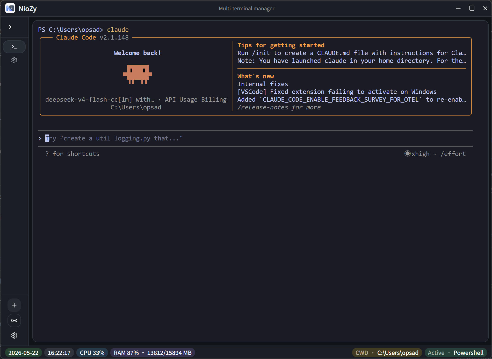
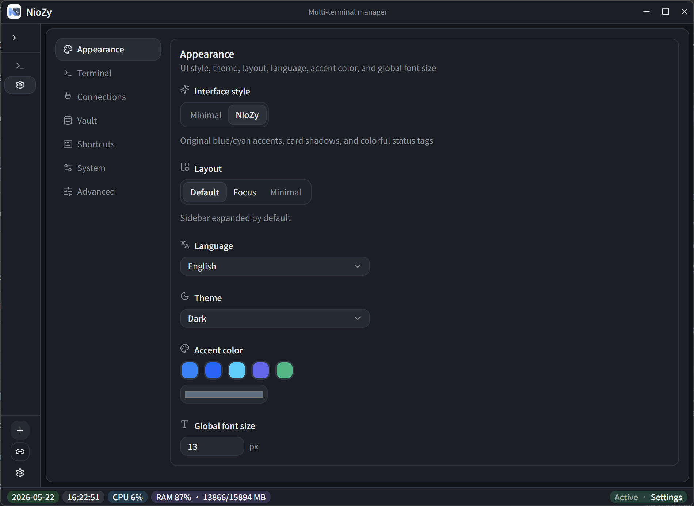
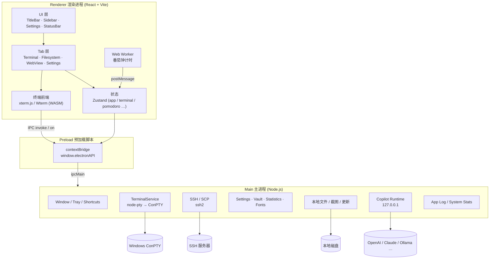
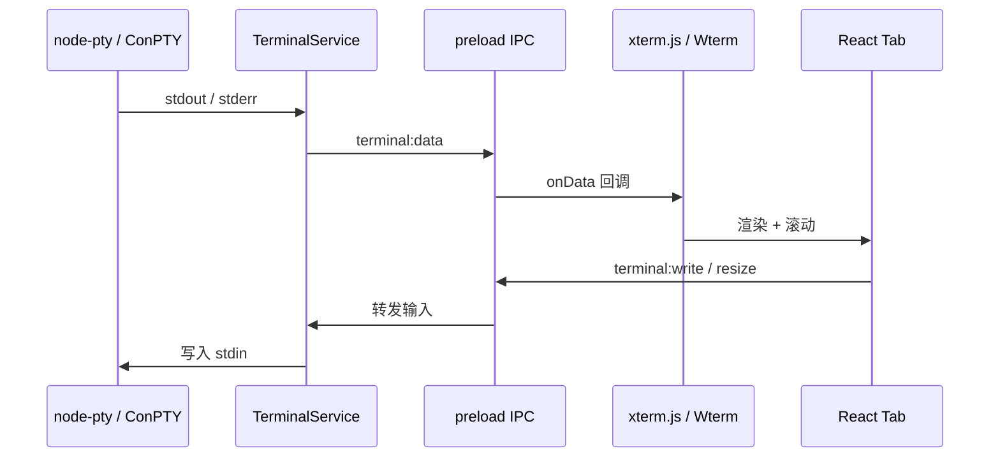

# NioZy

Windows 多终端管理器 — 基于 Electron 的本地终端工作台，集成 SSH、文件浏览、AI 助手与专注工具。




## 功能

### 终端与会话

- **多 Tab 终端**：本地 PowerShell / CMD / pwsh，以及自定义连接与 SSH 会话
- **双引擎渲染**：默认 xterm.js 6（DOM / WebGL）；实验性 Wterm（WASM + Ghostty，仅 DOM）
- **同步渲染（DEC 2026）**：xterm 下可开关 TUI 原子帧刷新，减少闪烁（Wterm 不支持）
- **终端拆分**：单 Tab 内最多 3  pane 分屏
- **Shell 集成**：PowerShell 工作目录同步、右键菜单「在此处打开 NioZy」
- **管理员重启**：支持以管理员身份重启本地终端进程
- **Attach-PTY**：实验性 attach 模式，复用外部 PTY 会话

### 连接与传输

- **SSH 连接管理**：保存主机、端口、认证方式；断开提醒
- **SCP 传输**：在 SSH Tab 中上传 / 下载文件，带进度反馈
- **密钥保险箱（Vault）**：密文变量，可在连接串与 API Key 中以 `${VAR}` 引用

### 文件与预览

- **本地文件系统 Tab**：浏览目录、预览图片、用 VS Code / Cursor / 自定义程序打开
- **链接预览**：终端内 URL 悬浮预览；WebView Tab 打开网页
- **文件预览**：Office / PDF / 图片等格式预览（js-preview）
- **截图工具**：区域截图、简单标注、复制到剪贴板

### 界面与效率

- **自定义标题栏**：无边框窗口、最小化 / 最大化 / 关闭、窗口分屏贴靠
- **三种布局**：默认 / 专注 / 极简（Minimal Tab Bar）
- **多套 UI 风格**：Minimal、NioZy 经典、XP 怀旧主题；明暗色切换
- **全局快捷键**：新建终端、切换 Tab、拆分等可配置
- **番茄钟**：Web Worker 独立计时，圆环进度，5 分钟–2 小时可调，完成 Toast 提醒
- **使用统计**：本地记录使用时长、Tab 开关、命令输入（可选）

### 顶部栏工具

- 终端输出搜索、窗口分屏、截图、AI 对话边栏（实验性）
- 渲染引擎 / 渲染模式切换、使用统计入口

### 设置中心

外观 · 终端 · SSH · Shell · 预览 · 性能 · 文件系统 · 连接 · 保险箱 · 快捷键 · 使用统计 · 系统 · 日志 · 高级 · 实验特性

### 系统能力

- 系统托盘、开机启动、关闭最小化到托盘
- 底部状态栏：日期、时间、CPU、内存、进程指标
- 应用更新检查、设置导入 / 导出、环境变量重载
- 多语言：中文 / English / 日本語

## 架构



### 进程职责

| 层级 | 目录 | 职责 |
|------|------|------|
| Main | `electron/main/`、`electron/*.ts` | 窗口、PTY、SSH、持久化、系统 API |
| Preload | `electron/preload/` | 安全暴露 `electronAPI`，IPC 多路复用 |
| Renderer | `src/` | React UI、终端模拟器、业务状态 |
| Shared | `electron/shared/` | 主进程与渲染进程共用的类型与默认值 |
| Worker | `src/workers/` | 与 UI 解耦的计时等后台任务 |

### 数据流（终端输出）



## 技术栈

| 类别 | 技术 |
|------|------|
| 桌面壳 | Electron 34、electron-vite、electron-builder |
| 前端 | React 19、TypeScript、Tailwind CSS 4、shadcn/ui (Radix) |
| 终端 | xterm.js 6.0、@xterm/addon-webgl、@wterm/*（实验性）、node-pty |
| 远程 | ssh2（SSH 会话与 SCP） |
| 状态 | Zustand |
| 国际化 | i18next |
| AI（实验性） | CopilotKit Runtime、多提供商 API |
| 提示 | sonner |

## 开发

```bash
npm install
npm run dev        # 或 npm start
```

> 请使用 `npm run dev` 启动桌面应用，不要直接在浏览器打开 Vite 地址（缺少 Electron 预加载 API）。

```bash
npm run typecheck  # TypeScript 检查
```

## 构建与发布

```bash
npm run build      # 编译 main / preload / renderer
npm run preview    # 预览构建结果
npm run dist       # 构建 Windows 安装包（输出到 release/）
```

### Git Tag 触发 Release

推送 Tag 后，GitHub Actions（[`.github/workflows/release.yml`](./.github/workflows/release.yml)）会自动：

1. 从 Tag 解析版本号（支持 `v0.1.13` 或 `0.1.13`）
2. 执行 `npm run dist` 构建 Windows 安装包
3. 上传 `release/*.exe` 到 GitHub Release

```bash
git push origin master
git tag 0.1.13
git push origin 0.1.13   # 仅推送单个 Tag，避免 --tags 触发多次构建
```

## 设计规范

详见 [design.md](./design.md)。

## 许可证

见仓库根目录 LICENSE（如有）。
