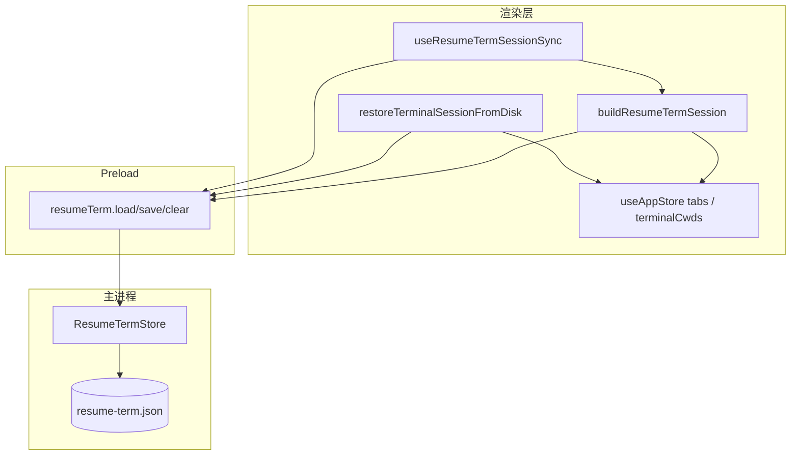
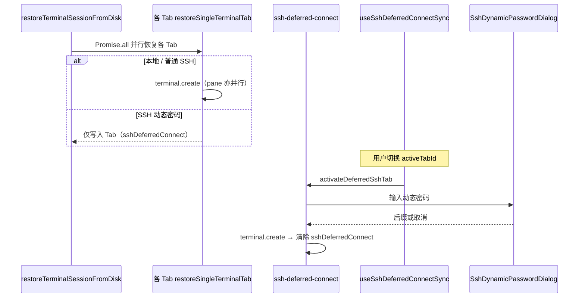

# 功能：SHELL · 重启恢复终端会话

在 **设置 · SHELL** 中开启「重启后恢复上次终端会话」后，关闭程序时会保存终端 Tab 结构与连接配置；下次启动时按保存内容重建 PTY 并恢复 Tab 顺序与活动 Tab。

> 与 [功能增强SHELL.md](./功能增强SHELL.md)（链接/emoji/命令回放/Oh My Posh 等）同属 **设置 · SHELL** 分区。

## 功能列表

- 保存终端 Tab **数量、顺序、自定义标题**
- 保存每个 Tab 的 **连接配置**（`terminalSpawn`：内置 Shell / 自定义命令 / SSH 连接 id）
- 保存 **横向拆分** pane 数量与活动 pane 索引
- **本地终端**：保存各 pane 当前工作目录，恢复时在该目录下启动
- **SSH / 远程**：恢复连接配置（连接仍须存在于 `term.json`）；不保存远程 cwd
- **SSH 动态密码**：启动时仅恢复 Tab 元数据（不创建 PTY）；切换到该 Tab 时再弹框输入并连接（见 [功能SSH连接.md](./功能SSH连接.md)）
- **并行恢复**：各 Tab 及同一 Tab 内各分屏 pane 的 `terminal.create` 并发执行，缩短多 Tab 启动时间
- 关闭开关时 **删除** `resume-term.json`
- **不恢复**终端 scrollback 历史（PTY 进程已结束）

## 进程归属

| 层级 | 职责 |
|------|------|
| **主进程** | 读写 `%USERPROFILE%\.config\NioZy\resume-term.json`；关闭开关时清空 |
| **渲染层** | 构建会话快照、启动时恢复 Tab、防抖自动保存 |
| **Preload** | `resumeTerm:load` / `save` / `clear` |

| 文件 | 作用 |
|------|------|
| `electron/shared/shell-settings.ts` | `restoreTerminalSessionOnRestart` 开关 |
| `electron/shared/resume-term-session.ts` | 会话 JSON 类型与归一化 |
| `electron/resume-term-store.ts` | 磁盘读写 |
| `electron/config-paths.ts` | `getResumeTermFilePath()` |
| `electron/open-directory.ts` | 启动 argv 解析（与恢复优先级，见下文） |
| `src/lib/resume-term-session.ts` | 快照构建、并行恢复、`markResumeTermBootComplete` |
| `src/lib/ssh-deferred-connect.ts` | SSH 动态密码 Tab 延迟连接（切换 Tab 时激活） |
| `src/hooks/useSshDeferredConnectSync.ts` | 监听 `activeTabId`，触发延迟 SSH 连接 |
| `src/components/terminal/SshDeferredConnectPane.tsx` | 待连接 SSH Tab 占位视图 |
| `src/hooks/useResumeTermSessionSync.ts` | Tab/cwd 变化防抖保存、`beforeunload` flush |
| `src/components/settings/ShellSettings.tsx` | 设置 UI 开关 |
| `src/components/terminal/RestoreTerminalSessionOverlay.tsx` | 启动恢复时的全局加载动画 |
| `src/App.tsx` | 启动时恢复或回退 `createTerminal()` |
| `src/lib/resume-term-log.ts` | 渲染层调试日志 `[NioZy][ResumeTerm]` |

## 架构与数据流

### 保存与恢复总览



### 启动引导顺序

```mermaid
sequenceDiagram
  participant App as App.tsx boot
  participant Pending as getPendingOpenDirectory
  participant Restore as restoreTerminalSessionFromDisk
  participant Create as createTerminal
  participant Mark as markResumeTermBootComplete
  participant Sync as useResumeTermSessionSync

  App->>Pending: 是否有「打开目录」请求？
  alt 有待打开目录（右键 / 第二实例）
    Pending-->>App: payload
    App->>Create: handleOpenDirectoryPayload（跳过恢复）
  else 无待打开目录 且 开关开启
    App->>Restore: 从 resume-term.json 并行恢复
    Note over Restore: 动态密码 SSH 仅恢复 Tab，不 create PTY
    alt 恢复成功
      Restore-->>App: true
    else 恢复失败
      Restore-->>App: false
      App->>Create: 新建默认终端
    end
  else 开关关闭
    App->>Create: 新建默认终端
  end
  App->>Mark: finally：允许持久化
  Note over Sync: boot 完成前不同步，避免空 Tab 误删 JSON
  Mark->>Sync: 可开始防抖保存
```

### 与「使用 NioZy 打开」的优先级

| 场景 | 行为 |
|------|------|
| 正常重启（无 argv 目录） | 尝试会话恢复 |
| 文件夹右键「使用 NioZy 打开」 | **优先**在指定目录开终端，跳过恢复 |
| 开发模式 `electron-vite dev` | 不将 argv 中的项目目录误判为「打开目录」（`!app.isPackaged`） |
| 打包后旧注册表 `%V` 裸路径 | 仍兼容解析为打开目录 |

### 并行恢复与 SSH 动态密码



| 场景 | 行为 |
|------|------|
| 多 Tab 启动恢复 | `Promise.all` 并行；单 Tab 内多分屏 pane 亦并行 `create` |
| SSH 动态密码 Tab | 启动时不弹框、不连 PTY；Tab 带 `sshDeferredConnect` + `deferredSplitPaneCount` |
| 切换到待连接 Tab | `useSshDeferredConnectSync` → 弹动态密码 → 创建 PTY |
| 切走 Tab 且密码框未提交 | 取消进行中的密码输入 |
| 取消密码后重试 | 先切到其他 Tab 再切回 |

显式目录参数：`--niozy-open-dir="路径"`（注册表新格式）。

## 配置文件

### settings.json

`shell.restoreTerminalSessionOnRestart`（默认 `false`）；子开关 `showRestoreTerminalSessionLoadingAnimation`（默认 `true`，仅父开关开启时可见）：

```json
{
  "shell": {
    "restoreTerminalSessionOnRestart": true,
    "showRestoreTerminalSessionLoadingAnimation": true
  }
}
```

关闭开关时主进程在 `settings:save` 中调用 `resumeTermStore.clear()`。

### resume-term.json

路径：`%USERPROFILE%\.config\NioZy\resume-term.json`

```json
{
  "version": 1,
  "activeTerminalTabIndex": 1,
  "tabs": [
    {
      "title": "PowerShell",
      "shell": "powershell",
      "splitPaneCount": 1,
      "terminalSpawn": {
        "create": {
          "shell": "powershell",
          "args": ["-NoLogo"],
          "env": {}
        }
      },
      "panes": [{ "cwd": "D:\\Projects\\NioZy" }]
    }
  ]
}
```

| 字段 | 说明 |
|------|------|
| `version` | 固定 `1` |
| `activeTerminalTabIndex` | 上次活动终端 Tab 在 `tabs` 中的索引 |
| `tabs[].terminalSpawn` | 与运行时 `TabTerminalSpawn` 一致，用于 `terminal.create` |
| `tabs[].splitPaneCount` | 拆分 pane 数（1–3） |
| `tabs[].panes[].cwd` | 仅本地终端；恢复时写入 `create.cwd` |

## 数据存储

| 路径 | 内容 |
|------|------|
| `settings.json` → `shell.restoreTerminalSessionOnRestart` | 功能开关 |
| `resume-term.json` | 上次终端会话快照（开关开启且存在终端 Tab 时写入） |

## 调试日志

渲染进程 DevTools 过滤：`[NioZy][ResumeTerm]`

主进程日志过滤：`[ResumeTerm]`

| 日志 | 含义 |
|------|------|
| `boot: attempting session restore` | 开始恢复 |
| `restore ok` | 恢复成功 |
| `restore tab deferred (dynamic password)` | 动态密码 SSH Tab 仅恢复元数据 |
| `deferred ssh connect start/ok` | 切换 Tab 后延迟 SSH 连接 |
| `boot: pending open directory, skip session restore` | 被「打开目录」抢占 |
| `persist skipped: boot not complete` | 启动未完成，跳过保存（正常） |
| `load: normalize failed` | JSON 格式无效 |
| `IPC clear` | 文件被删除 |

## 核心代码

### 开关与默认值

```typescript
// electron/shared/shell-settings.ts
restoreTerminalSessionOnRestart: boolean  // 默认 false
```

### 启动恢复入口

```typescript
// src/App.tsx — boot finally
markResumeTermBootComplete()

// 恢复分支
if (pending) { /* 打开目录，跳过恢复 */ }
else if (s.shell.restoreTerminalSessionOnRestart) {
  await restoreTerminalSessionFromDisk() || createTerminal()
}
```

### 并行恢复与延迟 SSH

```typescript
// src/lib/resume-term-session.ts — 各 Tab 并行
const restoreResults = await Promise.all(
  session.tabs.map((saved, i) => restoreSingleTerminalTab(saved, i)),
)

// 动态密码 SSH：shouldDeferSshDynamicConnect → 仅 AppTab，不 terminal.create
// src/lib/ssh-deferred-connect.ts — 切换 Tab 时 activateDeferredSshTab
```

### 启动完成前禁止清空

```typescript
// src/lib/resume-term-session.ts
let resumeTermBootComplete = false
// persistResumeTermSession() 在 boot 完成前直接 return
```

## 实验特性

否（正式 SHELL 设置项）。

## 相关文档

- [功能终端与会话.md](./功能终端与会话.md) — Tab / PTY / 拆分
- [功能增强SHELL.md](./功能增强SHELL.md) — 同设置页其它 Shell 选项
- [功能系统与托盘.md](./功能系统与托盘.md) — 文件夹右键「使用 NioZy 打开」
