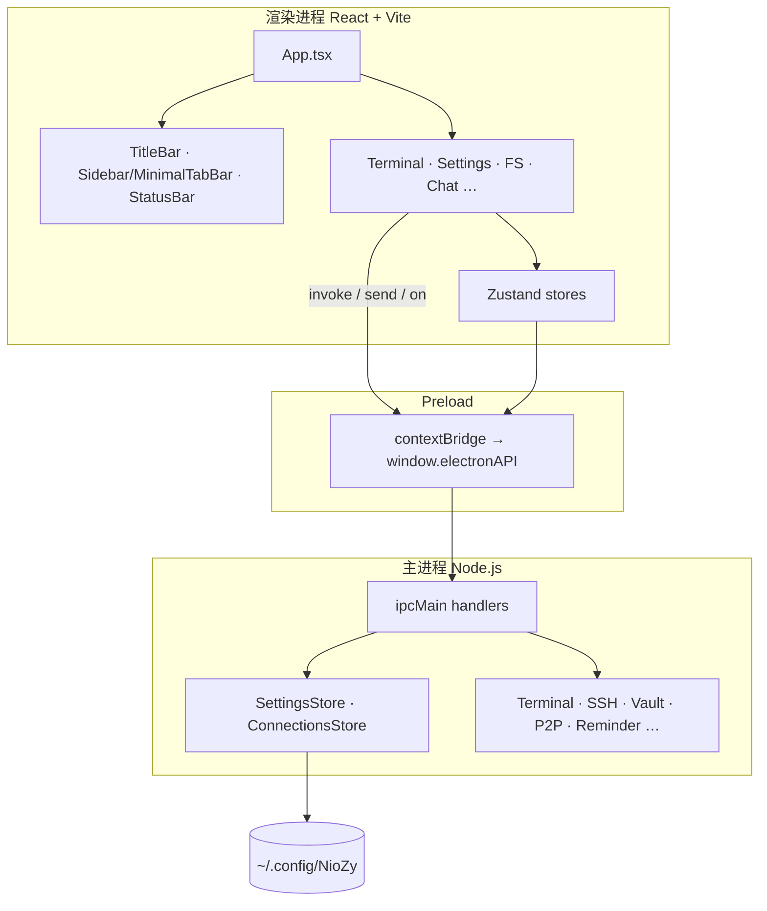
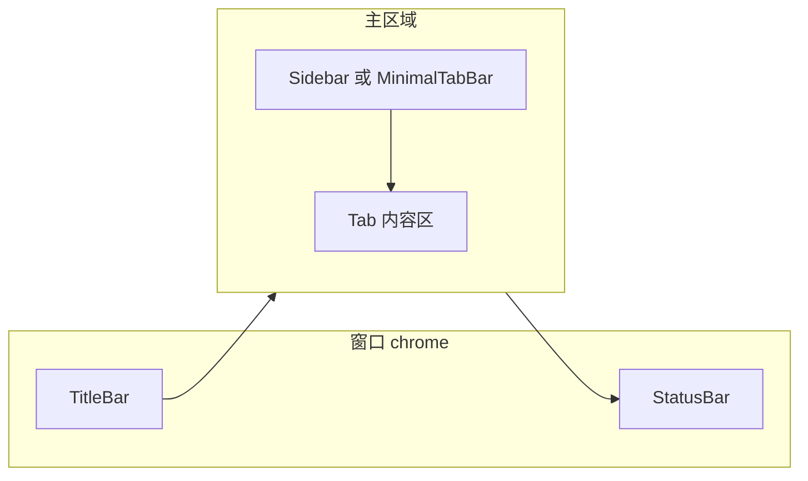
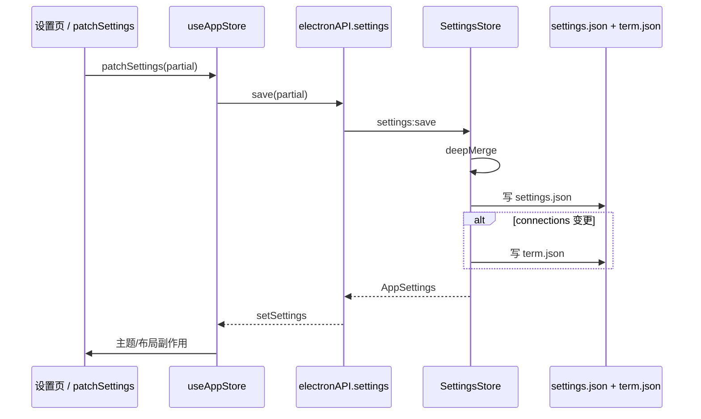
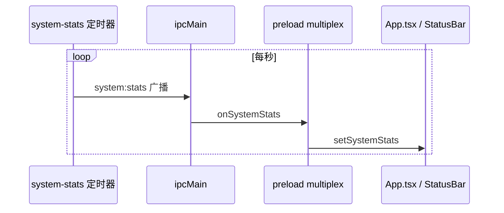

# 公共功能（Common）

应用级基础设施：进程边界、配置持久化、全局 UI 骨架、状态管理与 IPC 桥接。

## 功能列表

| 功能 | 进程 | 说明 |
|------|------|------|
| 应用入口与 Tab 路由 | 渲染层 | `App.tsx` 组合标题栏、侧栏/极简 Tab、内容区、状态栏 |
| 全局状态 `useAppStore` | 渲染层 | Tab 列表、设置缓存、系统指标、SSH/SCP 状态 |
| 设置读写 | 主进程 + 渲染层 | `settings.json` / `term.json` 持久化 |
| Preload `electronAPI` | Preload | `contextBridge` 暴露安全 IPC |
| 自定义标题栏 | 渲染层 | 无边框窗口控制、拖拽区 |
| 侧栏 / 极简 Tab 栏 | 渲染层 | `layoutMode` 切换三种布局 |
| 底部状态栏 | 渲染层 | 日期时间、CPU/内存、CWD、当前 Tab |
| 主题与 UI 风格 | 渲染层 + 共享类型 | `theme`、`uiStyle` 写入 DOM |
| 国际化 i18n | 渲染层 | `zh` / `en` / `ja` |
| 窗口 IPC | 主进程 | 最小化、最大化、贴靠分屏 |
| 系统指标轮询 | 主进程 → 渲染层 | `system:getStats` 推送 |

## 架构与数据流

### 三层架构



### UI 布局结构



### 设置读写数据流



### 系统指标推送



## 配置与存储

| 路径 | 内容 |
|------|------|
| `%USERPROFILE%\.config\NioZy\settings.json` | 除连接列表外的全部 `AppSettings` |
| `%USERPROFILE%\.config\NioZy\term.json` | `{ "connections": CustomConnection[] }` |
| `%USERPROFILE%\.config\NioZy\fonts-cache.json` | 系统字体列表缓存 |

路径定义：

```5:33:electron/config-paths.ts
/** 配置根目录：%USERPROFILE%/.config/NioZy */
export function getConfigDir(): string {
  const home = process.env.USERPROFILE || homedir()
  return join(home, '.config', 'NioZy')
}

export function getSettingsFilePath(): string {
  return join(getConfigDir(), 'settings.json')
}

export function getTermFilePath(): string {
  return join(getConfigDir(), 'term.json')
}
```

`AppSettings` 结构（节选）：

```82:141:electron/settings-store.ts
export interface AppSettings {
  locale: import('./shared/locale').AppLocale
  theme: ThemeMode
  uiStyle: import('./shared/ui-style').UiStyle
  layoutMode: LayoutMode
  sidebarWidth: number
  // ...
  connections: CustomConnection[]
  system: { proxy: string; launchOnStartup: boolean; minimizeToTrayOnClose: boolean }
  advanced: { hardwareAcceleration: boolean; /* ... */ }
  shortcuts: AppShortcuts
  ssh: import('./shared/ssh-settings').SshSettings
  shell: import('./shared/shell-settings').ShellSettings
  // ...
}
```

持久化实现：

```343:386:electron/settings-store.ts
  load(): AppSettings {
    // 读取 settings.json + term.json 合并 connections
  }
  update(partial: Partial<AppSettings>): AppSettings {
    // 深合并后写回 settings.json；connections 单独写 term.json
  }
```

## 核心函数与文件

### 渲染层入口

```62:83:src/App.tsx
export default function App() {
  // ...
  useAppShortcuts()
  useSshDisconnectAlert()
  useReminderAlerts()
  useTerminalStreamSync(tabs, activeTabId)
  useSuperPowerSavingPtySync(tabs, activeTabId)
  useAttachPtyTabSwitch(tabs, activeTabId)
```

启动时加载设置并创建首个终端：`96:113:src/App.tsx`。

### 全局 Store

Tab 类型与状态字段：`19:87:src/stores/app-store.ts`。

核心方法：`addTerminalTab`、`patchSettings`、`setSystemStats` 等，见 `89:337:src/stores/app-store.ts`。

### 标题栏

```10:52:src/components/layout/TitleBar.tsx
export function TitleBar() {
  // Logo、窗口最小化/最大化/关闭 → electronAPI.window.*
```

终端相关工具入口在 `TitleBarTerminalControls`：`42:96:src/components/layout/TitleBarTerminalControls.tsx`。

### 状态栏

日期、时间、CPU、内存、进程指标、当前 Tab 标题、PTY 工作目录：`1:80:src/components/layout/StatusBar.tsx`。

是否显示实时 CPU/内存由 `settings.advanced.statusBarLiveStats` 控制。

### 布局模式

| `layoutMode` | 组件 |
|--------------|------|
| `default` | `Sidebar` + 主内容 |
| `focus` | 侧栏可折叠 |
| `minimal` | `MinimalTabBar`，无传统侧栏 |

判断逻辑：`src/lib/layout-mode.ts`；侧栏宽度 `settings.sidebarWidth`。

### 设置面板骨架

17 个设置分区定义：`43:61:src/components/settings/SettingsPanel.tsx`。

### Preload IPC 桥

```66:123:electron/preload/index.ts
const api: ElectronAPI = {
  window: { minimize, maximize, close, isMaximized, snap, /* ... */ },
  settings: { get, save, exportToFile, importFromFile },
  terminal: { create, write, resize, kill, onData, /* ... */ },
  // ...
}
```

### 主进程 IPC（节选）

```761:813:electron/main/index.ts
ipcMain.handle('settings:get', () => settingsStore.get())
ipcMain.handle('settings:save', async (_, partial) => { /* ... */ })
ipcMain.handle('system:getStats', () => systemStats.getCurrent())
```

## 实验特性

公共层本身无实验开关；实验项集中在 `settings.experimental`（见 [功能实验特性.md](./功能实验特性.md)）。

## 浏览器开发预览

无 Electron 时使用 `src/lib/electron-browser-mock.ts` 模拟 `electronAPI`（仅 `npm run dev` 桌面模式为完整能力）。
