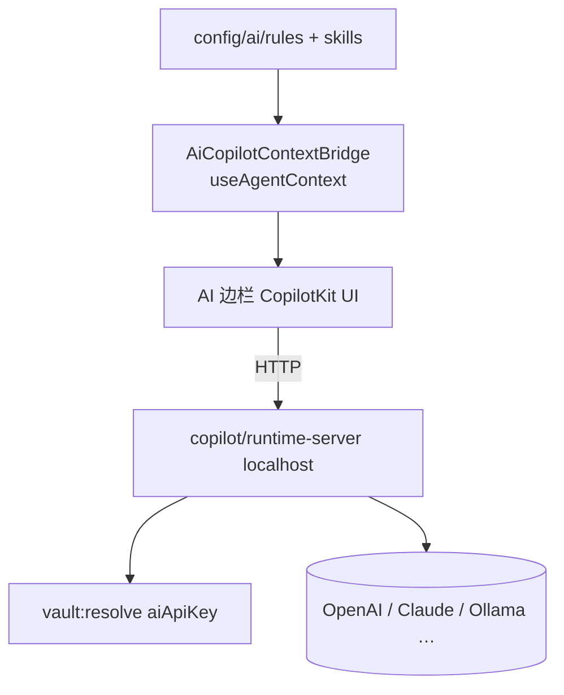
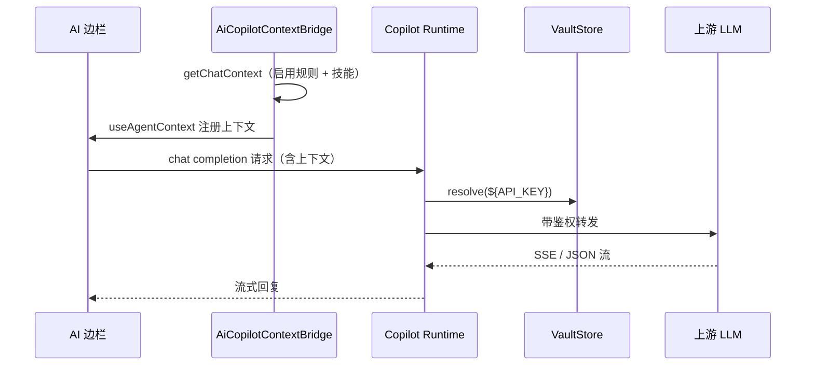

# 功能：AI 助手边栏

CopilotKit Runtime 本机 HTTP 服务 + 右侧对话边栏，多模型提供商。

## 功能列表

- 可折叠 AI 边栏（主界面右侧）
- 本机 Runtime（默认 `127.0.0.1` + 可配置端口）
- 提供商：OpenAI / Claude / Ollama 等（`aiProvider`）
- API Key 支持 Vault `${VAR}` 引用
- 可选附件（图片/文件，实验）
- 标题栏 Brain 图标开关边栏
- **上下文设置**：本地 **规则**（Markdown）与 **技能**（`SKILL.md` 目录），注入 CopilotKit 对话上下文

## 进程归属

| 层级 | 文件 |
|------|------|
| **主进程** | `electron/copilot/runtime-server.ts`、`electron/copilot/lazy.ts`、`electron/copilot-telemetry-env.ts`、`electron/ai-context-store.ts` |
| **渲染层** | `src/stores/ai-sidebar-store.ts`、`src/components/ai/AiCopilotRoot.tsx`、`src/components/ai/AiCopilotContextBridge.tsx`、`src/components/settings/AiContextSettings.tsx` |
| **共享** | `electron/shared/ai-provider-settings.ts`、`electron/shared/ai-context-types.ts`、`experimental-settings.ts` |

## 架构与数据流





## 实验特性

**是** — 全部开关在 `settings.experimental`：

| 字段 | 说明 |
|------|------|
| `aiSidebarEnabled` | 启用边栏 |
| `aiAttachmentsEnabled` | 附件 |
| `aiSidebarWidth` | 宽度预设 |
| `aiRuntimePort` | Runtime 端口 |
| `aiProvider` / `aiModel` / `aiBaseUrl` / `aiApiKey` | 模型配置 |
| `aiRuleStates` | 规则启用状态（`id → true` 表示注入上下文） |

```62:80:electron/shared/experimental-settings.ts
  aiSidebarEnabled: boolean
  aiAttachmentsEnabled: boolean
  aiSidebarWidth: AiSidebarWidthPreset
  aiRuntimePort: number
  aiProvider: AiProvider
  aiModel: string
  aiBaseUrl: string
  aiApiKey: string
  aiRuleStates: AiRuleStates
```

## 上下文设置

设置入口：**设置 → AI 特性**（`AiSettings.tsx`），边栏开启后显示 `AiContextSettings`。

### 规则（Rules）

| 操作 | 说明 |
|------|------|
| 新增 | 输入规则名称（`a-zA-Z0-9_-`）与 Markdown 正文，保存为 `ai/rules/{id}.md` |
| 编辑 | 修改 Markdown 内容 |
| 启用 | 开关写入 `experimental.aiRuleStates[id]`；仅 `true` 的规则注入对话 |
| 删除 | 删除文件并从 `aiRuleStates` 移除对应项 |

### 技能（Skills）

| 操作 | 说明 |
|------|------|
| 导入技能 | 打开 `ai/skills` 目录，用户自行创建子目录并放入 `SKILL.md` |
| 刷新技能 | 扫描含 `SKILL.md` 的子目录，更新列表 |
| 注入 | 所有已发现技能全文注入对话上下文（无单独启用开关） |

技能目录示例：

```
%USERPROFILE%/.config/NioZy/ai/skills/
  my-skill/
    SKILL.md
```

## 配置文件片段

```json
{
  "experimental": {
    "aiSidebarEnabled": false,
    "aiAttachmentsEnabled": false,
    "aiSidebarWidth": "medium",
    "aiRuntimePort": 6173,
    "aiProvider": "openai",
    "aiModel": "gpt-4o-mini",
    "aiBaseUrl": "",
    "aiApiKey": "",
    "aiRuleStates": {
      "coding-style": true
    }
  }
}
```

## 数据存储

| 数据 | 位置 |
|------|------|
| 对话历史 | CopilotKit / Runtime 管理（内存或 Runtime 默认行为） |
| API Key | `settings.json`（或 Vault 引用，解析后在主进程内存中使用） |
| 规则正文 | `%USERPROFILE%/.config/NioZy/ai/rules/*.md` |
| 技能 | `%USERPROFILE%/.config/NioZy/ai/skills/{id}/SKILL.md` |
| 规则启用状态 | `settings.json` → `experimental.aiRuleStates` |

路径定义见 `electron/config-paths.ts`（`getAiRulesDir`、`getAiSkillsDir`）。

## 核心代码

### Runtime URL

```1044:1044:electron/main/index.ts
ipcMain.handle('copilot:getRuntimeUrl', () => getCopilotRuntimeUrl())
```

Preload：`copilot.getRuntimeUrl` — `electron/preload/index.ts`。

### 上下文 IPC

| 通道 | 说明 |
|------|------|
| `aiContext:listRules` | 列出规则及启用状态 |
| `aiContext:readRule` / `saveRule` / `deleteRule` | 规则 CRUD |
| `aiContext:listSkills` | 扫描技能目录 |
| `aiContext:getChatContext` | 组装启用规则 + 全部技能内容 |
| `aiContext:openSkillsDirectory` | 打开 `ai/skills` 目录 |

Preload 命名空间：`electronAPI.aiContext` — `electron/preload/index.ts`。

存储实现：`electron/ai-context-store.ts`。

### 对话上下文注入

`AiCopilotContextBridge` 在 `CopilotKit` 内通过 `useAgentContext`（`@copilotkit/react-core/v2`）注册规则与技能；规则/技能变更时由 `src/stores/ai-context-store.ts` 的 `revision` 触发重新加载。

```221:221:src/components/ai/AiCopilotRoot.tsx
        <AiCopilotContextBridge />
```

### 渲染层宽度

`src/lib/ai-sidebar-width.ts`、`resolveAiSidebarWidthPx` — `App.tsx`。

### 标题栏切换

`TitleBarTerminalControls` — `aiSidebarEnabled`、`handleAiSidebarToggle`（`src/components/layout/TitleBarTerminalControls.tsx`）。

### 设置 UI

- `src/components/settings/AiSettings.tsx` — 模型、边栏、附件等
- `src/components/settings/AiContextSettings.tsx` — 规则与技能上下文
