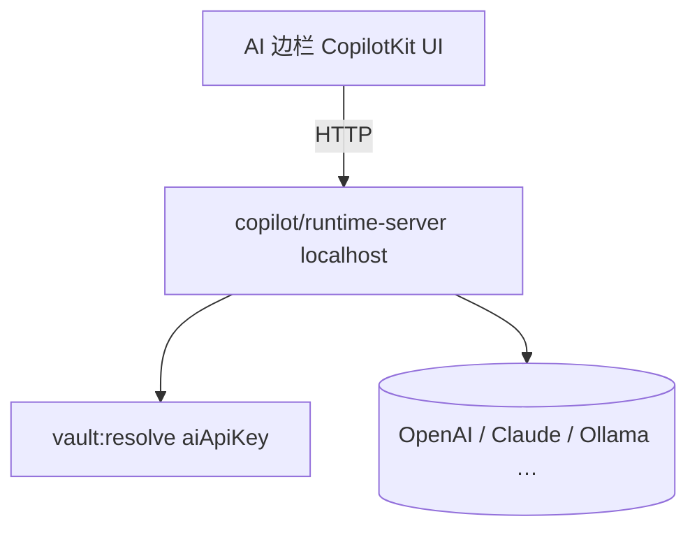
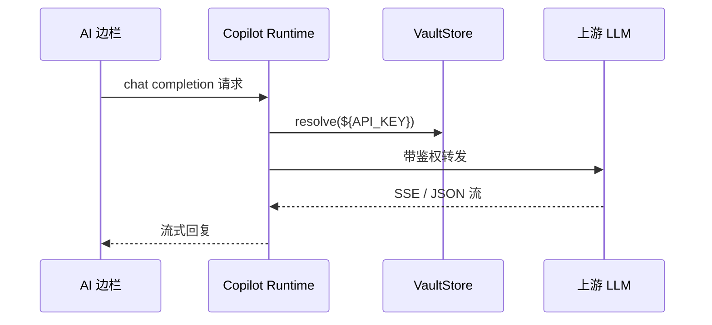

# 功能：AI 助手边栏

CopilotKit Runtime 本机 HTTP 服务 + 右侧对话边栏，多模型提供商。

## 功能列表

- 可折叠 AI 边栏（主界面右侧）
- 本机 Runtime（默认 `127.0.0.1` + 可配置端口）
- 提供商：OpenAI / Claude / Ollama 等（`aiProvider`）
- API Key 支持 Vault `${VAR}` 引用
- 可选附件（图片/文件，实验）
- 标题栏 Brain 图标开关边栏

## 进程归属

| 层级 | 文件 |
|------|------|
| **主进程** | `electron/copilot/runtime-server.ts`、`electron/copilot/lazy.ts`、`electron/copilot-telemetry-env.ts` |
| **渲染层** | `src/stores/ai-sidebar-store.ts`、CopilotKit React 组件（`App.tsx` 内边栏区域） |
| **共享** | `electron/shared/ai-provider-settings.ts`、`experimental-settings.ts` |

## 架构与数据流





## 实验特性

**是** — 全部开关在 `settings.experimental`：

| 字段 | 说明 |
|------|------|
| `aiSidebarEnabled` | 启用边栏 |
| `aiAttachmentsEnabled` | 附件 |
| `aiSidebarWidth` | 宽度预设 |
| `aiRuntimePort` | Runtime 端口 |
| `aiProvider` / `aiModel` / `aiBaseUrl` / `aiApiKey` | 模型配置 |

```61:76:electron/shared/experimental-settings.ts
  aiSidebarEnabled: boolean
  aiAttachmentsEnabled: boolean
  aiSidebarWidth: AiSidebarWidthPreset
  aiRuntimePort: number
  aiProvider: AiProvider
  aiModel: string
  aiBaseUrl: string
  aiApiKey: string
```

## 配置文件片段

```json
{
  "experimental": {
    "aiSidebarEnabled": false,
    "aiAttachmentsEnabled": false,
    "aiSidebarWidth": "medium",
    "aiRuntimePort": 3006,
    "aiProvider": "openai",
    "aiModel": "gpt-4o-mini",
    "aiBaseUrl": "",
    "aiApiKey": ""
  }
}
```

## 数据存储

- 对话历史：由 CopilotKit / Runtime 管理（内存或 Runtime 默认行为）
- API Key：仅存于 `settings.json`（或 Vault 引用，解析后在主进程内存中使用）
- 无独立 `ai.json`

## 核心代码

### Runtime URL

```762:762:electron/main/index.ts
ipcMain.handle('copilot:getRuntimeUrl', () => getCopilotRuntimeUrl())
```

Preload：`copilot.getRuntimeUrl` — `85:87:electron/preload/index.ts`。

### 渲染层宽度

`src/lib/ai-sidebar-width.ts`、`resolveAiSidebarWidthPx` — `App.tsx` 约 29 行。

### 标题栏切换

`TitleBarTerminalControls` — `aiSidebarEnabled`、`handleAiSidebarToggle`（`59:66:src/components/layout/TitleBarTerminalControls.tsx`）。

### 设置 UI

`src/components/settings/ExperimentalSettings.tsx` — AI 相关表单项。
