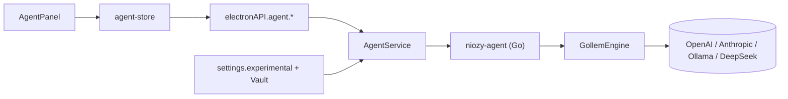
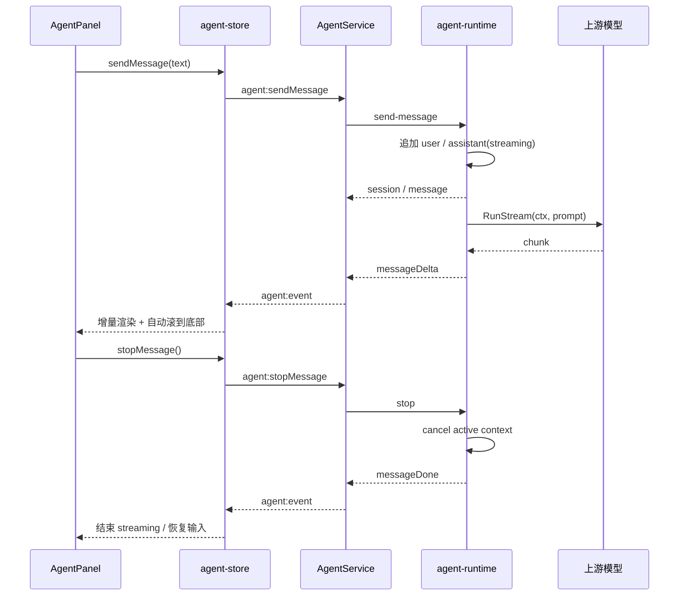

# 功能：Agent

`NioZy Agent` 是内置在主界面中的对话式工程 Agent 工作台，采用 **Electron Main ↔ Go agent-runtime ↔ 上游 LLM** 的 IPC 架构，支持项目目录上下文、模型/模式切换、流式回复、停止生成、Markdown 渲染、`@文件` 搜索引用与基础会话管理。

## 功能列表

- Agent 独立 Tab（`agent` 类型）
- 打开 Agent Tab 自动启动并连接 runtime
- 项目目录选择与 Git 分支展示
- 模型选择与模式切换（`plan` / `build`）
- 读取 AI 特性中的提供商 / 模型 / Base URL / API Key 配置
- Go `agent-runtime` 子进程承载会话与模型请求
- 流式回复（`messageDelta` 增量推送）
- 运行中按钮与停止生成
- 回复 Markdown 渲染
- Thinking 状态文本效果
- 新消息 / 流式增量自动滚动到底部
- 输入框 `@` 搜索当前项目目录文件
- 鼠标 / 键盘确认文件引用，支持一次附加多个文件
- 引用文件以标签展示，不把 `@路径` 文本保留在输入框中
- 文件候选列表支持高亮、自动滚动、显式竖向滚动条与鼠标滚轮
- NioZy Agent 专属日志级别、日志文件、`max-tokens` 配置

## 进程归属

| 层级 | 文件 |
|------|------|
| **Go Runtime** | `agent-runtime/cmd/niozy-agent/main.go`、`agent-runtime/internal/runtime/runtime.go`、`agent-runtime/internal/engine/gollem.go` |
| **Electron 主进程** | `electron/agent-service.ts`、`electron/main/index.ts` |
| **Preload / 共享类型** | `electron/preload/index.ts`、`electron/shared/agent-types.ts`、`electron/shared/api-types.ts` |
| **渲染层** | `src/components/agent/AgentPanel.tsx`、`src/stores/agent-store.ts` |
| **设置** | `src/components/settings/AiSettings.tsx`、`electron/shared/experimental-settings.ts` |
| **样式 / 文案** | `src/index.css`、`src/locales/zh.json`、`en.json`、`ja.json` |

## 架构与数据流





## 会话模型

Agent 会话保存在 `AgentSessionState`：

- `sessionId`
- `workspaceDir`
- `gitBranch`
- `model`
- `mode`
- `messages`

消息模型为 `AgentMessage`：

- `id`
- `role`
- `content`
- `createdAt`
- `streaming`
- `referencedFiles`

其中 `referencedFiles` 为 UI 侧维护的引用文件元数据：

- `path`
- `relativePath`

Go runtime 内部也维护同构 `ipc.Session` / `ipc.Message`，保证主进程与子进程之间的会话状态一致。

## IPC 协议

### Renderer -> Main

| 通道 | 说明 |
|------|------|
| `agent:getState` | 读取当前快照 |
| `agent:ensureRuntime` | 启动并初始化 runtime |
| `agent:pickDirectory` | 选择项目目录 |
| `agent:searchFiles` | 搜索当前项目目录文件 |
| `agent:setWorkspaceDir` | 更新工作目录与分支 |
| `agent:setModel` | 切换模型 |
| `agent:setMode` | 切换模式 |
| `agent:sendMessage` | 发送消息 |
| `agent:stopMessage` | 停止当前流式请求 |
| `agent:resetSession` | 重置会话 |

### Main / Runtime -> Renderer

| 事件 | 说明 |
|------|------|
| `runtime` | runtime 状态变化（`idle` / `starting` / `ready` / `error`） |
| `session` | 完整会话快照 |
| `message` | 新消息对象（主要用于 assistant streaming 占位） |
| `messageDelta` | 回复增量文本 |
| `messageDone` | 当前 streaming 消息结束 |
| `error` | 运行错误 |

## 流式回复实现

Go 端通过 `GollemEngine.RespondStream()` 调用 `agent.RunStream(ctx, prompt)`，并将 `stream.StreamText(true)` 中的 chunk 逐段转换为 `messageDelta` 事件发回前端。

关键点：

- **不是一个字一个字写死输出**，而是按上游模型 SDK 返回的文本 chunk 增量推送
- assistant 消息先以 `streaming: true` 的空消息占位
- 每次收到 chunk 就更新 runtime 内部消息内容，并发出 `messageDelta`
- 完成或取消时统一发出 `messageDone`

对应核心文件：

- `agent-runtime/internal/engine/engine.go`
- `agent-runtime/internal/engine/gollem.go`
- `agent-runtime/internal/runtime/runtime.go`

## 停止生成实现

停止生成不是前端单纯隐藏 Thinking，而是实际中断 Go runtime 当前请求：

1. 前端在 `hasStreamingMessage` 时将发送按钮切换为“运行中”
2. 点击按钮调用 `stopMessage()`
3. Main 进程向 Go runtime 发送 `stop` 命令
4. runtime 调用当前活动请求的 `context.CancelFunc`
5. `RunStream` 被取消后结束循环，runtime 将对应消息 `streaming` 置为 `false`
6. 发出 `messageDone`，前端恢复为可发送状态

为实现 stop，runtime 从“同步阻塞处理命令”改成了：

- stdin 主循环继续读取命令
- 单次 `send-message` 在后台 goroutine 中执行
- 当前活动请求由 `activeCancel` / `activeMessageID` 跟踪
- 输出经 `emitMu` 串行化，避免 `messageDelta` / `error` / `messageDone` 并发写 stdout 乱序

## 模型与配置同步

Agent 运行配置来自 **设置 → AI 特性**：

- `aiProvider`
- `aiModel`
- `aiBaseUrl`
- `aiApiKey`
- `niozyAgentLogLevel`
- `niozyAgentLogToFile`
- `niozyAgentLogFile`
- `niozyAgentMaxTokens`

主进程通过 `resolveAgentRuntimeConfigFromSettings()` 生成 `AgentRuntimeConfig`，并在以下场景同步给 Agent：

- 应用启动、`settingsStore.load()` 之后
- 手动启动 Agent runtime 时
- 发送消息前
- AI 特性设置保存后

另外，`AgentService` 增加了配置变更比较，避免 runtime 已运行时每次发送都重复下发 `update-config`，从而减少旧 `session` 覆盖新消息的竞态。渲染层在 Agent Tab 完成 `bootstrap()` 后，会在 runtime 仍为 `idle/error` 时自动调用 `ensureRuntime()`，因此通常不需要再手动点击“连接”按钮。

## Max Tokens

`max-tokens` 为 Agent 单次请求的最大输出 token 数：

- Go CLI flag：`niozy-agent -max-tokens <n>`
- Electron 配置：`AgentRuntimeConfig.maxTokens`
- 设置入口：AI 特性 → NioZy Agent 分组

实现路径：

- `agent-runtime/cmd/niozy-agent/main.go`
- `agent-runtime/internal/config/config.go`
- `electron/main/index.ts`
- `electron/shared/experimental-settings.ts`
- `src/components/settings/AiSettings.tsx`

## 回复渲染与交互

### Markdown 渲染

assistant / system 消息复用了 Markdown 编辑器的统一管线：

- `markdownToHtml()`
- `remark-gfm`
- `remark-math`
- `rehype-raw`
- `rehype-sanitize`
- `rehype-katex`

其中：

- **用户消息** 保持纯文本渲染
- **assistant / system 消息** 支持 Markdown
- Agent 面板使用独立的 `agent-markdown-surface` 变量，避免直接套用 Markdown 编辑器的大留白布局

### Thinking UI

流式回复中额外显示一个简洁的 `Thinking` 文本，并使用 `agent-thinking-shine` CSS 动画做亮带扫过效果。

### 自动滚动

消息列表底部放置隐藏锚点；当出现以下变化时自动 `scrollIntoView`：

- 新消息进入
- 最后一条消息内容增长
- streaming 状态变化

这样可以在流式输出过程中持续跟随最新回复。

### `@` 文件引用

Agent 输入框支持类似 Codex 的 `@文件` 搜索与引用：

1. 输入框检测当前光标前是否存在活动中的 `@query`
2. 命中后调用 `agent:searchFiles`
3. Main 进程转给 `WorkspaceService.searchFiles()` 在当前 `workspaceDir` 下遍历文件并评分
4. 渲染层展示候选列表，支持：
   - `ArrowUp` / `ArrowDown` 上下切换
   - `Enter` 确认当前高亮项
   - 鼠标 `hover` 切换高亮
   - 鼠标点击确认
5. 确认后不把 `@路径` 文本保留在输入框中，而是转成上方的引用标签
6. 单条消息可附加多个文件，发送后用户消息气泡中也会显示这些引用标签

对应核心文件：

- `src/components/agent/AgentPanel.tsx`
- `src/stores/agent-store.ts`
- `electron/agent-service.ts`
- `electron/workspace-service.ts`
- `electron/shared/agent-types.ts`

### 引用文件如何传给模型

Go runtime IPC 协议本身没有新增“文件附件”字段；当前实现是在 Electron 主进程里把所选文件内容展开为上下文块，再拼到真正发往 runtime 的 prompt：

- UI 消息 `content` 仍保留用户原始输入文本
- `referencedFiles` 仅用于展示和状态同步
- `AgentService.buildPromptWithReferences()` 会读取每个文件内容
- 最终发送给 runtime 的文本结构为：
  - `Referenced project files:`
  - 每个文件一个 `File: relativePath` + fenced code block
  - `User request:`
  - 用户原始问题

这样既保留了现有 runtime 协议，又让模型能拿到严格的文件上下文。

### 文件候选列表滚动与滚动条

当候选列表高度超出时：

- 当前高亮项变化会触发 `scrollIntoView({ block: 'nearest' })`
- 列表显式展示竖向滚动条
- 支持鼠标滚轮滚动
- 列表左右保留内边距，避免高亮边框被外层边框遮挡

## 设置项

与 Agent 直接相关的实验配置字段：

```json
{
  "experimental": {
    "niozyAgentEnabled": false,
    "aiProvider": "openai",
    "aiModel": "gpt-4o-mini",
    "aiBaseUrl": "",
    "aiApiKey": "",
    "niozyAgentLogLevel": "INFO",
    "niozyAgentLogToFile": false,
    "niozyAgentLogFile": "",
    "niozyAgentMaxTokens": 4096
  }
}
```

## 数据存储

| 数据 | 位置 |
|------|------|
| Agent 会话消息 | 主进程内存 + Go runtime 内存 |
| Agent 模型/提供商配置 | `settings.json` → `experimental.*` |
| API Key | `settings.json` 或 Vault 引用，主进程解析后传入 runtime |
| Agent 日志文件路径 | `settings.json` → `experimental.niozyAgentLogFile` |

Agent 当前不做长期对话持久化；重置会话或重启应用后，消息历史按当前主进程会话状态重新开始。

## 核心代码索引

- `agent-runtime/cmd/niozy-agent/main.go`
- `agent-runtime/internal/config/config.go`
- `agent-runtime/internal/engine/engine.go`
- `agent-runtime/internal/engine/gollem.go`
- `agent-runtime/internal/ipc/types.go`
- `agent-runtime/internal/runtime/runtime.go`
- `electron/agent-service.ts`
- `electron/main/index.ts`
- `electron/preload/index.ts`
- `electron/shared/agent-types.ts`
- `electron/shared/api-types.ts`
- `electron/shared/experimental-settings.ts`
- `src/stores/agent-store.ts`
- `src/components/agent/AgentPanel.tsx`
- `src/components/settings/AiSettings.tsx`
- `src/index.css`

## 注意事项

- Agent runtime 需要有效的工作目录、模型名与 API 配置后才能正常发送请求
- `stop` 依赖上游 `RunStream(ctx, ...)` 对 `context.Cancel` 的响应速度
- 当前会话消息以主进程内存为准，不是数据库持久化
- 渲染层通过 `normalizeMessages` 过滤非法消息，避免 IPC 异常对象污染 UI
