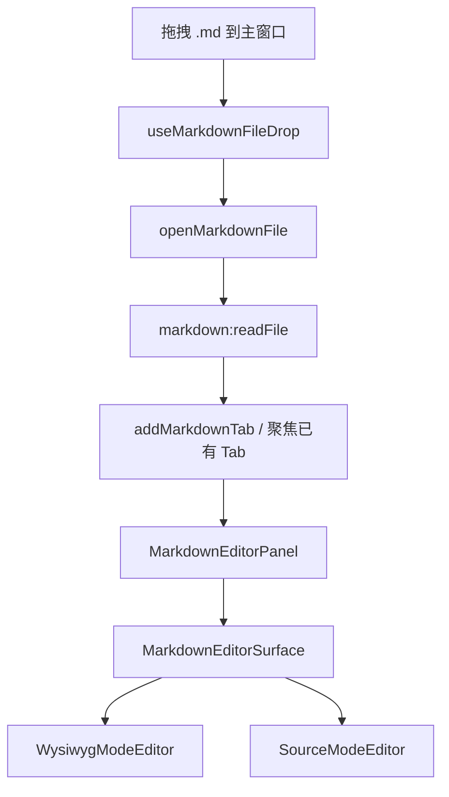
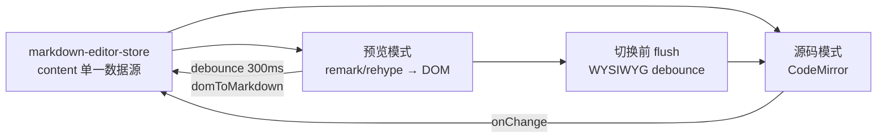
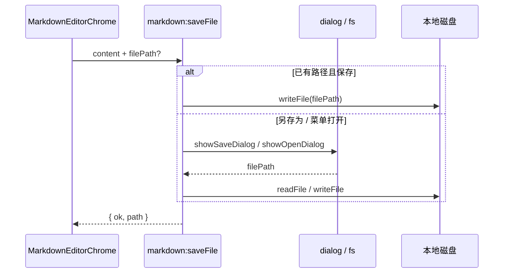

# 功能：Markdown 编辑器

在应用内集成 Markdown 文档编辑与预览，支持 CommonMark + GFM、KaTeX 公式、Mermaid 图表与 HTML 富文本；双模式（预览 / 源码）切换；通过拖拽 `.md` 文件打开多 Tab 编辑。

## 功能列表

| 子功能 | 说明 |
|--------|------|
| 打开方式 | 将 `.md` / `.markdown` 文件**拖拽**到主窗口即可打开 Tab（v1 仅此入口） |
| 多 Tab | `markdown` 类型 Tab，同一文件路径去重后聚焦已有 Tab |
| 文件大小限制 | 主进程读取前 `stat`，超过 **10MB** 拒绝打开并 toast 提示 |
| 预览模式 | remark/rehype 渲染 + `contenteditable` 编辑，块级 widget 保留原始 fence 源码 |
| 源码模式 | CodeMirror 6 + `@codemirror/lang-markdown`，GFM 与多语言代码高亮 |
| 模式切换 | 右上角 Switch：预览 ↔ 源码 |
| 极简菜单 | 右上角 `⋯`：新建、打开、保存、另存为、导出 HTML、复制 Markdown |
| 公式 | KaTeX（`$...$` / `$$...$$`） |
| 图表 | Mermaid 代码块渲染 SVG，可编辑源码 |
| 代码块 | 嵌入式 CodeMirror，双击或 Edit 编辑 fence |
| 主题 | 随应用明暗模式与强调色自动适配（`--md-*` CSS 变量） |
| 未保存提示 | 关闭 Tab 时若有未保存修改，弹出确认 |
| 懒加载 | `MarkdownEditorPanel` 经 `lazy()` 加载，独立 `codemirror` / `markdown` / `katex` / `mermaid` chunk |

## 进程归属

| 层级 | 文件 |
|------|------|
| **主进程** | `electron/main/index.ts`（`markdown:readFile` / `markdown:openFile` / `markdown:saveFile`） |
| **共享类型** | `electron/shared/markdown-file-limits.ts`、`markdown-file-types.ts` |
| **Preload** | `electron/preload/index.ts` → `api.markdown.*` |
| **渲染层** | `src/components/markdown-editor/*` |
| **状态** | `src/stores/markdown-editor-store.ts`（按 Tab 存 content / dirty / mode） |
| **Tab 集成** | `src/stores/app-store.ts`、`src/components/layout/MarkdownTabItem.tsx`、`src/App.tsx` |
| **拖拽** | `src/hooks/useMarkdownFileDrop.ts`、`src/lib/markdown-tab-actions.ts` |

## 架构与数据流

### 拖拽打开 → Tab → 编辑器



### 双模式与内容同步



### 本地文件读写



## 渲染管线

`src/components/markdown-editor/render/markdown-pipeline.ts`：

| 阶段 | 库 |
|------|-----|
| 解析 | `remark-parse` + `remark-gfm` + `remark-math` |
| 转 HTML | `remark-rehype` → `rehype-katex` → `rehype-raw` → `rehype-sanitize` |
| 块级保留 | 自定义 `rehypePreserveBlocks`（`data-md-source` 保留 fence / mermaid / math 原文） |
| 序列化 | `domToMarkdown` / `mdast-util-to-markdown` |

## UI 布局

- 编辑区 Typora 式居中排版（`max-width: 860px`）
- 右上角浮动控件：`[ Switch ] 预览/源码` + `[ ⋯ ]` 菜单（`no-drag`，不干扰窗口拖拽）
- 竖向滚动：预览区与 CodeMirror `.cm-scroller` 使用 `show-scrollbar` 显示滚动条

## 实验特性

否。无需设置开关，拖拽 `.md` 即可使用。

## IPC 接口

| 通道 | 说明 |
|------|------|
| `markdown:readFile(path)` | 校验大小后 `readFile utf8`；错误：`FILE_TOO_LARGE` / `READ_FAILED` / `NOT_FOUND` |
| `markdown:openFile()` | 系统打开对话框，选中后读取 |
| `markdown:saveFile({ content, defaultFileName, filePath? })` | 直接写入或另存为对话框 |

## 主要依赖（direct）

```
@uiw/react-codemirror @codemirror/lang-markdown @codemirror/language-data
@codemirror/theme-one-dark unified remark-parse remark-gfm remark-math remark-rehype
rehype-katex rehype-raw rehype-sanitize mdast-util-to-markdown mdast-util-gfm mdast-util-math
katex mermaid unist-util-visit
```

## 国际化

`markdownEditor.*` 键位于 `src/locales/zh.json`、`en.json`、`ja.json`（菜单项、保存提示、文件过大警告、关闭确认等）。

## 已知限制

- WYSIWYG 与源码往返时，复杂嵌套（列表内代码块、HTML 混排）可能丢失部分格式；块级 widget 通过 `data-md-source` 尽量保留 fence / mermaid / 公式原文
- 复杂文档建议在**源码模式**下编辑

## 相关源码索引

```
src/components/markdown-editor/
  MarkdownEditorPanel.tsx      # Tab 面板入口
  MarkdownEditorSurface.tsx    # 双模式容器与切换 flush
  MarkdownEditorChrome.tsx     # Switch + 菜单
  modes/SourceModeEditor.tsx
  modes/WysiwygModeEditor.tsx
  render/markdown-pipeline.ts
  render/blocks/{Code,Mermaid,Math}BlockWidget.tsx
  theme/markdown-theme.ts
  theme/markdown-theme.css
```
