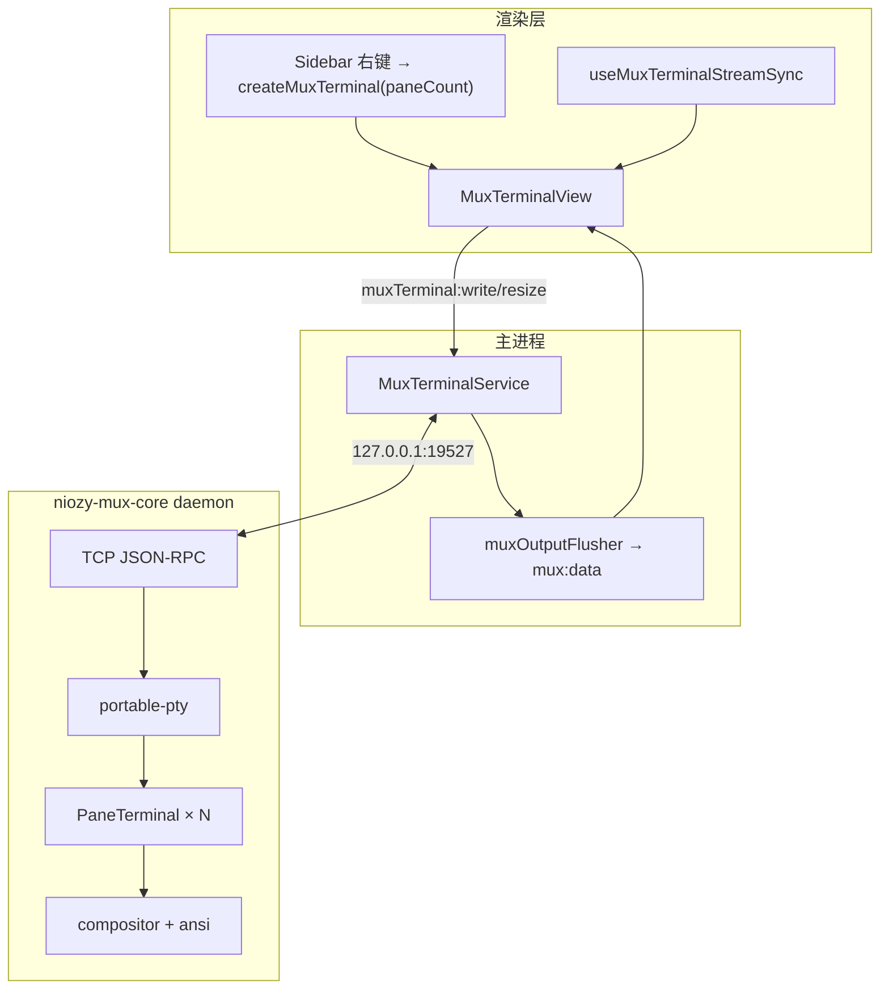
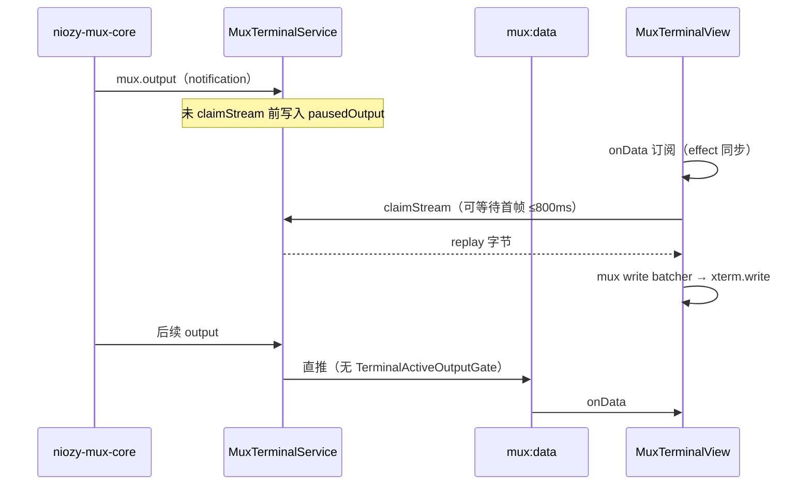
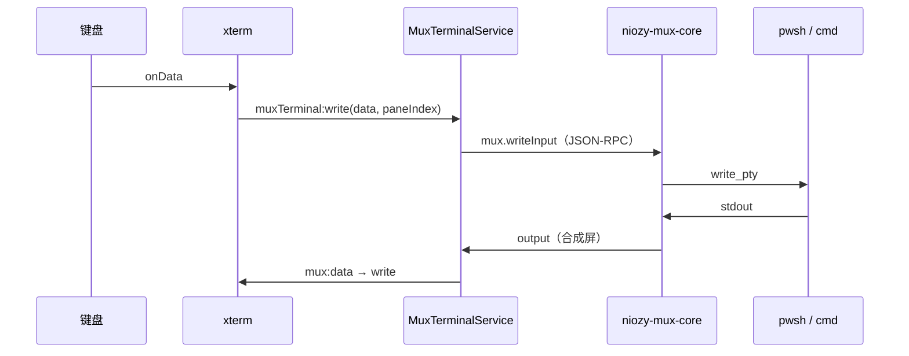

# 功能：Mux 终端（Rust 合成屏）

实验特性：本地 Shell 经独立守护进程 `niozy-mux-core` 管理 PTY，多 pane 合成单帧 ANSI 后由 **单个 xterm.js** 渲染。与 Legacy 分屏 / node-pty 并行，互不影响。

## 功能列表

- 设置 → 实验特性 → **Mux 合成屏**（`experimental.muxCoreEnabled`）
- 合成布局 pane 数：1 / 2 / 4（`experimental.muxPaneCount`，默认 4）；Windows 与 Unix 均支持。
- 开启后：侧栏「新建终端」**左键**仍创建普通 node-pty Tab；**右键**可选 1/2/4 窗格 Mux 布局
- 单 Tab 单 xterm；多 pane 由 Rust compositor 合成整屏输出
- 本地内置 Shell：PowerShell / CMD / pwsh（含 Shell 集成脚本）
- **不支持 SSH**（仍走 `TerminalService` + node-pty / ssh2）
- **不参与重启恢复**（`resume-term.json` 不保存 Mux Tab）
- 多 pane 时 **Ctrl+Alt+1~4** 或 **鼠标左键点击 pane** 切换焦点（→ `muxTerminal:setFocus`）；焦点 pane 的分隔线为青色高亮

## 生效条件

| 条件 | 说明 |
|------|------|
| `muxCoreEnabled === true` | 设置中开启 |
| `terminalEmulator === 'xterm'` | Ghostty / Wterm 下不可用 |
| 已编译 `niozy-mux-core` | 开发：`niozy-mux-core/target/release/niozy-mux-core.exe` |

判定：`src/lib/mux-terminal-render.ts` → `isMuxCoreEnabled()`。

## 进程归属

| 层级 | 职责 |
|------|------|
| **MuxDaemon**（`niozy-mux-core serve`） | 全局唯一；PTY、VT 网格、布局、ANSI 合成；TCP JSON-RPC |
| **主进程** | `ensureMuxDaemon` + `MuxRpcClient`；`claimStream` 缓冲；`muxTerminal:*` IPC |
| **渲染层** | `MuxTerminalView` 单 xterm；`useMuxTerminalStreamSync` 声明活跃流 |

## 架构与数据流

### 模块架构



### JSON-RPC 方法

**Client → Server（request/response）**

| method | 说明 |
|--------|------|
| `mux.ping` | 健康检查 |
| `mux.spawnSession` | 创建会话（同步返回 `{ sessionId, paneCount }`） |
| `mux.writeInput` | 键盘输入（`dataB64`） |
| `mux.resize` | 终端尺寸 |
| `mux.setFocus` | 多 pane 焦点 |
| `mux.killSession` | 结束会话 |

**Server → Client（notification）**

| method | 说明 |
|--------|------|
| `mux.ready` | 连接握手 |
| `mux.output` | 合成屏帧（`dataB64`, `seq`） |
| `mux.cwdChanged` | 工作目录 |
| `mux.sessionExit` | 会话结束 |

### 输出数据流（claim 前缓冲，避免 IPC 丢失）



**要点**：

- `setActiveStreams` **不会**对未 `claimStream` 的 session 开启 IPC 推流；首帧经 `claimStream` replay 交给 xterm。
- Mux 每帧为整屏 `\x1b[2J` 重绘，体积大；主进程 **不做** Legacy 的 `TerminalActiveOutputGate` 反压，渲染层使用 `mux-terminal-write-batcher`（无 FlowControl 阻塞）。

### 输入数据流



## 实验特性

**是** — 需在设置 → 实验特性中开启；与 Attach-PTY、Wterm 等独立。

## 配置文件片段

```json
{
  "experimental": {
    "terminalEmulator": "xterm",
    "muxCoreEnabled": false,
    "muxPaneCount": 4
  }
}
```

```71:73:electron/shared/experimental-settings.ts
  muxCoreEnabled: boolean
  /** Mux 合成屏默认 pane 数（1 / 2 / 4） */
  muxPaneCount: 1 | 2 | 4
```

## 数据存储

| 项 | 说明 |
|----|------|
| Mux Tab | **不**写入 `resume-term.json`（`src/lib/resume-term-session.ts` 跳过 `muxMode`） |
| 设置 | 仅存于 `settings.json` → `experimental` |

## 构建与调试

```bash
cd niozy-mux-core
cargo build --release
```

主进程查找路径：`electron/mux-binary-path.ts`（开发态 `target/release/niozy-mux-core.exe`）。

**Windows 限制**：

- 多 pane（2/4）各 pane 独立 ConPTY；须正确释放 slave 并保留 master（见 `pty/mod.rs`）。
- **Mux + 普通 node-pty Tab 并存时**：若 portable-pty 启动 pwsh 超时，可暂时关闭其他终端 Tab 或改用 cmd；Mux 不走 shell-integration / OMP。

**守护进程**：Electron 在需要 Mux 时检测 `127.0.0.1:19527`；已监听则不再 spawn。开发态传 `--mode dev`（弹出控制台显示 tracing 日志），发布态 `--mode prod`（无窗口）。App 退出时仅结束**本 App 本次 spawn** 的 core 进程；外部已运行的实例不受影响。

**手动调试**：

```bash
# 守护进程
niozy-mux-core/target/release/niozy-mux-core.exe serve --mode dev --bind 127.0.0.1 --port 19527

# 无交互 smoke
node scripts/mux-core-smoke.mjs

# 真实终端交互式 Shell
node scripts/mux-interactive-shell.mjs
```

诊断日志（需开启 [功能日志.md](./功能日志.md)）：

| 日志 | 含义 |
|------|------|
| `Mux RPC spawnSession` | 主进程已下发创建 |
| `niozy-mux-core stderr … spawn_session start/done` | Rust 侧 PTY 创建 |
| `Mux core ready (TCP JSON-RPC)` | 主进程已连接 daemon |
| `Mux core first output` | 收到首帧合成屏 |
| `Mux claimStream` | replay 字节数 |
| `Mux first input` | 首次键盘输入到达主进程 |
| `[MuxView] …` | 渲染层挂载 / fit / onData |

## 核心代码

### Rust（`niozy-mux-core/`）

| 模块 | 作用 |
|------|------|
| `pty/` | portable-pty 读写 |
| `pane/` | `alacritty_terminal::Term` + vte 解析 |
| `layout/` | 1 / 2 / 4 pane 布局 |
| `compositor/` | 多 pane 合成 `ComposedScreen` |
| `ansi/` | 整屏 redraw ANSI 编码 |
| `session/` | 会话生命周期、spawn/resize/write |
| `ipc/` | JSON-RPC over TCP（`jsonrpc.rs`, `tcp.rs`, `protocol.rs`） |

### Electron

| 文件 | 作用 |
|------|------|
| `electron/mux-terminal-service.ts` | RPC 客户端封装、`claimedStreamIds` 推流策略 |
| `electron/mux-rpc-client.ts` | TCP JSON-RPC 客户端、`ensureMuxDaemon` |
| `electron/mux-core-config.ts` | 默认 host/port |
| `electron/mux-terminal-spawn.ts` | Shell 集成参数 |
| `electron/mux-binary-path.ts` | 可执行文件路径 |
| `electron/main/index.ts` | `muxTerminal:*` / `mux:data` IPC |

### 渲染层

| 文件 | 作用 |
|------|------|
| `src/lib/mux-terminal-actions.ts` | `createMuxTerminal` |
| `src/components/layout/NewTerminalButton.tsx` | 左键普通终端；Mux 开启时右键布局菜单 |
| `src/lib/terminal-actions.ts` | `createTerminal` 始终创建 node-pty Tab |
| `src/lib/mux-terminal-render.ts` | `isMuxCoreEnabled`、`getMuxPaneCount` |
| `src/components/terminal/MuxTerminalView.tsx` | 单 xterm 视图 |
| `src/hooks/useMuxTerminalStreamSync.ts` | 活跃 Mux session 集合 |
| `src/lib/mux-terminal-write-batcher.ts` | 写入 xterm（无 FlowControl） |

## 与 Legacy 终端对比

| 项 | Legacy（node-pty） | Mux（Rust） |
|----|-------------------|-------------|
| PTY | Node `node-pty` | Rust `portable-pty` |
| 分屏 | 每 pane 独立 xterm | 单 xterm + 合成屏 |
| SSH | ✅ | ❌ |
| 会话恢复 | ✅ | ❌ |
| 推流 | `terminal:data` + gate 反压 | `mux:data` 直推 + claim 回放 |
| 模拟器 | xterm / ghostty / wterm | 仅 xterm |

## 相关文档

- [功能实验特性.md](./功能实验特性.md)
- [功能终端与会话.md](./功能终端与会话.md)（Legacy PTY、分屏、Attach-PTY）
- [功能增强SHELL.md](./功能增强SHELL.md)（Shell 集成环境变量）
- [SHELL.md](./SHELL.md)（重启恢复 — Mux 除外）
- [ADR: Mux TCP JSON-RPC](./adr/mux-tcp-jsonrpc.md)
