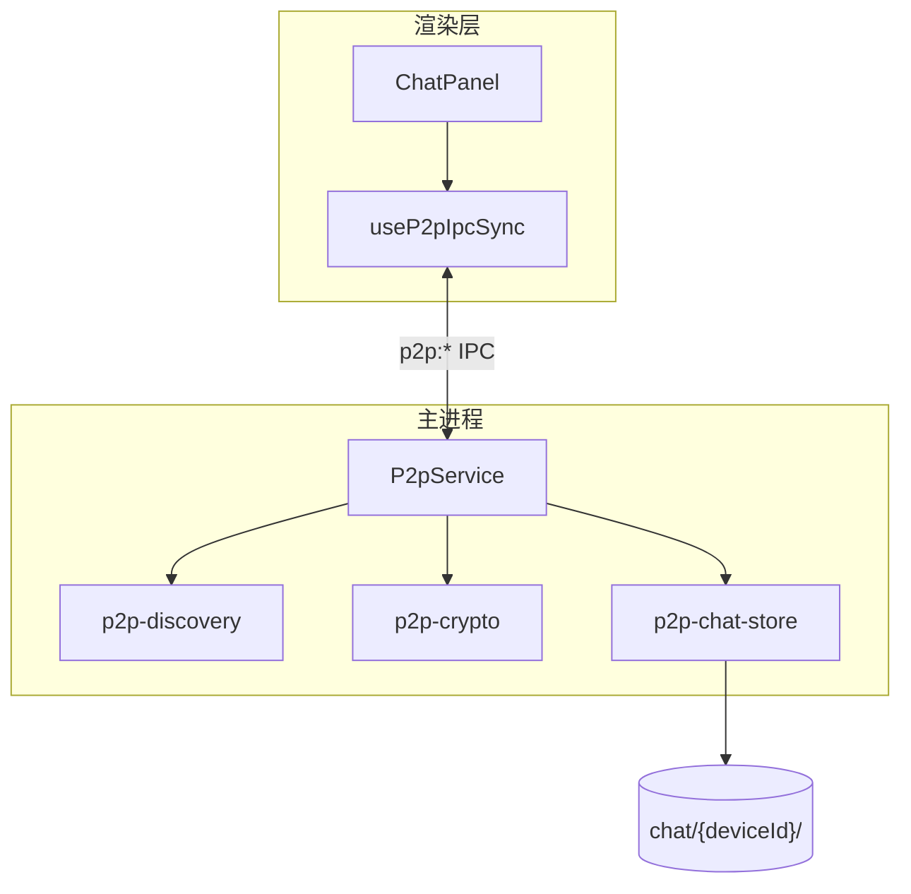
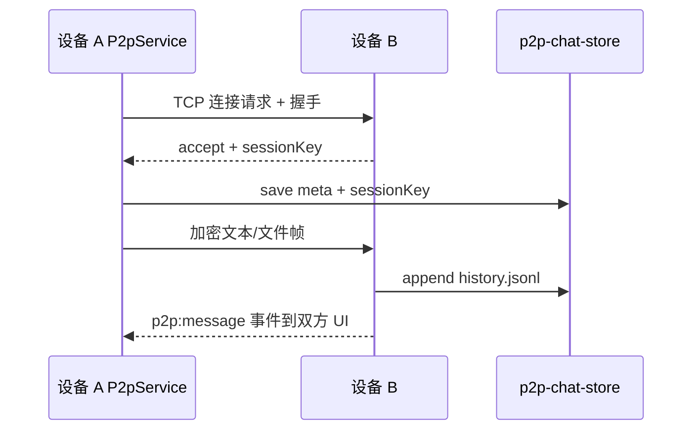

# 功能：P2P 局域网聊天

局域网设备发现、加密会话、文本与文件传输、聊天 Tab。

## 功能列表

- 本机 TCP 监听（默认端口 6869）
- mDNS/扫描发现对端（可关闭 discovery，手动 IP:端口）
- 连接请求 / 接受 / 拒绝
- 端到端加密消息与文件
- 会话列表、聊天记录、隐藏/删除会话
- 独立「聊天」Tab（需 `p2p.enabled`）

## 进程归属

| 层级 | 文件 |
|------|------|
| **主进程** | `electron/p2p/p2p-service.ts`、`p2p-discovery.ts`、`p2p-crypto.ts`、`p2p-chat-store.ts`、`p2p-protocol.ts` |
| **渲染层** | `src/components/chat/ChatPanel.tsx`、`ChatConversation.tsx`、`ChatSessionList.tsx` |
| **Hook** | `src/hooks/useP2pIpcSync.ts` |

## 架构与数据流





## 实验特性

否（设置中心「P2P」分区；默认关闭）。

## 配置文件片段

```json
{
  "p2p": {
    "enabled": false,
    "port": 6869,
    "discoveryEnabled": true
  }
}
```

`5:18:electron/shared/p2p-settings.ts`。

## 数据存储

| 路径 | 内容 |
|------|------|
| `%USERPROFILE%\.config\NioZy\chat\` | P2P 根目录 |
| `chat/{deviceId}/meta.json` | 对端元数据、会话密钥 |
| `chat/{deviceId}/history.jsonl` | 聊天历史（追加） |
| `chat/device.json` | 本机设备身份 |

```40:43:electron/config-paths.ts
export function getChatDir(): string {
  return join(getConfigDir(), 'chat')
}
```

Peer 目录：`89:90:electron/p2p/p2p-chat-store.ts` — `join(getChatDir(), deviceId)`。

## 核心代码

### P2pService（主进程）

`electron/p2p/p2p-service.ts` — `getStatus`、`scan`、`connect`、`sendText`、`sendFile` 等。

### IPC（节选）

```664:700:electron/main/index.ts
ipcMain.handle('p2p:getStatus', () => p2pService.getStatus())
ipcMain.handle('p2p:scan', () => p2pService.scan())
ipcMain.handle('p2p:connect', (_, host, port, message?) => p2pService.connect(/* ... */))
ipcMain.handle('p2p:sendText', (_, sessionId, text) => /* ... */)
```

### 渲染层

`src/hooks/useP2pIpcSync.ts` — 同步会话与消息事件。

`MinimalTabBar` / `Sidebar` — `p2pChatEnabled` 时显示聊天按钮（`27:27:src/components/layout/MinimalTabBar.tsx`）。

### 设置 UI

`src/components/settings/P2pSettings.tsx`
