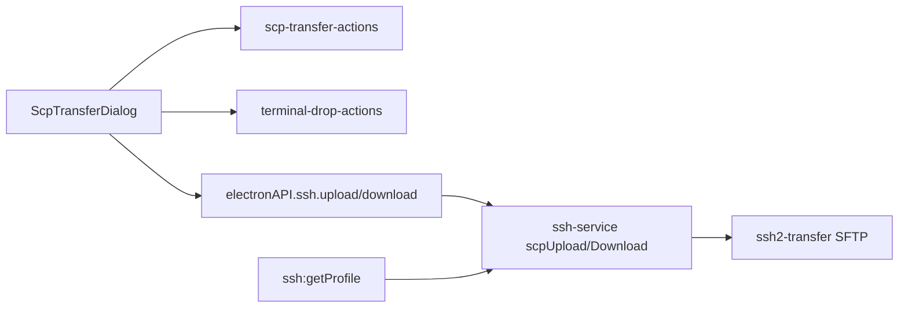
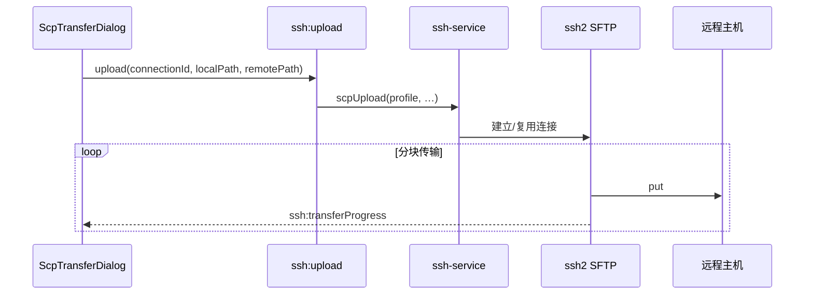
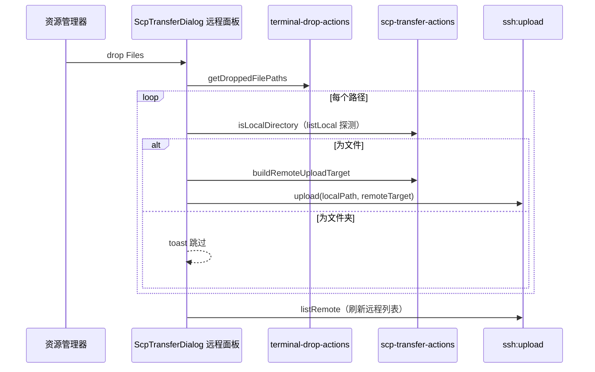

# 功能：SCP 文件传输

在 SSH 终端 Tab 中上传/下载文件，带进度与日志。

## 功能列表

- 上传本地**文件**到远程路径（按钮或拖放）
- 下载远程文件/目录到本地
- 浏览本地与远程目录列表
- **拖放上传**：从资源管理器将文件拖到传输面板右侧「远程」区域，松开后自动上传
- 传输进度条
- 依赖 ssh2 SFTP（非必须系统 `scp.exe`，但设置中可检测 PATH）

> 上传暂不支持本地文件夹；拖入或选中目录时会提示跳过。下载侧仍可选远程目录（按现有逻辑处理）。

## 使用方式

1. **开启功能**：设置 → SSH → 开启 SCP 传输
2. **打开面板**：SSH 终端 Tab 右键 →「打开传输」
3. **上传**
   - **按钮**：左侧选中本机文件 → 右侧选定目标目录（或浏览到目标路径）→ 点击「上传到远程」
   - **拖放**：将本机文件拖到右侧面板，松开即上传到当前远程目录；若选中了远程文件夹，则上传到该文件夹
4. **下载**：右侧选中远程文件 → 左侧选定本机目录 → 点击「下载到本机」

拖放时远程面板会高亮并显示「松开鼠标，上传到当前远程目录」。支持一次拖入多个文件，依次上传并显示进度。

## 进程归属

| 层级 | 文件 |
|------|------|
| **主进程** | `electron/ssh2-transfer.ts`、`electron/ssh-service.ts`（`scpUpload`/`scpDownload`） |
| **渲染层** | `src/components/scp/ScpTransferDialog.tsx`、`src/lib/scp-transfer-actions.ts` |
| **拖放路径解析** | `src/lib/terminal-drop-actions.ts`（`getDroppedFilePaths`、`hasExternalFileDrag`） |
| **日志** | `electron/scp-logger.ts` |

## 架构与数据流

### 模块架构



### 按钮上传数据流



### 拖放上传数据流



远程目标路径由 `buildRemoteUploadTarget` 统一计算：优先使用选中的远程目录，否则使用当前浏览的 `remotePath`。

## 实验特性

否。

## 配置文件片段

无独立 SCP 配置块；使用 `term.json` 中当前 SSH 连接 profile 与 `settings.ssh`。

相关设置项（`settings.ssh`）：

| 字段 | 说明 |
|------|------|
| `scpTransferEnabled` | 开启后 SSH Tab 右键显示「打开传输」 |

## 数据存储

- 传输任务状态：仅内存（渲染层 Dialog + 主进程进行中的 ssh2 会话）
- SCP 日志：由 `scp-logger` 写入应用日志（若 logging 已启用）

## 核心代码

### 主进程传输 API

```135:145:electron/ssh-service.ts
export async function scpUpload(/* ... */)
export async function scpDownload(/* ... */)
```

```96:103:electron/ssh-service.ts
export async function listRemoteDirectory(/* ... */)
```

IPC：`ssh:upload`、`ssh:download`、`ssh:transferProgress`（`electron/main/index.ts`）。

### 渲染层

- 打开面板：`useAppStore` 的 `scpTransferTabId`（`src/stores/app-store.ts`）
- 入口：`openScpTransferForTab`（`src/lib/scp-transfer-actions.ts`）
- UI 与拖放：`src/components/scp/ScpTransferDialog.tsx`
- 远程目标路径：`buildRemoteUploadTarget`（`src/lib/scp-transfer-actions.ts`）
- 本机目录初始路径：`src/lib/scp-local-path.ts`

### App 懒加载对话框

```52:56:src/App.tsx
const ScpTransferDialog = lazy(() =>
  import('@/components/scp/ScpTransferDialog').then((m) => ({ default: m.ScpTransferDialog })),
)
```
