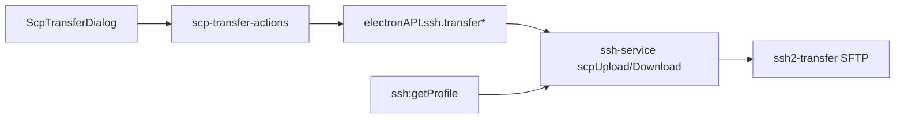
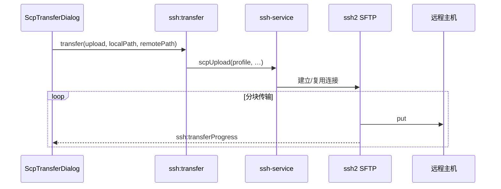

# 功能：SCP 文件传输

在 SSH 终端 Tab 中上传/下载文件，带进度与日志。

## 功能列表

- 上传本地文件/目录到远程路径
- 下载远程文件/目录到本地
- 浏览本地与远程目录列表
- 传输进度条与取消
- 依赖 ssh2 SFTP（非必须系统 `scp.exe`，但设置中可检测 PATH）

## 进程归属

| 层级 | 文件 |
|------|------|
| **主进程** | `electron/ssh2-transfer.ts`、`electron/ssh-service.ts`（`scpUpload`/`scpDownload`） |
| **渲染层** | `src/components/scp/ScpTransferDialog.tsx`、`src/lib/scp-transfer-actions.ts` |
| **日志** | `electron/scp-logger.ts` |

## 架构与数据流

### 模块架构



### 上传数据流



## 实验特性

否。

## 配置文件片段

无独立 SCP 配置块；使用 `term.json` 中当前 SSH 连接 profile 与 `settings.ssh`。

## 数据存储

- 传输任务状态：仅内存（渲染层 Dialog + 主进程进行中的 ssh2 会话）
- SCP 日志：由 `scp-logger` 写入应用日志（若 logging 已启用）

## 核心代码

### 主进程传输 API

```135:145:electron/ssh-service.ts
export async function scpUpload(/* ... */)
export async function scpDownload(/* ... */)
```

```96:103:electron/ssh-service.ts
export async function listRemoteDirectory(/* ... */)
```

IPC：`ssh:transfer`、`ssh:transferProgress`（`electron/main/index.ts`）。

### 渲染层

- 打开面板：`useAppStore` 的 `scpTransferTabId`（`src/stores/app-store.ts` 约 59–106 行）
- UI：`src/components/scp/ScpTransferDialog.tsx`
- 本地路径解析：`src/lib/scp-local-path.ts`

### App 懒加载对话框

```52:56:src/App.tsx
const ScpTransferDialog = lazy(() =>
  import('@/components/scp/ScpTransferDialog').then((m) => ({ default: m.ScpTransferDialog })),
)
```
