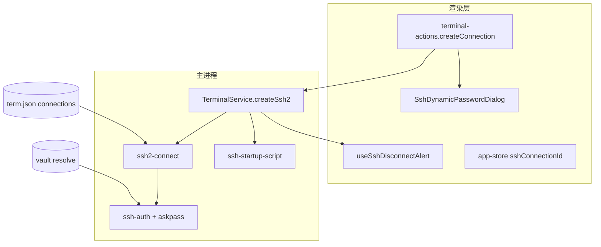
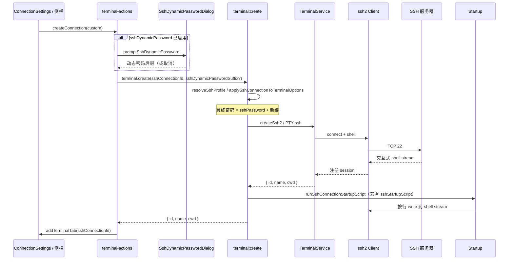
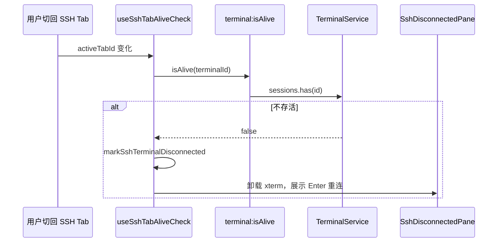

# 功能：SSH 连接

基于 ssh2 的交互式 Shell、认证与断开提醒；与系统 `ssh.exe` 可选路径检查。

## 功能列表

- 保存 SSH 主机配置（在 `term.json` 连接列表，`type: 'ssh'`）
- 密码 / 私钥 / 键盘交互认证（`ssh-askpass`）
- **动态密码**（`sshDynamicPassword`）：密码认证时可启用；连接前弹框输入服务器当前随机密码，最终登录密码 = `sshPassword`（含 Vault 解析）+ 动态密码；后缀经 `TerminalCreateOptions.sshDynamicPasswordSuffix` 临时传入，不持久化
- 交互式 Shell 会话（`TerminalService.createSsh2` 或系统 `ssh.exe`）
- **连接后脚本**：`sshStartupScript` 多行 bash，连接成功后按行依次执行（见 [功能连接管理.md](./功能连接管理.md)）
- SSH Tab 断开检测与告警（`useSshDisconnectAlert`）
- **切回 SSH Tab 存活检查**（`useSshTabAliveCheck`）：主进程 session 不存在时标记断开并展示重连 UI
- 断开后卸载 xterm/wterm（`SshDisconnectedPane`），不接收输入；按 Enter 重连
- **可配置连接超时**（`settings.ssh.connectTimeoutSeconds`，默认 10 秒）
- KEX 算法等高级选项（`settings.ssh`）
- 检查系统是否安装 `scp`（供 SCP 模块使用）

## 进程归属

| 层级 | 文件 |
|------|------|
| **主进程** | `electron/ssh-service.ts`、`electron/ssh2-connect.ts`、`electron/ssh-terminal-spawn.ts`、`electron/ssh-auth.ts`、`electron/ssh-startup-script.ts` |
| **渲染层** | `src/lib/ssh-connection.ts`、`src/lib/terminal-actions.ts`、`src/lib/ssh-dynamic-password-prompt.ts`、`src/lib/ssh-reconnect-actions.ts`、`src/hooks/useSshDisconnectAlert.ts`、`src/hooks/useSshTabAliveCheck.ts`、`src/components/terminal/SshDisconnectedPane.tsx` |
| **设置 UI** | `src/components/settings/SshSettings.tsx`、`src/components/ssh/SshDynamicPasswordDialog.tsx` |

## 架构与数据流

### 模块架构



### 建立 SSH 会话



### 断开检测



前台 Tab 内进程退出时仍由 `TerminalView` / `WterminalView` 的 `terminal:onExit` 标记断开。后台 Tab 可选 toast（`ssh.alertOnDisconnect`）。

## 实验特性

否（稳定功能）。

## 配置文件片段

`settings.json` → `ssh`：

```json
{
  "ssh": {
    "alertOnDisconnect": false,
    "scpTransferEnabled": false,
    "useBuiltinSsh2": false,
    "connectTimeoutSeconds": 10,
    "enabledKexAlgorithms": []
  }
}
```

`connectTimeoutSeconds`：OpenSSH `-o ConnectTimeout` 与 ssh2 `readyTimeout`（秒），合法范围 3–120，默认 10。亦用于 SCP/SFTP 传输连接。

类型定义：`electron/shared/ssh-settings.ts`。

连接实例保存在 `term.json` 的 `connections[]`（非 settings.json）。

## 数据存储

| 路径 | 内容 |
|------|------|
| `term.json` | SSH 连接配置（host、user、auth、`sshDynamicPassword`、`sshStartupScript` 等） |
| `settings.json` | `ssh.*` 全局 SSH 行为 |

私钥路径为本地文件路径；密钥内容与固定密码前缀可通过 Vault `${VAR}` 引用（见 [功能保险箱.md](./功能保险箱.md)）。动态密码每次连接时手动输入，**不写入** `term.json` 或 Tab 的 `terminalSpawn`。

## 核心代码

### 主进程创建 SSH PTY

```195:207:electron/terminal-service.ts
  async createSsh2(options: Ssh2TerminalCreateOptions): Promise<{
    id: string
    name: string
    shell: ShellType
    cwd: string
  }> {
```

### SSH 服务

```28:31:electron/ssh-service.ts
export function checkScpInPath(): ScpCheckResult
```

连接配置解析：`electron/main/index.ts` 中 `resolveSshProfile(connectionId, dynamicPasswordSuffix?)`（`ipcMain.handle('ssh:getProfile', ...)` 仍仅按 connectionId 解析，不含动态后缀，供 SCP 等场景使用）。

密码拼接：`electron/ssh-auth.ts` — `resolveSshConnectionPassword` / `isSshDynamicPasswordEnabled`；内置 ssh2 与系统 `ssh.exe`（`ssh-terminal-spawn.ts` → `SSH_ASKPASS`）均使用该结果。

连接后脚本：`electron/ssh-startup-script.ts`；`terminal:create` 中 `runSshConnectionStartupScript`（ssh2 与系统 ssh 两条路径均会调用）。

### 渲染层打开 SSH Tab

`src/lib/terminal-actions.ts` — `createConnection`、`applySshDynamicPasswordToCreateOptions`，设置 `sshConnectionId` 关联 Tab；动态密码弹框由 `src/lib/ssh-dynamic-password-prompt.ts` + `SshDynamicPasswordDialog`（挂载于 `App.tsx`）提供。

需再次输入动态密码的场景：新建连接、断线重连（`ssh-reconnect-actions.ts`）、拆分/克隆 Tab、超级省电恢复。**会话恢复**（`resume-term-session.ts`）对动态密码 SSH 仅恢复 Tab，切换 Tab 时由 `ssh-deferred-connect.ts` + `useSshDeferredConnectSync` 弹框并连接。

### 断开状态

`src/stores/app-store.ts` — `sshDisconnectedTerminalIds`、`markSshTerminalDisconnected`（约 61–119 行）。

### IPC（preload）

`electron/preload/index.ts` — `ssh.checkScp`、`ssh.getProfile`、`ssh.listLocal`、`ssh.transfer*`（SCP 见专文）。
