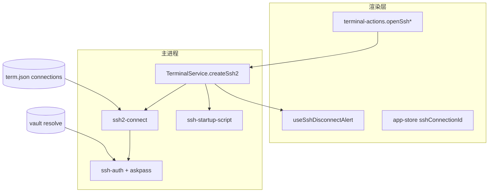
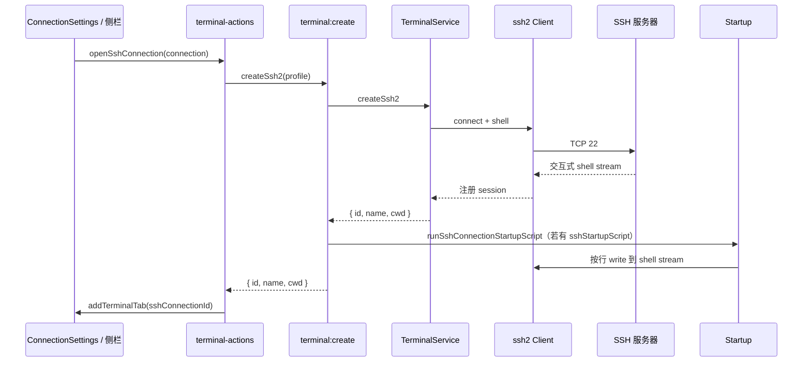
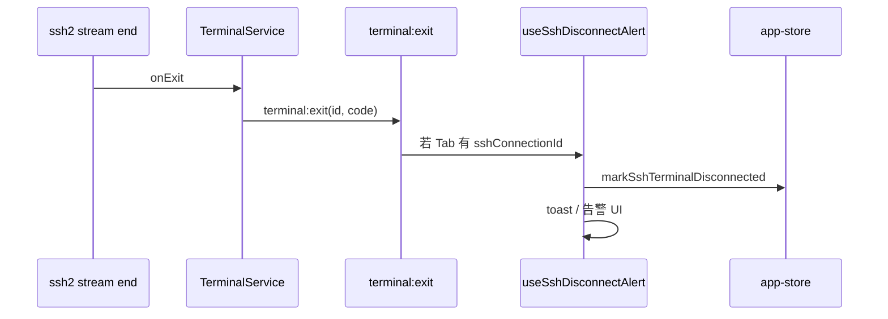

# 功能：SSH 连接

基于 ssh2 的交互式 Shell、认证与断开提醒；与系统 `ssh.exe` 可选路径检查。

## 功能列表

- 保存 SSH 主机配置（在 `term.json` 连接列表，`type: 'ssh'`）
- 密码 / 私钥 / 键盘交互认证（`ssh-askpass`）
- 交互式 Shell 会话（`TerminalService.createSsh2` 或系统 `ssh.exe`）
- **连接后脚本**：`sshStartupScript` 多行 bash，连接成功后按行依次执行（见 [功能连接管理.md](./功能连接管理.md)）
- SSH Tab 断开检测与告警（`useSshDisconnectAlert`）
- 断开后在同一 Tab 按 Enter 重连
- KEX 算法等高级选项（`settings.ssh`）
- 检查系统是否安装 `scp`（供 SCP 模块使用）

## 进程归属

| 层级 | 文件 |
|------|------|
| **主进程** | `electron/ssh-service.ts`、`electron/ssh2-connect.ts`、`electron/ssh-terminal-spawn.ts`、`electron/ssh-auth.ts`、`electron/ssh-startup-script.ts` |
| **渲染层** | `src/lib/ssh-connection.ts`、`src/hooks/useSshDisconnectAlert.ts` |
| **设置 UI** | `src/components/settings/SshSettings.tsx` |

## 架构与数据流

### 模块架构



### 建立 SSH 会话



### 断开检测



## 实验特性

否（稳定功能）。

## 配置文件片段

`settings.json` → `ssh`：

```json
{
  "ssh": {
    "defaultPort": 22,
    "keepaliveInterval": 0,
    "readyTimeout": 20000,
    "strictHostKeyChecking": false
  }
}
```

类型定义：`electron/shared/ssh-settings.ts`。

连接实例保存在 `term.json` 的 `connections[]`（非 settings.json）。

## 数据存储

| 路径 | 内容 |
|------|------|
| `term.json` | SSH 连接配置（host、user、auth、`sshStartupScript` 等） |
| `settings.json` | `ssh.*` 全局 SSH 行为 |

私钥路径为本地文件路径；密钥内容可通过 Vault `${VAR}` 引用（见 [功能保险箱.md](./功能保险箱.md)）。

## 核心代码

### 主进程创建 SSH PTY

```195:207:electron/terminal-service.ts
  async createSsh2(options: Ssh2TerminalCreateOptions): Promise<{
    id: string
    name: string
    shell: ShellType
    cwd: string
  }> {
```

### SSH 服务

```28:31:electron/ssh-service.ts
export function checkScpInPath(): ScpCheckResult
```

连接配置解析：`electron/main/index.ts` 中 `resolveSshProfile(connectionId)`（`ipcMain.handle('ssh:getProfile', ...)`）。

连接后脚本：`electron/ssh-startup-script.ts`；`terminal:create` 中 `runSshConnectionStartupScript`（ssh2 与系统 ssh 两条路径均会调用）。

### 渲染层打开 SSH Tab

`src/lib/terminal-actions.ts` — `openSshConnection(connection)` 等，设置 `sshConnectionId` 关联 Tab。

### 断开状态

`src/stores/app-store.ts` — `sshDisconnectedTerminalIds`、`markSshTerminalDisconnected`（约 61–119 行）。

### IPC（preload）

`electron/preload/index.ts` — `ssh.checkScp`、`ssh.getProfile`、`ssh.listLocal`、`ssh.transfer*`（SCP 见专文）。
