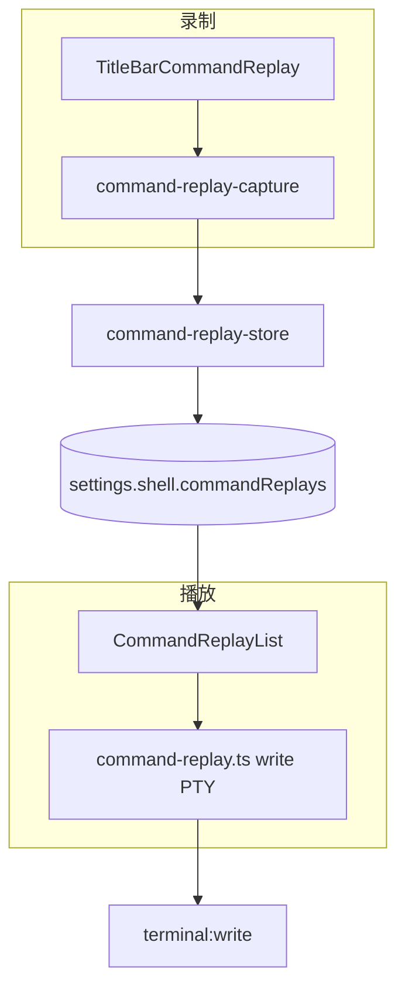
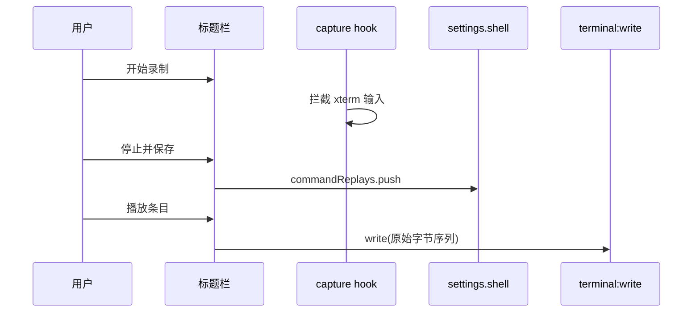

# 功能：Shell 与命令回放

终端内链接/emoji/换行行为、Tab 编号与拖拽，以及命令序列录制与一键重放。

> **Oh My Posh / posh-git 内置美化**见 [功能增强SHELL.md](./功能增强SHELL.md)。

## 功能列表

- Emoji Unicode 11 宽度表
- 高亮/单击打开 http(s) 链接
- Shift+Enter 等映射为换行（交互式 CLI）
- 侧栏终端 Tab 编号
- 长按 2s 拖拽排序 Tab
- **命令回放**：录制终端输入序列、命名保存、标题栏一键播放

## 进程归属

**渲染层**实现回放写入 PTY；列表持久化在 `settings.shell.commandReplays`。

| 文件 | 作用 |
|------|------|
| `src/components/settings/ShellSettings.tsx` | Shell 设置 + 嵌入命令回放区 |
| `src/components/command-replay/CommandReplaySettingsSection.tsx` | 回放说明 |
| `src/components/layout/TitleBarCommandReplay.tsx` | 标题栏录制/播放 UI |
| `src/stores/command-replay-store.ts` | 回放列表状态 |
| `src/lib/command-replay.ts` | 写入 PTY |
| `electron/shared/shell-settings.ts` | 类型与默认值 |

## 架构与数据流





## 实验特性

否。

## 配置文件片段

`settings.json` → `shell`：

```json
{
  "shell": {
    "emojiNativeRendering": false,
    "highlightLinks": false,
    "clickToOpenLinks": false,
    "shiftEnterNewline": false,
    "showTerminalIndex": false,
    "enableTabDrag": false,
    "commandReplays": [
      { "id": "uuid", "name": "deploy", "command": "npm run build\r" }
    ]
  }
}
```

类型：`5:30:electron/shared/shell-settings.ts`。

## 数据存储

命令回放列表存在 **`settings.json` 的 `shell.commandReplays`**，无单独文件。

## 核心代码

### Shell 设置结构

```5:30:electron/shared/shell-settings.ts
export interface ShellSettings {
  emojiNativeRendering: boolean
  highlightLinks: boolean
  clickToOpenLinks: boolean
  shiftEnterNewline: boolean
  showTerminalIndex: boolean
  enableTabDrag: boolean
  commandReplays: CommandReplayItem[]
}
```

### 标题栏命令回放

`src/components/layout/TitleBarCommandReplay.tsx` — `export function TitleBarCommandReplay`（录制开始/停止、播放、编辑）。

挂载于 `TitleBarTerminalControls`：`25:25:src/components/layout/TitleBarTerminalControls.tsx`。

### 回放项类型

```1:6:electron/shared/command-replay.ts
export interface CommandReplayItem {
  id: string
  name: string
  command: string  // 含 \r \n 等原始序列
}
```

### 终端交互辅助

`src/lib/terminal-interactive-cli.ts`、`src/lib/terminal-right-click.ts`
