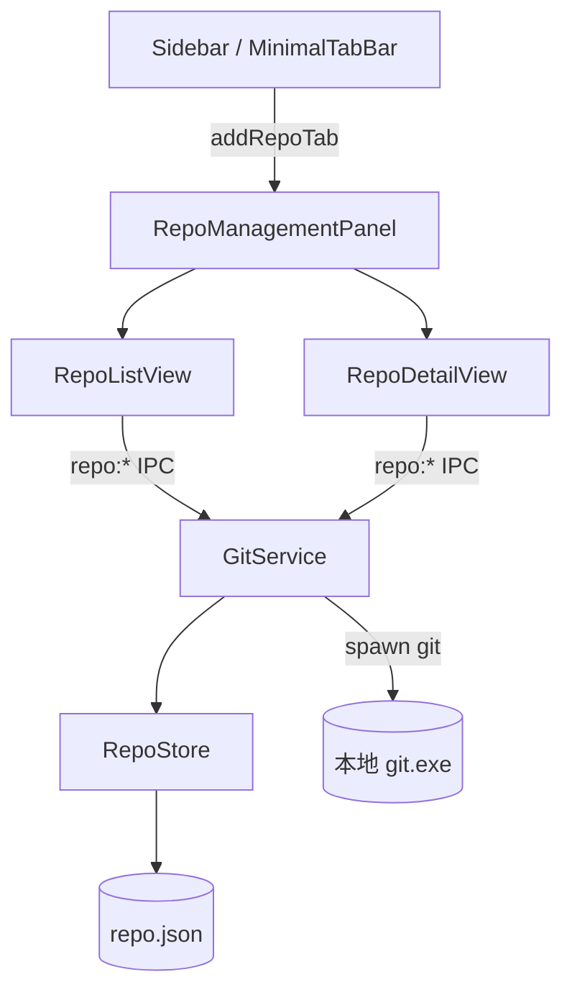
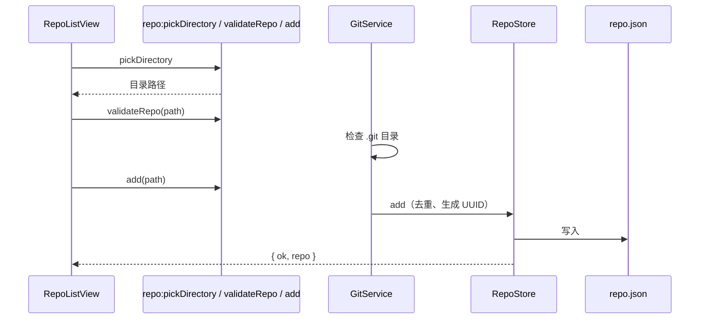
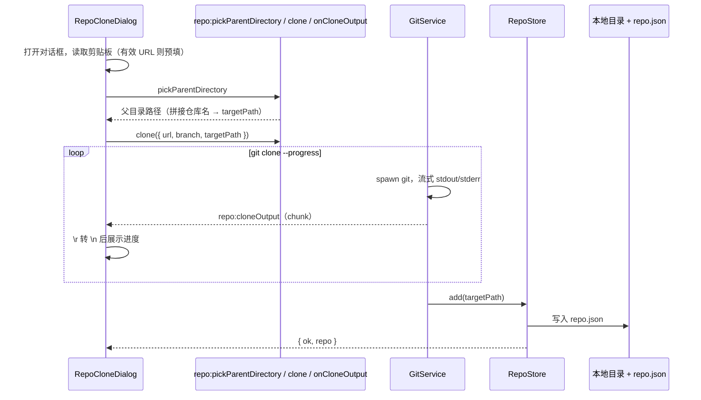
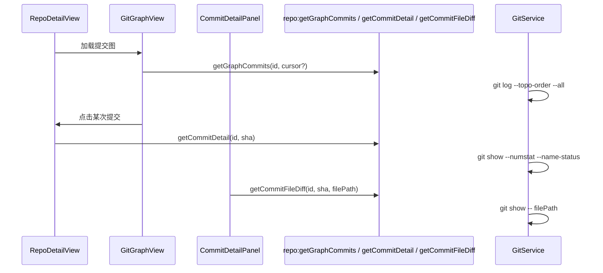

# 功能：仓库管理

本地 Git 仓库的添加、克隆、拉取、分支切换，以及提交图与 diff 浏览。

## 功能列表

- 独立「仓库管理」Tab（侧栏 / 极简栏入口，需在设置中开启）
- 添加本地 Git 仓库目录（校验 `.git` 存在、去重）
- **克隆仓库**：从远程地址 `git clone` 到本地，支持 https / git 协议；打开对话框时若剪贴板为有效仓库地址则自动填入
- 仓库卡片展示：当前分支、最近提交时间与摘要
- **更新（git pull）**：全屏遮罩提示执行进度
- **切换分支**：对话框列出本地与远程分支（`for-each-ref`），支持搜索；检出远程分支时自动创建本地跟踪分支（`git switch --track`），避免 detached HEAD
- **查看详情**：提交图 + 提交列表 + 右侧详情面板
- 提交图：拓扑排序、分支/远程/标签标注、分页加载（每页 100 条）
- 点击提交查看作者、日期、父提交、变更文件列表
- 点击变更文件查看 unified diff（`git show`）
- 从列表移除仓库（不删除磁盘目录）
- Git 未检测到时顶部横幅提示，可在设置中配置 `git.exe` 路径

## 进程归属

| 层级 | 文件 |
|------|------|
| **主进程** | `electron/git-service.ts`、`electron/repo-store.ts` |
| **渲染层** | `src/components/repo/RepoManagementPanel.tsx` 及子组件 |

## 架构与数据流

### 模块总览



### 添加仓库



### 克隆仓库



克隆对话框字段：

| 字段 | 说明 |
|------|------|
| Git 仓库地址 | `https://`、`http://`、`git://`、`git@host:path` |
| 分支 | 默认 `master`，传给 `git clone --branch` |
| 本地存储路径 | 浏览选择父目录后自动拼接仓库名（`electron/shared/git-url.ts` 解析），可手动修改 |

### 提交图与 diff



## 实验特性

否。默认关闭，需在 **设置 · 文件系统 → 仓库设置** 中开启「开启仓库管理」。

## 配置文件片段

`settings.json` → `filesystem`（与文件系统 Tab 共用同一设置页）：

```json
{
  "filesystem": {
    "repoManagementEnabled": false,
    "gitPath": ""
  }
}
```

- `repoManagementEnabled`：为 `true` 时在侧栏显示「仓库管理」入口；关闭时会自动关闭已打开的仓库 Tab
- `gitPath`：留空则自动检测 PATH 中的 `git`；也可填写 `git.exe` 完整路径

类型：`electron/shared/filesystem-settings.ts`。

## 数据存储

| 路径 | 内容 |
|------|------|
| `%USERPROFILE%\.config\NioZy\repo.json` | 已管理的仓库列表 `ManagedRepo[]` |

`repo.json` 结构：

```json
{
  "repos": [
    {
      "id": "uuid",
      "path": "D:\\projects\\my-app",
      "displayName": "my-app",
      "addedAt": 1710000000000
    }
  ]
}
```

存储类：`electron/repo-store.ts`（`getRepoFilePath()` 见 `electron/config-paths.ts`）。

## 核心代码

### 渲染层

| 组件 | 职责 |
|------|------|
| `RepoManagementPanel.tsx` | 列表 / 详情视图切换；Git 缺失横幅 |
| `RepoListView.tsx` | 仓库列表、添加 / 克隆 / 拉取 / 移除 |
| `RepoCloneDialog.tsx` | 克隆对话框（表单、剪贴板预填、实时 git 输出） |
| `RepoCard.tsx` | 单仓库卡片（分支、最近提交、操作按钮） |
| `RepoDetailView.tsx` | 详情页布局（提交图 + 详情面板） |
| `GitGraphView.tsx` | 提交图加载与分页 |
| `GitGraphCanvas.tsx` | SVG 分支线渲染 |
| `GitCommitList.tsx` | 提交行列表（与图 gutter 对齐） |
| `CommitDetailPanel.tsx` | 提交元数据、变更文件、diff 展示 |
| `BranchSwitchDialog.tsx` | 分支选择与 checkout |
| `RepoPullOverlay.tsx` | pull 时的全屏加载遮罩 |

提交图布局算法：`src/lib/git-graph-layout.ts`。

### 主进程 GitService

```132:191:electron/git-service.ts
export class GitService {
  // resolveGitPath / detectGit / validateRepo / pickDirectory / pickParentDirectory
  addRepo(path) { /* validate + RepoStore.add */ }
  removeRepo(id) { /* RepoStore.remove */ }
  clone(params, onOutput) { /* git clone --progress，流式输出，成功后 add */ }
  // listManaged / pull / listBranches / checkout
  // getGraphCommits / getCommitDetail / getCommitFileDiff
}
```

URL 解析与校验：`electron/shared/git-url.ts`（`parseRepoNameFromUrl`、`isValidGitCloneUrl`）。

### RepoStore

```38:60:electron/repo-store.ts
  add(path: string, displayName?: string): { ok: true; repo: ManagedRepo } | { ok: false; error: 'DUPLICATE' }
  remove(id: string): boolean
  findById(id: string): ManagedRepo | undefined
```

### 主进程 IPC

```1039:1078:electron/main/index.ts
ipcMain.handle('repo:detectGit', () => { /* ... */ })
ipcMain.handle('repo:pickDirectory', () => gitService.pickDirectory(mainWindow))
ipcMain.handle('repo:pickParentDirectory', () => gitService.pickParentDirectory(mainWindow))
ipcMain.handle('repo:validateRepo', (_, path) => gitService.validateRepo(path))
ipcMain.handle('repo:listManaged', () => { /* ... */ })
ipcMain.handle('repo:add', (_, path) => { /* ... */ })
ipcMain.handle('repo:remove', (_, id) => gitService.removeRepo(id))
ipcMain.handle('repo:pull', (_, id) => { /* ... */ })
ipcMain.handle('repo:clone', (_, params) => { /* 流式 send repo:cloneOutput */ })
ipcMain.handle('repo:listBranches', (_, id) => { /* ... */ })
ipcMain.handle('repo:checkout', (_, id, branch) => { /* ... */ })
ipcMain.handle('repo:getGraphCommits', (_, id, cursor) => { /* ... */ })
ipcMain.handle('repo:getCommitDetail', (_, id, sha) => { /* ... */ })
ipcMain.handle('repo:getCommitFileDiff', (_, id, sha, filePath) => { /* ... */ })
ipcMain.handle('repo:getById', (_, id) => gitService.getRepo(id) ?? null)
```

克隆进度：`repo:clone` 执行期间主进程通过 `repo:cloneOutput` 向渲染层推送 git 输出 chunk；Preload 暴露 `repo.onCloneOutput(cb)` 订阅。

每次 IPC 调用前会通过 `settingsStore.get().filesystem.gitPath` 更新 Git 路径。

### 设置 UI

`src/components/settings/FilesystemSettings.tsx` — 「仓库设置」区块：`repoManagementEnabled` 开关、`gitPath` 输入与自动检测。

### App 集成

```62:65:src/App.tsx
const RepoManagementPanel = lazy(() =>
  import('@/components/repo/RepoManagementPanel').then(/* ... */),
)
```

`useAppStore.addRepoTab` / `closeRepoTabIfPresent` — `src/stores/app-store.ts`（Tab `type: 'repo'`，固定 `id: 'repo'`）。

侧栏入口：`src/components/layout/Sidebar.tsx`、`src/components/layout/MinimalTabBar.tsx`（受 `filesystem.repoManagementEnabled` 控制）。

### 类型定义

`electron/shared/repo-types.ts` — `ManagedRepo`、`ManagedRepoSummary`、`GitCloneParams`、`GitCloneResult`、`GitGraphRow`、`GitCommitDetail` 等。

Preload 暴露：`electron/preload/index.ts` → `electronAPI.repo.*`。
