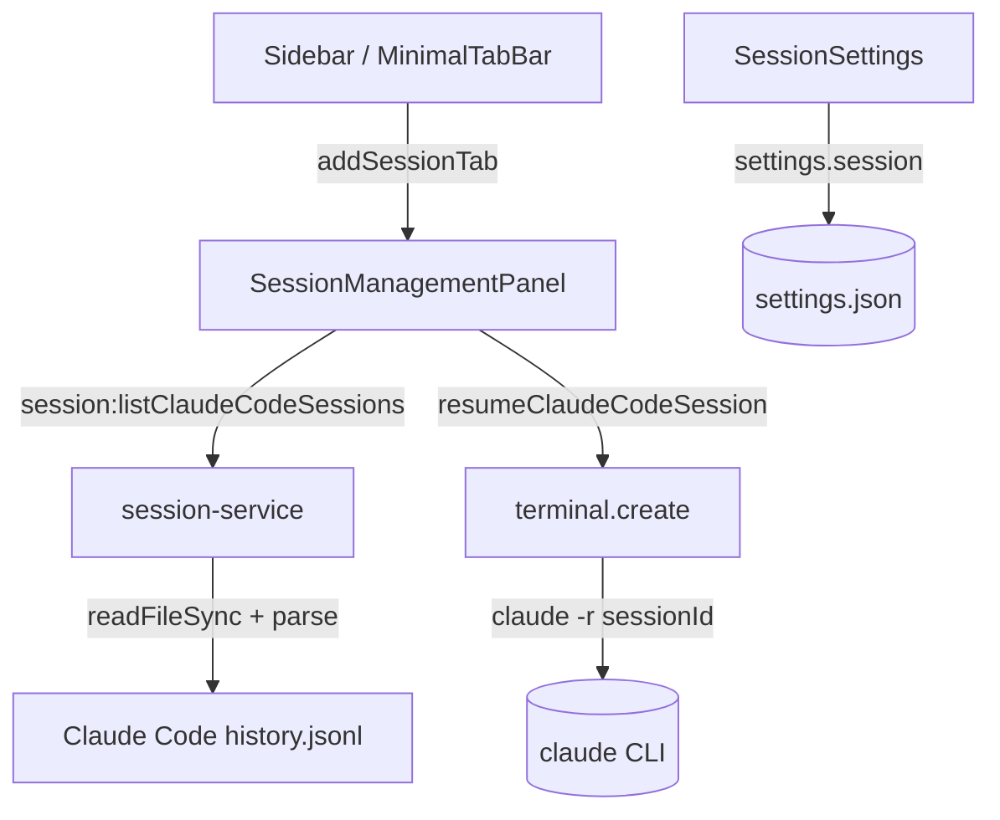
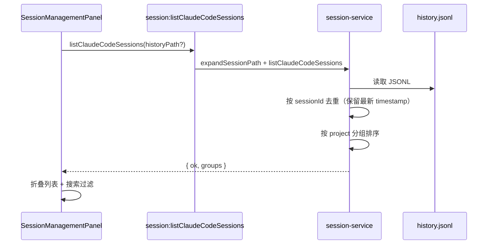
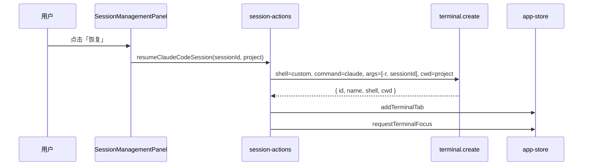

# 功能：会话管理

管理 AI 编程工具（Claude Code 等）的历史会话：按项目聚合展示、搜索筛选，并在终端 Tab 中一键恢复会话。

## 功能列表

- 独立「会话管理」Tab（侧栏 / 极简栏入口，需在设置中开启）
- **设置 → 管理会话**（位于 **AI 特性** 下方）配置各 AI 工具开关
- 开启 **Agent 会话管理** 后显示侧栏入口；关闭时自动关闭已打开的会话管理 Tab
- 开启 **Claude Code 会话管理** 后解析 `history.jsonl` 并在面板中展示
- Claude Code 会话列表路径可配置，默认 `%USERPROFILE%/.claude/history.jsonl`
- 会话管理面板顶部 Tab 切换：Claude Code / Open Code / Pi Agent / Cline / Codex（Claude Code、Open Code、Cline、Codex 使用 `src/icons/` 品牌图标；除 Claude Code 外暂未实现，置灰不可选）
- 按**项目**维度折叠分组展示会话列表
- 每行展示：会话标题（`display`）、时间（`timestamp`）、`sessionId`、**恢复** 按钮
- 支持按项目路径、标题、时间文本搜索
- 恢复会话：在项目目录下新建终端 Tab，执行 `claude -r {sessionId}`
- Open Code、Pi Agent、Cline、Codex 会话管理开关在设置中预留，当前为禁用状态

## 进程归属

| 层级 | 文件 |
|------|------|
| **主进程** | `electron/session-service.ts` |
| **共享** | `electron/shared/session-settings.ts`、`electron/shared/session-types.ts` |
| **Preload** | `electron/preload/index.ts` → `electronAPI.session.*` |
| **渲染层** | `src/components/session/SessionManagementPanel.tsx` |
| **渲染层** | `src/components/settings/SessionSettings.tsx` |
| **渲染层** | `src/components/icons/session-tool-icons.tsx`（`src/icons/` 品牌 SVG） |
| **渲染层** | `src/lib/session-actions.ts`（恢复会话 → 新建终端 Tab） |
| **布局集成** | `src/components/layout/Sidebar.tsx`、`MinimalTabBar.tsx`、`SessionTabItem.tsx` |
| **状态** | `src/stores/app-store.ts`（`type: 'session'` 单例 Tab） |

## 架构与数据流

### 模块总览



### 加载会话列表



### 恢复会话



## 实验特性

否。默认关闭，需在 **设置 → 管理会话** 中分别开启「开启 Agent 会话管理」与「开启 Claude Code 会话管理」。

## 配置文件片段

`settings.json` → `session`：

```json
{
  "session": {
    "agentSessionEnabled": false,
    "claudeCodeSessionEnabled": false,
    "claudeCodeHistoryPath": "%USERPROFILE%/.claude/history.jsonl",
    "openCodeSessionEnabled": false,
    "piAgentSessionEnabled": false,
    "clineSessionEnabled": false,
    "codexSessionEnabled": false
  }
}
```

| 字段 | 说明 |
|------|------|
| `agentSessionEnabled` | 为 `true` 时在侧栏 / 极简栏显示「会话管理」入口；关闭时自动关闭已打开的会话 Tab |
| `claudeCodeSessionEnabled` | 为 `true` 时解析 Claude Code 会话并在面板中展示 |
| `claudeCodeHistoryPath` | Claude Code 会话列表 JSONL 路径；支持 `%USERPROFILE%` 与 `~` 占位符（主进程展开） |
| `openCodeSessionEnabled` | 预留，暂未实现 |
| `piAgentSessionEnabled` | 预留，暂未实现 |
| `clineSessionEnabled` | 预留，暂未实现 |
| `codexSessionEnabled` | 预留，暂未实现 |

类型定义：`electron/shared/session-settings.ts`。

## 数据存储

| 路径 | 内容 |
|------|------|
| `%USERPROFILE%\.config\NioZy\settings.json` | `session` 配置段 |
| `%USERPROFILE%\.claude\history.jsonl` | Claude Code 默认会话历史（外部工具写入，只读） |

### Claude Code `history.jsonl` 行格式

每行一条 JSON 记录，示例：

```json
{
  "display": "/new",
  "pastedContents": {},
  "timestamp": 1778250592516,
  "project": "D:\\code\\rust\\moonlight-web-stream",
  "sessionId": "28177fb0-8c1e-4aaa-b4b7-af2ae8c3d52a"
}
```

解析规则（`electron/session-service.ts`）：

- `display` → 会话标题
- `project` → 项目路径（分组键）
- `sessionId` → 会话唯一标识（恢复命令参数）
- `timestamp` → 毫秒时间戳；同一 `sessionId` 出现多行时保留时间最新的一条
- 无效行、缺少 `sessionId` 的行跳过

## 核心代码

### 渲染层

| 组件 / 模块 | 职责 |
|-------------|------|
| `SessionSettings.tsx` | 设置 UI：总开关、Claude Code 开关与路径、Open Code / Pi Agent / Cline / Codex 预留开关 |
| `SessionManagementPanel.tsx` | 面板：工具 Tab（含品牌图标）、搜索栏、按项目折叠列表、恢复按钮 |
| `SessionTabItem.tsx` | 侧栏会话管理 Tab 行 |
| `session-actions.ts` | `resumeClaudeCodeSession`：调用 `terminal.create` 并新建 Tab |

面板 UI 使用 `useUiClasses()` 适配各 UI 风格（见 [功能外观与布局.md](./功能外观与布局.md)）；列表区域使用普通文档流布局以支持滚动（避免 `AnimatedLoadingSwap` 在绝对定位下高度塌陷）。

### 主进程 session-service

```typescript
// expandSessionPath：%USERPROFILE% / ~ → 实际用户目录（仅主进程）
// listClaudeCodeSessions(historyPath)：读取 JSONL → 去重 → 按 project 分组
```

### 主进程 IPC

```1546:1553:electron/main/index.ts
ipcMain.handle('session:listClaudeCodeSessions', (_, historyPath?: string) => {
  const settings = settingsStore.get()
  const path =
    typeof historyPath === 'string' && historyPath.trim()
      ? historyPath.trim()
      : settings.session.claudeCodeHistoryPath
  return listClaudeCodeSessions(path)
})
```

Preload 暴露：`electron/preload/index.ts` → `electronAPI.session.listClaudeCodeSessions`。

### App 集成

- `src/App.tsx`：lazy 加载 `SessionManagementPanel`，经 `AnimatedTabPanel` 挂载
- `useAppStore.addSessionTab` / `closeSessionTabIfPresent`：Tab `type: 'session'`，固定 `id: 'session'`
- `src/lib/tab-groups.ts`：`session` 为单例 Tab 类型

侧栏入口：`Sidebar.tsx`、`MinimalTabBar.tsx`（受 `session.agentSessionEnabled` 控制）。

### 类型定义

`electron/shared/session-types.ts` — `SessionTool`、`ClaudeCodeSessionEntry`、`ProjectSessionGroup`、`ListClaudeCodeSessionsResult`。

### 品牌图标（`src/icons/`）

| 工具 | 源文件 | React 组件 |
|------|--------|------------|
| Claude Code | `claudecode-color.svg` | `ClaudeCodeIcon` |
| Open Code | `opencode.svg` | `OpenCodeIcon` |
| Pi Agent | —（暂无品牌 SVG） | `PiAgentIcon`（Lucide `Bot`） |
| Cline | `cline.svg` | `ClineIcon` |
| Codex | `codex-color.svg` | `CodexIcon` |

封装于 `src/components/icons/session-tool-icons.tsx`，用于设置页 `SettingField` 与会话管理面板 Tab。

## 注意事项

- `electron/shared/session-settings.ts` 不得引用 Node 内置模块（如 `os`），以免被渲染层打包；路径展开逻辑仅在 `electron/session-service.ts`（主进程）中执行。
- 恢复会话依赖系统 PATH 中的 `claude` 命令；若未安装 Claude Code CLI，终端 Tab 会启动失败并弹出错误提示。
- 恢复时若会话记录含 `project` 路径，终端将在该目录下启动（`cwd`）。
- Open Code、Pi Agent、Cline、Codex 的解析与恢复逻辑尚未实现，设置中对应开关为禁用状态。
