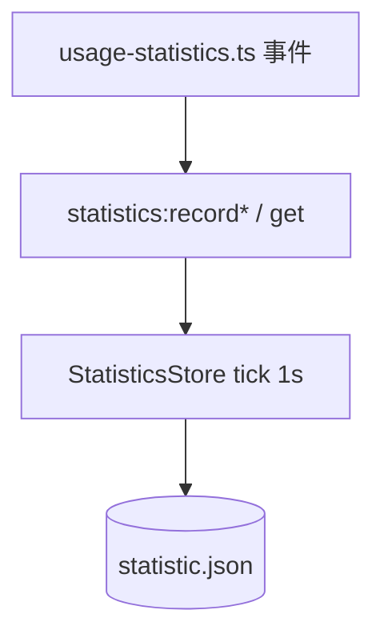
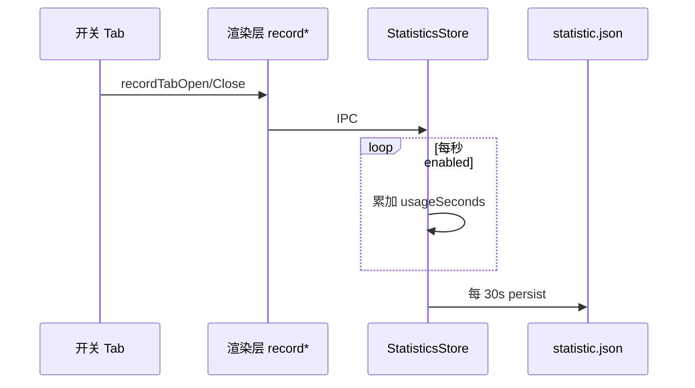

# 功能：使用统计

本地记录使用时长、Tab 开关次数、终端命令提交次数（可选）。

## 功能列表

- 启用/禁用统计
- 状态栏或标题栏入口查看汇总
- 按日聚合 counters
- 清空统计数据
- 主进程每秒 tick + 定期落盘

## 进程归属

| 层级 | 文件 |
|------|------|
| **主进程** | `electron/statistics-store.ts` |
| **渲染层** | `src/lib/usage-statistics.ts`、`src/components/layout/UsageStatisticsDialog.tsx`、`StatisticsSettings.tsx` |
| **共享** | `electron/shared/usage-statistics-data.ts`、`usage-statistics-settings.ts` |

## 架构与数据流





## 实验特性

否。

## 配置文件片段

```json
{
  "statistics": {
    "enabled": false,
    "showStatusBar": true
  }
}
```

## 数据存储

| 路径 | 内容 |
|------|------|
| `%USERPROFILE%\.config\NioZy\statistic.json` | 按日 usage 数据 |

```31:33:electron/config-paths.ts
export function getStatisticFilePath(): string {
  return join(getConfigDir(), 'statistic.json')
}
```

## 核心代码

### StatisticsStore

```16:48:electron/statistics-store.ts
export class StatisticsStore {
  load(): void  // 读 statistic.json
  getSnapshot(): UsageStatisticData
  clear(): void
  recordTabOpen(): void
```

持久化间隔 `PERSIST_MS = 30_000`（同文件约 14 行）。

### IPC

```894:897:electron/main/index.ts
ipcMain.handle('statistics:get', () => statisticsStore.getSnapshot())
ipcMain.on('statistics:recordTabOpen', () => statisticsStore.recordTabOpen())
ipcMain.handle('statistics:clear', () => { /* ... */ })
```

### 渲染层记录

`src/lib/usage-statistics.ts` — `recordTerminalTabOpened` / `recordTerminalTabClosed`；在 `app-store` 增删 Tab 时调用。

### 标题栏入口

`TitleBarTerminalControls` — `showUsageStatistics` 条件渲染（约 60–62 行）。
