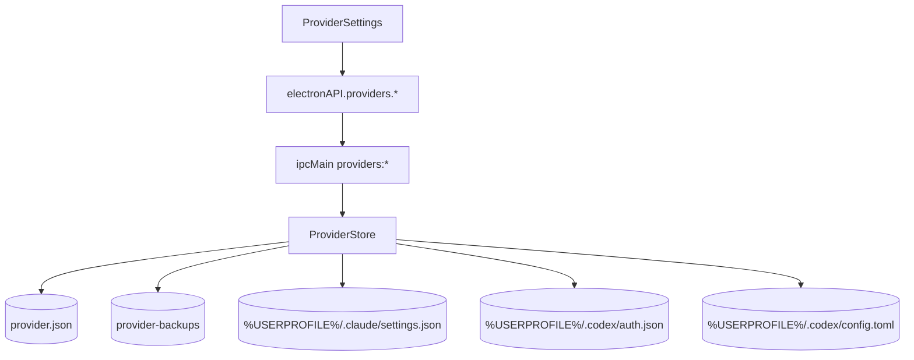

# 功能：供应商配置

为 Claude Code 与 Codex 提供本地“供应商配置”管理：在设置页内集中维护多个配置档，按工具切换、编辑、启用，并将所选配置写回对应工具的本地配置文件。

## 功能列表

- 设置页新增 **供应商配置 / Provider** 菜单，位置在 **工作区** 下方
- 顶部使用分段式切换栏，支持 **Claude Code**、**Codex**，图标与会话管理保持一致
- 同一页面内支持 **新增 / 编辑 / 删除 / 启用** 供应商
- 供应商数据独立持久化到 `configPath/provider.json`
- 默认不启用任何供应商；点击 **启用** 后才会应用到目标工具配置
- 首次打开且尚未创建供应商时：
  - 若检测到 Claude Code / Codex 现有配置文件
  - 先备份到 `provider-backups`
  - 再导入为“初始供应商”，便于后续恢复
- Claude Code 编辑弹框支持：
  - 表单化编辑 `API Key`、`Base URL`、默认模型
  - `Sonnet / Opus / Haiku / Fable` 模型映射
  - 认证字段下拉：`ANTHROPIC_AUTH_TOKEN` / `ANTHROPIC_API_KEY`
  - 底部保留 `settings.json` 原始数据区域
  - 表单与原始 JSON 双向同步
- Codex 当前使用原始文件编辑方式：
  - `auth.json`
  - `config.toml`

## 进程归属

| 层级 | 文件 |
|------|------|
| **主进程** | `electron/provider-store.ts` |
| **共享类型** | `electron/shared/provider-types.ts` |
| **共享 API** | `electron/shared/api-types.ts` |
| **Preload** | `electron/preload/index.ts` → `electronAPI.providers.*` |
| **主进程 IPC** | `electron/main/index.ts` |
| **路径管理** | `electron/config-paths.ts` |
| **设置入口** | `src/components/settings/SettingsPanel.tsx` |
| **渲染层** | `src/components/settings/ProviderSettings.tsx` |
| **浏览器 mock** | `src/lib/electron-browser-mock.ts` |
| **文案** | `src/locales/zh.json`、`en.json`、`ja.json` |

## 配置与落盘

### NioZy 自身配置

| 路径 | 说明 |
|------|------|
| `%USERPROFILE%/.config/NioZy/provider.json` | 供应商配置主文件 |
| `%USERPROFILE%/.config/NioZy/provider-backups/` | 首次导入时的原始配置备份目录 |

### 目标工具配置

| 工具 | 应用目标 |
|------|----------|
| Claude Code | `%USERPROFILE%/.claude/settings.json` |
| Codex | `%USERPROFILE%/.codex/auth.json`、`%USERPROFILE%/.codex/config.toml` |

## 数据结构

`provider.json` 保存内容包括：

- `activeProviderIds`
  - 当前每个工具已启用的供应商 id
- `providers`
  - 供应商列表
- 每个供应商包含：
  - `id`
  - `tool`
  - `name`
  - `files`
  - `createdAt`
  - `updatedAt`
  - `importedFromExisting`
  - `backupDir`

其中 `files` 为目标配置文件内容快照：

- Claude Code：
  - `claudeSettings` → `settings.json`
- Codex：
  - `codexAuth` → `auth.json`
  - `codexConfig` → `config.toml`

## Claude Code 表单字段

表单最终会生成 `settings.json`，当前支持：

```json
{
  "ANTHROPIC_AUTH_TOKEN": "...",
  "ANTHROPIC_BASE_URL": "https://api.codexzh.com",
  "ANTHROPIC_DEFAULT_FABLE_MODEL": "cc-gpt-5.4",
  "ANTHROPIC_DEFAULT_FABLE_MODEL_NAME": "cc-gpt-5.4",
  "ANTHROPIC_DEFAULT_HAIKU_MODEL": "cc-gpt-5.4",
  "ANTHROPIC_DEFAULT_HAIKU_MODEL_NAME": "cc-gpt-5.4",
  "ANTHROPIC_DEFAULT_OPUS_MODEL": "cc-gpt-5.4",
  "ANTHROPIC_DEFAULT_OPUS_MODEL_NAME": "cc-gpt-5.4",
  "ANTHROPIC_DEFAULT_SONNET_MODEL": "cc-gpt-5.4",
  "ANTHROPIC_DEFAULT_SONNET_MODEL_NAME": "cc-gpt-5.4",
  "ANTHROPIC_MODEL": "cc-gpt-5.4"
}
```

认证字段支持两种写法：

- `ANTHROPIC_AUTH_TOKEN`
- `ANTHROPIC_API_KEY`

若用户直接修改原始 JSON：

- JSON 合法时，表单自动回填
- JSON 非法时，仅保留原始文本并提示格式错误

## 数据流



## 启用逻辑

1. 用户在设置页选择某个供应商
2. 点击 **启用**
3. 渲染层调用 `electronAPI.providers.activate(id)`
4. 主进程 `ProviderStore.activateProvider()`：
   - 根据 `tool` 找到目标文件路径
   - 将供应商保存的文件内容写回工具配置
   - 更新 `activeProviderIds`
   - 持久化到 `provider.json`

## 注意事项

- Provider 配置独立于 `settings.json`，避免和应用通用设置混在一起
- 只有点击 **启用** 才会覆盖 Claude Code / Codex 的实际配置文件
- 初始导入仅在“供应商列表为空”时触发一次
- Codex 当前仍以原始文件编辑为主，后续若需要可继续做表单化
- 本功能目前未接入远程验证或测速，仅负责本地配置管理与切换
