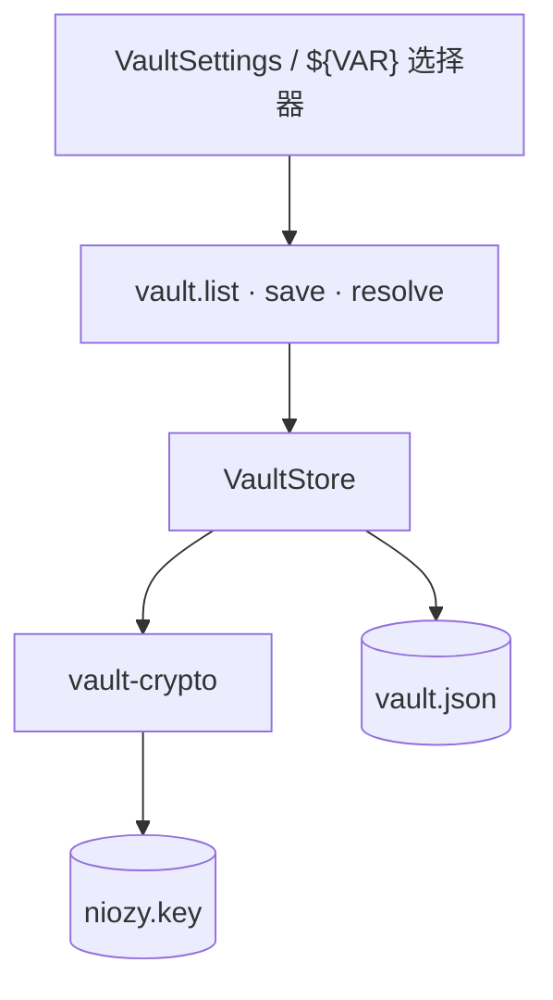
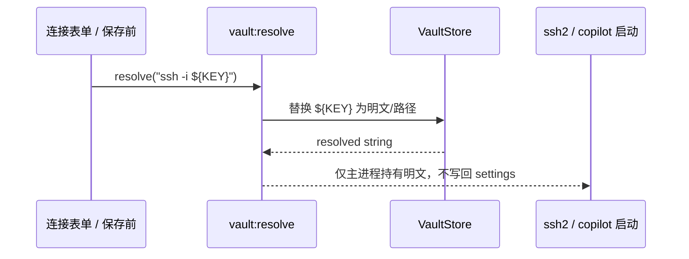

# 功能：保险箱（Vault）

加密/明文变量库，在连接字符串、AI API Key 等处以 `${VAR_NAME}` 引用。

## 功能列表

- 变量增删改（`plain` / `secret`）
- 密文变量 AES 加密存储
- 主进程解析 `${KEY}` 占位符
- 设置页变量选择器（`VaultVariablePicker`）
- 导出设置时不包含明文密钥（sanitized）

## 进程归属

| 层级 | 文件 |
|------|------|
| **主进程** | `electron/vault-store.ts`、`electron/vault-crypto.ts` |
| **渲染层** | `src/components/settings/VaultSettings.tsx`、`TextareaWithVaultPicker.tsx` |

## 架构与数据流

### 模块架构



### 解析占位符（连接/AI Key）



## 实验特性

否。

## 配置文件片段

Vault 数据**不在** `settings.json`，独立文件。

## 数据存储

| 路径 | 内容 |
|------|------|
| `%USERPROFILE%\.config\NioZy\vault.json` | `{ "variables": [{ id, key, type, value }] }` |
| `%USERPROFILE%\.config\NioZy\niozy.key` | 加密主密钥材料 |

```19:25:electron/config-paths.ts
export function getVaultFilePath(): string {
  return join(getConfigDir(), 'vault.json')
}
export function getVaultKeyFilePath(): string {
  return join(getConfigDir(), 'niozy.key')
}
```

## 核心代码

### VaultStore

```28:45:electron/vault-store.ts
export class VaultStore {
  load(): VaultVariablePublic[]
  // read vault.json, decrypt secret types
```

```51:56:electron/vault-store.ts
  save(input: { id?, key, type, value? }): VaultVariablePublic
```

### 引用解析

`electron/shared/vault-reference.ts` — `${VAR}` 正则与替换。

IPC（preload）：`vault.list`、`vault.save`、`vault.remove`、`vault.resolve`（`124:130:electron/preload/index.ts`）。

### 设置 UI

`src/components/settings/VaultSettings.tsx`
