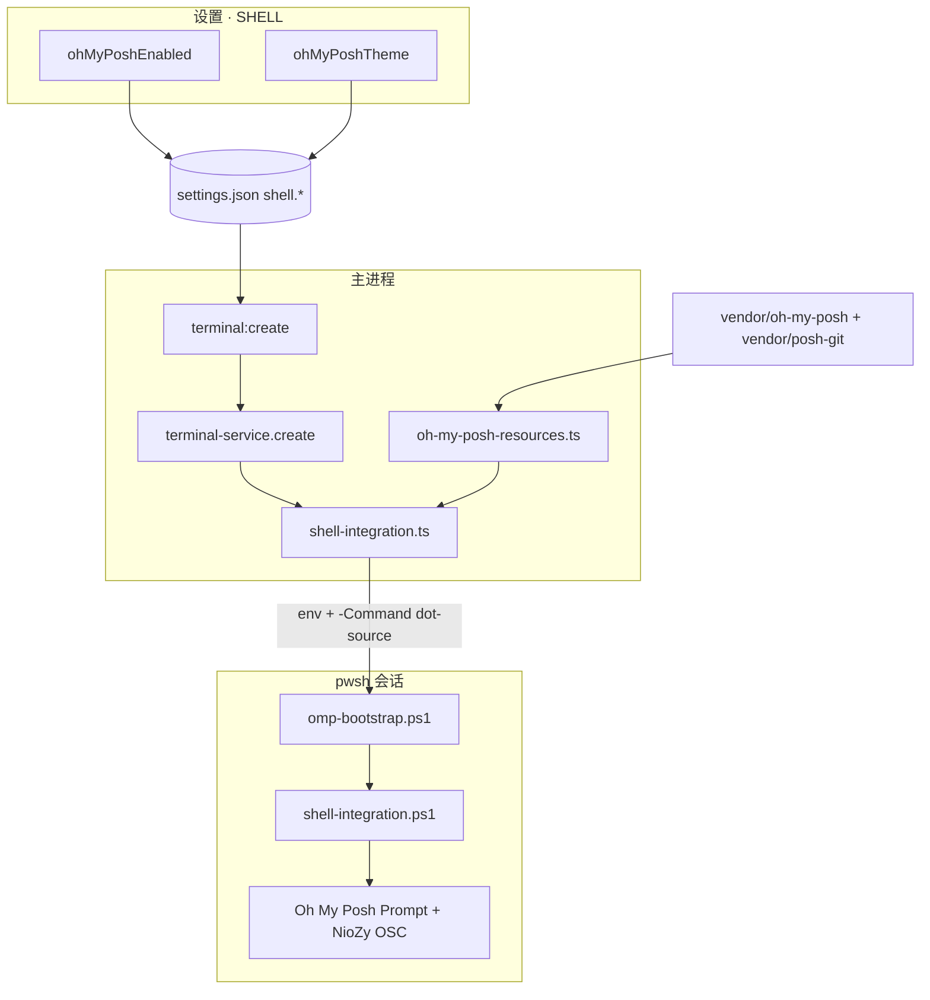
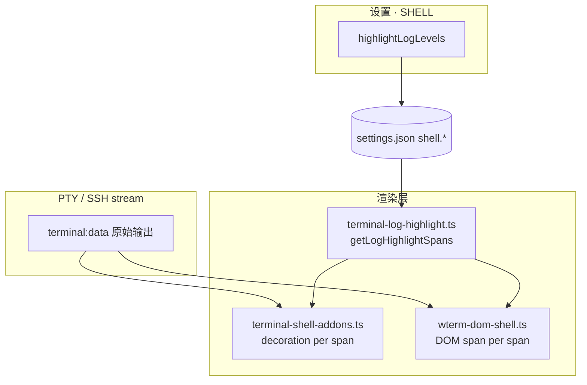
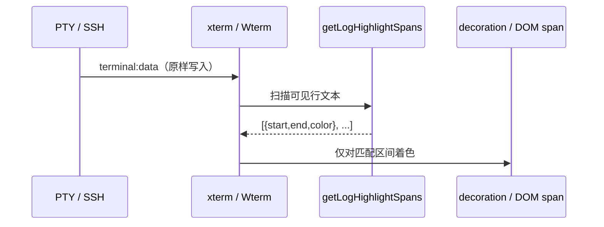
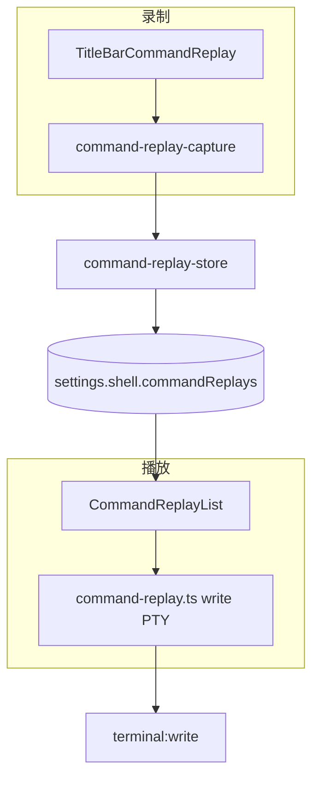
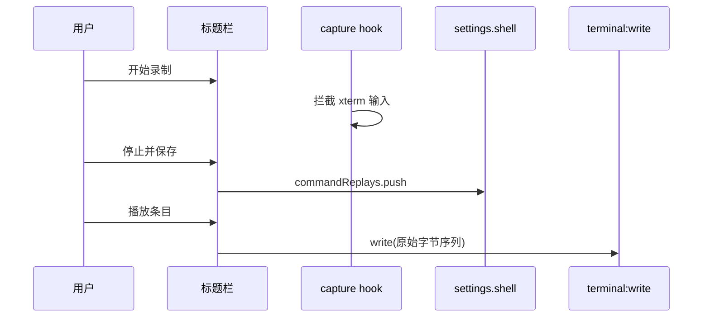
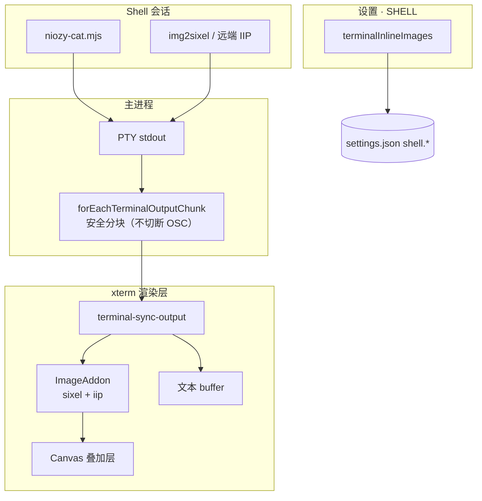
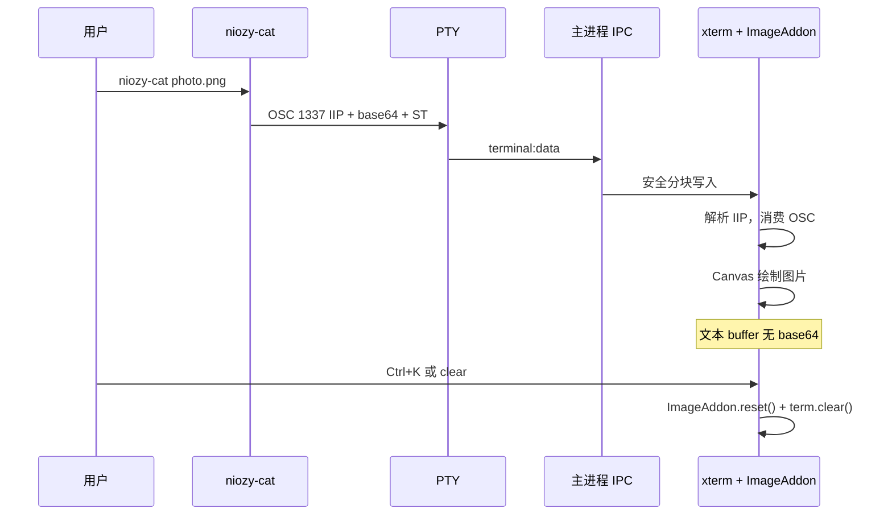

# 功能：增强 SHELL

**设置 · SHELL** 分区下的终端增强能力：链接与 Emoji 渲染、终端内联图片（SIXEL / iTerm IIP）、交互式 CLI 快捷换行、侧栏 Tab 交互、Oh My Posh 提示符美化、日志关键词着色，以及命令序列录制与一键重放。

> **重启恢复终端会话**（`restoreTerminalSessionOnRestart`）见 [SHELL.md](./SHELL.md)。

## 功能总览

| 类别 | 能力 |
|------|------|
| 终端交互 | Emoji Unicode 11 宽度表；高亮 / 单击打开 http(s) 链接；Shift+Enter / Ctrl+Enter 快捷换行（交互式 CLI）；侧栏 Tab 编号；长按 2s 拖拽排序 |
| 内联图片 | `@xterm/addon-image` 解析 SIXEL 与 iTerm IIP；内置 `niozy-cat` 命令；Ctrl+K / clear 清除 |
| 提示符美化 | 离线内置 Oh My Posh + posh-git（仅 pwsh） |
| 输出增强 | 日志级别关键词着色（MobaXterm 风格） |
| 命令回放 | 录制终端输入序列、命名保存、标题栏一键播放 |

统一类型与默认值：`electron/shared/shell-settings.ts`；设置 UI：`src/components/settings/ShellSettings.tsx`。

---

## 一、终端交互（链接 / Emoji / 快捷换行 / Tab）

在**渲染层**增强终端展示与输入行为，不修改 PTY 原始输出（链接高亮、日志着色除外，均为展示层）。

### 功能列表

- **Emoji 原生宽度**：`emojiNativeRendering` — Unicode 11 宽度表，正确渲染 emoji 等宽字符
- **链接高亮**：`highlightLinks` — 高亮终端输出中的 http / https 链接
- **单击打开链接**：`clickToOpenLinks` — 用系统默认浏览器打开链接
- **快捷换行**：`shiftEnterNewline` — 在交互式 CLI（Claude Code、Cursor agent 等）中，Shift+Enter / Ctrl+Enter 插入换行，Enter 提交；点击输出区不将光标移到屏幕末尾；TUI 中 Shift+左键拖选后自动复制
- **终端 Tab 编号**：`showTerminalIndex` — 侧栏 Tab 名称左侧显示序号
- **Tab 拖拽排序**：`enableTabDrag` — 长按侧栏 Tab 2s 进入拖拽模式

### 进程归属

| 文件 | 作用 |
|------|------|
| `src/components/settings/ShellSettings.tsx` | 上述开关 UI |
| `src/lib/terminal-shell-addons.ts` | xterm 链接高亮、日志着色 decoration |
| `src/lib/wterm-dom-shell.ts` | Wterm 链接高亮、日志着色 DOM span、交互式 CLI 鼠标 |
| `src/lib/terminal-shortcut-actions.ts` | 修饰键 + Enter → Kitty `CSI 13;2u` |
| `src/lib/terminal-interactive-cli.ts` | xterm 备用屏单击 / Shift 拖选 |
| `src/lib/terminal-right-click.ts` | 右键复制 / 粘贴 |
| `src/components/terminal/TerminalView.tsx` | xterm 挂载快捷键与交互逻辑 |
| `src/components/terminal/WterminalView.tsx` | Wterm 挂载快捷键（含内部 textarea capture） |

### 快捷换行原理

xterm.js / Wterm 默认将修饰键 + Enter 与裸 Enter 均发送 `\r`，交互式 CLI 无法区分「换行」与「提交」。开启 `shiftEnterNewline` 后，在键盘 `keydown` 阶段拦截**任意修饰键 + Enter**（Shift、Ctrl、Ctrl+Shift 等），统一写入 Kitty 序列 `\x1b[13;2u`。

| 按键 | 未开启时终端发送 | 开启后 NioZy 发送 |
|------|-----------------|------------------|
| Enter | `\r` | `\r`（不拦截，仍为提交） |
| Shift+Enter | `\r` | `\x1b[13;2u`（换行） |
| Ctrl+Enter | `\r` | `\x1b[13;2u`（换行，映射为与 Shift 相同序列） |

Claude Code 等将 `CSI 13;2u` 绑定为 `chat:newline`；`CSI 13;5u`（原生 Ctrl+Enter）未被识别，故 Ctrl+Enter 也映射为 `13;2u`。

Wterm 内置 `@wterm/dom` 的 `input.js` 仅原生处理 Shift+Enter；Ctrl+Enter 会落入 `FIXED_KEYS.Enter` → `\r`。因此在 `textarea` 上以 **capture** 阶段抢先拦截，并 `stopImmediatePropagation()`，避免与 Wterm 内部处理器冲突。

### 快捷换行核心代码

**拦截并写入 PTY** — `src/lib/terminal-shortcut-actions.ts`：

```typescript
const INTERACTIVE_CLI_NEWLINE_SEQUENCE = '\x1b[13;2u'

export function handleTerminalModifiedEnterKey(
  terminalId: string,
  event: KeyboardEvent,
  enabled: boolean,
): boolean {
  if (!enabled || event.type !== 'keydown' || !isEnterKey(event)) return false
  if (kittyEnterModifier(event) === null) return false

  event.preventDefault()
  writeTerminalInput(terminalId, INTERACTIVE_CLI_NEWLINE_SEQUENCE)
  return true
}
```

`isEnterKey` 同时识别 `Enter` 与 `NumpadEnter`；`kittyEnterModifier` 检测是否存在 Shift / Ctrl / Alt / Meta 修饰。

**xterm 挂载** — `src/components/terminal/TerminalView.tsx`，`attachCustomKeyEventHandler` 内调用；返回 `false` 阻止 xterm 默认发送 `\r`：

```typescript
if (handleTerminalModifiedEnterKey(terminalId, event, shell.shiftEnterNewline)) {
  return false
}
```

**Wterm 挂载** — `src/components/terminal/WterminalView.tsx`，在 `instance.element` 与内部 `textarea` 上均注册 capture `keydown`；处理成功后 `stopImmediatePropagation()`：

```typescript
const keyTargets: EventTarget[] = [instance.element]
const textarea = instance.element.querySelector('textarea')
if (textarea) keyTargets.push(textarea)

for (const target of keyTargets) {
  target.addEventListener('keydown', onKeyDown, { capture: true })
}
```

**交互式 CLI 鼠标行为**（非换行本身，但与同开关联动）— `src/lib/terminal-interactive-cli.ts`：`applyInteractiveCliTerminalOptions` 关闭 `altClickMovesCursor`；备用屏单击不抢焦点，Shift+拖选后复制。

设置键：`electron/shared/shell-settings.ts` → `shiftEnterNewline: boolean`（默认 `false`）。

### 实验特性

否（稳定功能）。

---

## 二、Oh My Posh

在 NioZy 内为 **pwsh** 终端离线内置 **Oh My Posh** 与 **posh-git**，通过会话级脚本注入美化提示符，无需用户全局安装或修改 `$PROFILE`。

### 功能列表

- **启用 Oh My Posh**：开关控制是否在 pwsh 会话中注入美化
- **主题选择**：19 个内置热门主题下拉切换
- **posh-git**：随 OMP 一并 `Import-Module`，在 Git 仓库目录显示分支/脏状态（需系统 PATH 有 `git.exe`）
- **离线内置**：可执行文件与主题随安装包分发，不依赖 winget / Install-Module / 联网
- **沙箱注入**：仅 NioZy 内终端生效，不修改用户主目录 Profile
- **与 Shell 集成协同**：OMP 先初始化 Prompt，再由 `shell-integration.ps1` 包装 CWD OSC 同步

### 生效范围

| 条件 | 是否注入 OMP |
|------|-------------|
| Shell 为 `pwsh` | ✅ |
| `shell.ohMyPoshEnabled === true` | ✅ |
| 内置资源齐全（exe + posh-git + 主题） | ✅ |
| Windows PowerShell 5.1（`powershell`） | ❌ |
| 管理员提升终端（UAC） | ❌ |
| SSH / 自定义 Shell | ❌ |

主题或开关变更后，需 **新建 pwsh 终端** 才生效；已打开 Tab 不会热更新。

### 进程归属

**主进程**负责资源路径解析、环境变量与启动参数注入；**渲染层**仅提供设置 UI。

| 文件 | 作用 |
|------|------|
| `src/components/settings/ShellSettings.tsx` | OMP 开关 + 主题下拉 |
| `electron/shared/shell-settings.ts` | `ohMyPoshEnabled` / `ohMyPoshTheme` 类型与归一化 |
| `electron/shared/oh-my-posh-themes.json` | 内置主题列表（单一数据源） |
| `electron/shared/oh-my-posh-themes.ts` | 主题 ID 类型、`normalizeOhMyPoshTheme` |
| `electron/oh-my-posh-resources.ts` | 开发/打包环境下资源路径解析 |
| `electron/shell-integration.ts` | 串联 `omp-bootstrap.ps1` → `shell-integration.ps1` |
| `electron/scripts/omp-bootstrap.ps1` | 加载 posh-git + `oh-my-posh init pwsh` |
| `electron/scripts/shell-integration.ps1` | CWD OSC；包装已有 Prompt |
| `electron/terminal-service.ts` | 创建 PTY 时合并 env 与启动参数 |
| `electron/main/index.ts` | `terminal:create` 时从设置传入 OMP 选项 |
| `scripts/vendor-oh-my-posh.mjs` | 构建前下载 exe、主题、posh-git |
| `electron-builder.yml` | `extraResources` 打入 `oh-my-posh` / `posh-git` |

### 架构与数据流



```mermaid
sequenceDiagram
  participant User as 用户
  participant UI as ShellSettings
  participant Main as terminal:create
  participant PTY as pwsh
  participant OMP as omp-bootstrap.ps1
  participant Nio as shell-integration.ps1

  User->>UI: 开启 OMP + 选主题
  UI->>Main: 保存 settings.shell
  User->>Main: 新建 pwsh 终端
  Main->>PTY: spawn + env(NIOZY_OMP_*)
  Main->>PTY: -Command & { . omp-bootstrap; . shell-integration }
  PTY->>OMP: dot-source
  OMP->>OMP: Import-Module posh-git
  OMP->>OMP: oh-my-posh init pwsh --config theme
  PTY->>Nio: dot-source
  Nio->>Nio: 包装 Prompt → 发 OSC 7 / 633
```

#### Prompt 链顺序

1. `omp-bootstrap.ps1`：`oh-my-posh init` 替换 `$function:Prompt`
2. `shell-integration.ps1`：保存当前 Prompt 为 `NioZyOriginalPrompt`，外层发送工作目录 OSC

必须先 OMP、后 NioZy，否则 CWD 同步会被覆盖。

### 内置资源与构建

#### 目录结构（开发态）

```
vendor/
  oh-my-posh/
    oh-my-posh.exe          # GitHub Release 下载，不提交 git
    themes/*.omp.json       # 19 个主题 JSON，不提交 git
    .vendor-version         # 版本标记，不提交 git
  posh-git/
    posh-git.psd1           # 模块文件，不提交 git
    ...
```

#### 自动下载

| npm 生命周期 | 命令 |
|-------------|------|
| `prestart` | `npm run vendor:oh-my-posh`（`start` / `dev` 前） |
| `prebuild` | `npm run vendor:oh-my-posh`（`build` / `dist` 前） |

手动执行：`npm run vendor:oh-my-posh`

当前固定版本（`scripts/vendor-oh-my-posh.mjs`）：

- Oh My Posh **v26.1.0**（`posh-windows-amd64.exe` → `oh-my-posh.exe`）
- posh-git **v1.1.0**

脚本读取 `electron/shared/oh-my-posh-themes.json` 下载全部主题；`.vendor-version` 与文件齐全时跳过重复下载。

#### 打包布局（`extraResources`）

安装后位于 `resources/`（asar 外，PowerShell 可直接访问）：

```
resources/
  omp-bootstrap.ps1
  shell-integration.ps1
  oh-my-posh/oh-my-posh.exe
  oh-my-posh/themes/*.omp.json
  posh-git/posh-git.psd1
```

### 内置主题

主题定义见 `electron/shared/oh-my-posh-themes.json`，默认 `jandedobbeleer`。

| ID | 显示名 |
|----|--------|
| `jandedobbeleer` | Jan De Dobbeleer（默认） |
| `powerlevel10k_modern` | Powerlevel10k Modern |
| `powerlevel10k_lean` | Powerlevel10k Lean |
| `powerlevel10k_rainbow` | Powerlevel10k Rainbow |
| `agnoster` | Agnoster |
| `paradox` | Paradox |
| `pure` | Pure |
| `dracula` | Dracula |
| `catppuccin_mocha` | Catppuccin Mocha |
| `catppuccin_latte` | Catppuccin Latte |
| `gruvbox` | Gruvbox |
| `night-owl` | Night Owl |
| `tokyo` | Tokyo |
| `tokyonight_storm` | Tokyo Night Storm |
| `spaceship` | Spaceship |
| `robbyrussell` | Robby Russell |
| `atomic` | Atomic |
| `cobalt2` | Cobalt2 |
| `material` | Material |

所选主题文件缺失时，回退到 `jandedobbeleer.omp.json`。

扩展主题：在 `oh-my-posh-themes.json` 增加条目并同步 `oh-my-posh-themes.ts` 中的 `OhMyPoshThemeId` 联合类型，再执行 `vendor:oh-my-posh`。

### 运行时环境变量

仅在 `ohMyPoshEnabled` 且资源齐全、Shell 为 `pwsh` 时由主进程注入：

| 变量 | 含义 |
|------|------|
| `NIOZY_OMP_ENABLED` | `1` 表示启用 bootstrap |
| `NIOZY_OMP_EXE` | `oh-my-posh.exe` 绝对路径 |
| `NIOZY_OMP_CONFIG` | 主题 `.omp.json` 绝对路径 |
| `NIOZY_POSH_GIT_MODULE` | `posh-git.psd1` 绝对路径 |

另保留 Shell 集成变量：`NIOZY_SHELL_INTEGRATION`、`TERM_PROGRAM=NioZy`。

### 启动参数注入

`mergeShellIntegrationArgs` 在保留用户原有 args 的前提下追加：

```text
pwsh.exe ... -NoExit -ExecutionPolicy Bypass -Command "& { . 'omp-bootstrap.ps1'; . 'shell-integration.ps1' }"
```

若调用方已含 `-Command` / `-File` 等，则不覆盖。

### OMP 核心代码

```typescript
// electron/shared/shell-settings.ts
ohMyPoshEnabled: boolean
ohMyPoshTheme: OhMyPoshThemeId
```

```typescript
// electron/main/index.ts — terminal:create
terminalService.create({
  ...resolved,
  ohMyPoshEnabled: shellSettings.ohMyPoshEnabled,
  ohMyPoshTheme: shellSettings.ohMyPoshTheme,
})
```

```powershell
# electron/scripts/omp-bootstrap.ps1
Import-Module -Name $env:NIOZY_POSH_GIT_MODULE -Force
(& $env:NIOZY_OMP_EXE init pwsh --config $env:NIOZY_OMP_CONFIG) | Invoke-Expression
```

### OMP 使用建议

- 主题图标依赖 **Nerd Font**；建议在 **设置 · 终端** 开启内置 Nerd Font（`useBuiltinFont`）
- posh-git 分支信息需要本机已安装 Git 且 `git` 在 PATH 中
- 离线环境：首次构建需能访问 GitHub 以下载 vendor 资源；之后可完全离线使用

---

## 三、日志关键词着色（MobaXterm 风格）

在**渲染层**对终端输出做语义着色：按 ERROR / WARNING / SUCCESS / INFO 等关键词**仅高亮匹配片段**（非整行），不修改 PTY 原始数据。远端 SSH 服务器不支持 ANSI 配色时同样生效。

行为对齐 MobaXterm 内置方案 **「Default (OK/warning/error keywords)」**（`CustomSyntax.ini` 正则规则，见 [wezterm#4348](https://github.com/wezterm/wezterm/issues/4348)）。

### 功能列表

- **日志级别着色**：`shell.highlightLogLevels` 开关（默认 **开启**）
- **区间高亮**：只给命中的关键词/短语上色，例如 `echo ERROR` 仅 `ERROR` 变红
- **四级配色**：error（红）、warning（黄）、success（绿）、info（蓝）
- **双引擎**：xterm（decoration）与 Wterm（DOM `<span>`）均支持
- **全终端类型**：本地 PTY 与 SSH 会话均可使用
- **热更新**：修改设置后已打开终端即时生效（无需重开 Tab）
- **与链接高亮共存**：URL 链接着色优先，避免 span 重叠

### 着色规则（摘要）

| 级别 | 颜色 | 典型匹配 |
|------|------|----------|
| error | `#f14c4c` | `ERROR`、`ERROR 1045`、`FATAL`、`failed`、`denied`、`refused`、`invalid`、`segmentation fault`、`= false` |
| warning | `#cca700` | `WARNING`、`cannot`、`could not`、`not found`、`deprecated`、`disconnected`、`(ww)` |
| success | `#89d185` | `SUCCESS`、`OK`、`PASS`、`connected`、`successful`、`= true` |
| info | `#3794ff` | `INFO`、`DEBUG`、`NOTE`、`loading`、`starting`、`last login`、`(ii)` |

规则按 **error → warning → success → info** 优先级匹配；词边界近似 MobaXterm（前后非 `[A-Za-z0-9_&-]` / `[A-Za-z0-9_-]`）。完整规则见 `src/lib/terminal-log-highlight.ts`。

### 进程归属

| 层级 | 文件 |
|------|------|
| **设置** | `src/components/settings/ShellSettings.tsx` — 「日志级别着色」开关 |
| **类型** | `electron/shared/shell-settings.ts` — `highlightLogLevels` |
| **匹配** | `src/lib/terminal-log-highlight.ts` — `getLogHighlightSpans()` |
| **xterm** | `src/lib/terminal-shell-addons.ts` — `registerDecoration` 按 span 着色 |
| **Wterm** | `src/lib/wterm-dom-shell.ts` — `buildEnhancedRowHtml` 注入彩色 span |
| **挂载** | `src/components/terminal/TerminalView.tsx`、`WterminalView.tsx` |

### 架构与数据流





**与 MobaXterm 一致**：不往 PTY 注入 ANSI 转义，纯展示层增强。

### 日志着色核心代码

```typescript
// electron/shared/shell-settings.ts
highlightLogLevels: boolean  // 默认 true
```

```typescript
// src/lib/terminal-log-highlight.ts
export function getLogHighlightSpans(lineText: string): LogHighlightSpan[]
```

```typescript
// src/lib/terminal-shell-addons.ts — xterm 按 span 注册 decoration
term.registerDecoration({
  marker,
  x: span.start,
  width: span.end - span.start,
  foregroundColor: span.color,
  layer: 'bottom',
})
```

---

## 四、命令回放

录制终端输入字节序列，命名保存后在标题栏一键重放写入 PTY。**渲染层**实现捕获与播放；列表持久化在 `settings.shell.commandReplays`。

标题栏入口受 **辅助功能 → 开启命令重放**（`commandReplayEnabled`）控制，见 [辅助功能.md](./辅助功能.md)。

### 功能列表

- 标题栏开始 / 停止录制，保存为命名条目
- 设置页管理回放列表（增删改）
- 播放时将原始字节序列（含 `\r`、`\n`、退格等）写入 PTY

### 进程归属

| 文件 | 作用 |
|------|------|
| `src/components/settings/ShellSettings.tsx` | Shell 设置 + 嵌入命令回放区 |
| `src/components/command-replay/CommandReplaySettingsSection.tsx` | 回放说明 |
| `src/components/layout/TitleBarCommandReplay.tsx` | 标题栏录制/播放 UI |
| `src/stores/command-replay-store.ts` | 回放列表状态 |
| `src/lib/command-replay.ts` | 写入 PTY |
| `electron/shared/command-replay.ts` | `CommandReplayItem` 类型 |
| `electron/shared/shell-settings.ts` | `commandReplays` 字段 |

### 架构与数据流





### 数据存储

命令回放列表存在 **`settings.json` 的 `shell.commandReplays`**，无单独文件。

### 命令回放核心代码

```typescript
// electron/shared/command-replay.ts
export interface CommandReplayItem {
  id: string
  name: string
  command: string  // 含 \r \n 等原始序列
}
```

`src/components/layout/TitleBarCommandReplay.tsx` — 录制开始/停止、播放、编辑；挂载于 `TitleBarTerminalControls`。

---

## 五、终端内联图片

在 **xterm** 渲染引擎下，通过 `@xterm/addon-image` 解析 **SIXEL** 与 **iTerm 内联图片协议（IIP / OSC 1337）**，在终端光标处叠加显示图片。协议序列由解析器消费，**不写入字符缓冲区**，因此正常显示时不会影响原有终端文本（不会出现 base64 乱码）。

> **Wterm 渲染引擎暂不支持** ImageAddon；需使用 xterm 终端 Tab。Kitty 图形协议需 xterm 6.1 beta + addon-image 0.10 beta，当前未启用。

### 功能列表

- **终端内联图片**：`shell.terminalInlineImages` 开关（默认 **关闭**）
- **协议支持**：SIXEL（`img2sixel` 等工具输出）+ iTerm IIP（`OSC 1337 ; File=...`）
- **内置命令 `niozy-cat`**：读取本地 PNG / JPEG / GIF，输出 IIP 序列并在终端显示
- **清除图片**：Ctrl+K（清屏快捷键）、或 shell 执行 `clear` / `cls`（ED 2J / 3J）
- **设置迁移**：旧键 `kittyImageProtocol` 自动映射为 `terminalInlineImages`

### 生效范围

| 条件 | 是否生效 |
|------|----------|
| `shell.terminalInlineImages === true` | ✅ |
| 终端 Tab 使用 **xterm** 渲染 | ✅ |
| 新建或重开终端 Tab（开关变更后） | ✅ 需重开 |
| Wterm 渲染引擎 | ❌ |
| 图片 &gt; 512 KB（`niozy-cat` 限制） | ❌ 需先压缩 |

### 使用示例

```powershell
# 开启「设置 · SHELL → 终端内联图片」后，在新 xterm Tab 中：
niozy-cat .\photo.png
niozy-cat --width 60 .\a.png .\b.jpg

# 查看完毕后清除（任选其一）：
# Ctrl+K
clear   # 或 cls（Windows）
```

`niozy-cat` 通过 Shell 集成注入 PATH（`NIOZY_BIN` / `prependNiozyBinToPath`），开发态位于 `electron/scripts/bin/`，打包后位于 `resources/niozy-bin/`。

### 架构与数据流

xterm.js 将图片渲染在 **Canvas 叠加层**，与文本 buffer 分离；`term.clear()` 只清文本，须额外调用 `ImageAddon.reset()` 才能清除 canvas 上的图片（NioZy 已在 Ctrl+K 与 `clear`/`cls` 路径中同步处理）。





#### 与原生终端（WezTerm / Kitty）的差异

| | WezTerm / Kitty | NioZy（xterm + ImageAddon） |
|--|-----------------|----------------------------|
| 图片存储 | 绑定到 cell 元数据 | Canvas 叠加层 + buffer marker |
| 清屏 | 原生一体清除 | 需 `ImageAddon.reset()` |
| 滚屏 | 图片随行进入 scrollback | marker dispose 时回收图片 |
| 协议序列 | 解析器消费，不进 buffer | 同上（成功时） |

### 进程归属

| 层级 | 文件 |
|------|------|
| **设置** | `src/components/settings/ShellSettings.tsx` — 「终端内联图片」开关 |
| **类型** | `electron/shared/shell-settings.ts` — `terminalInlineImages`；旧键 `kittyImageProtocol` 迁移 |
| **xterm 插件** | `src/lib/terminal-shell-addons.ts` — 加载 `ImageAddon`；`resetTerminalInlineImages` / `clearXtermTerminal` |
| **清屏联动** | `src/lib/terminal-shortcut-actions.ts` — Ctrl+K → `clearXtermTerminal` |
| **PTY 输出** | `src/lib/terminal-sync-output.ts` — 检测 ED 2J/3J 并重置图片 |
| **安全分块** | `electron/shared/terminal-output-limits.ts` — `findSafeTerminalOutputChunkEnd` |
| **写入批处理** | `src/lib/terminal-write-batcher.ts` — IPC / flush 时使用安全分块 |
| **内置 CLI** | `electron/scripts/bin/niozy-cat.mjs`（及 `.cmd` / 无扩展名 shim） |
| **PATH 注入** | `electron/shell-integration.ts` — `getNiozyBinDir` / `prependNiozyBinToPath` / `NIOZY_BIN` |
| **打包** | `electron.vite.config.ts` 复制 bin；`electron-builder.yml` → `resources/niozy-bin` |

### IIP 输出格式（`niozy-cat`）

```text
ESC ] 1337 ; File = inline=1;size=<bytes>;width=<cols>;height=<rows>;preserveAspectRatio=1 : <base64> ESC \
```

- **`inline=1`** 与 **`size=`** 为 `@xterm/addon-image` 校验必需，缺省会导致 base64 当普通文本显示
- 终止符使用 **ST（`\x1b\\`）** 而非 BEL，避免 Windows ConPTY 吞掉 `\x07`
- 单图上限 **512 KB**；默认最大宽度 **40 列**，高度按宽高比估算（上限约 24 行）

### 内联图片核心代码

```typescript
// electron/shared/shell-settings.ts
terminalInlineImages: boolean  // 默认 false
```

```typescript
// src/lib/terminal-shell-addons.ts
const addon = new ImageAddon({ sixelSupport: true, iipSupport: true })
term.loadAddon(addon)

export function clearXtermTerminal(term: Terminal): void {
  resetTerminalInlineImages(term)  // ImageAddon.reset()
  term.clear()
}
```

```javascript
// electron/scripts/bin/niozy-cat.mjs
process.stdout.write(`\x1b]1337;File=${params}:${b64}\x1b\\`)
```

### 传输层注意

IIP 序列含大量 base64，经主进程 IPC 以 **64 KB** 分块传输。`findSafeTerminalOutputChunkEnd` 保证不在 OSC 序列中间切断；pending 缓冲上限 **1 MB**（`TERMINAL_OUTPUT_PENDING_MAX_CHARS`）。若序列被截断，终端会把 base64 当普通文本显示——属异常路径，非协议设计本身。

### 实验特性

否（依赖稳定版 `@xterm/addon-image@0.9.0` + `@xterm/xterm@6.0.0`）。

---

## 配置文件

`settings.json` → `shell`：

```json
{
  "shell": {
    "emojiNativeRendering": false,
    "terminalInlineImages": false,
    "highlightLinks": false,
    "highlightLogLevels": true,
    "clickToOpenLinks": false,
    "shiftEnterNewline": false,
    "showTerminalIndex": false,
    "enableTabDrag": false,
    "ohMyPoshEnabled": false,
    "ohMyPoshTheme": "jandedobbeleer",
    "commandReplays": [
      { "id": "uuid", "name": "deploy", "command": "npm run build\r" }
    ],
    "restoreTerminalSessionOnRestart": false,
    "showRestoreTerminalSessionLoadingAnimation": true
  }
}
```

### Shell 设置结构

```typescript
// electron/shared/shell-settings.ts
export interface ShellSettings {
  emojiNativeRendering: boolean
  terminalInlineImages: boolean
  highlightLinks: boolean
  highlightLogLevels: boolean
  clickToOpenLinks: boolean
  shiftEnterNewline: boolean
  showTerminalIndex: boolean
  enableTabDrag: boolean
  ohMyPoshEnabled: boolean
  ohMyPoshTheme: OhMyPoshThemeId
  commandReplays: CommandReplayItem[]
  restoreTerminalSessionOnRestart: boolean
  showRestoreTerminalSessionLoadingAnimation: boolean
}
```

---

## 相关文档

- [SHELL.md](./SHELL.md) — 重启恢复终端会话
- [功能终端与会话.md](./功能终端与会话.md) — PTY、双渲染引擎、`shell-integration.ps1` 与内置字体
- [功能SSH连接.md](./功能SSH连接.md) — SSH 会话建立与断开检测
- [辅助功能.md](./辅助功能.md) — 标题栏命令重放入口开关
