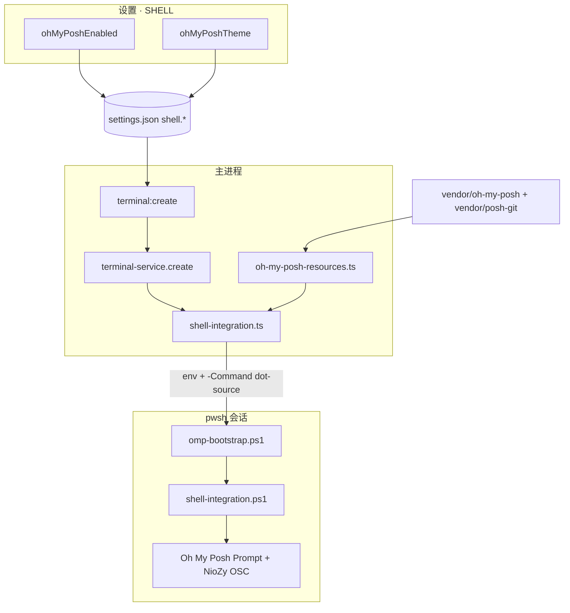

# 功能：增强 SHELL（Oh My Posh）

在 NioZy 内为 **pwsh** 终端离线内置 **Oh My Posh** 与 **posh-git**，通过会话级脚本注入美化提示符，无需用户全局安装或修改 `$PROFILE`。

与 [功能Shell与命令回放.md](./功能Shell与命令回放.md) 同属 **设置 · SHELL**；后者侧重链接/emoji/Tab 交互与命令回放，本文档专述 OMP 集成。

## 功能列表

- **启用 Oh My Posh**：开关控制是否在 pwsh 会话中注入美化
- **主题选择**：19 个内置热门主题下拉切换
- **posh-git**：随 OMP 一并 `Import-Module`，在 Git 仓库目录显示分支/脏状态（需系统 PATH 有 `git.exe`）
- **离线内置**：可执行文件与主题随安装包分发，不依赖 winget / Install-Module / 联网
- **沙箱注入**：仅 NioZy 内终端生效，不修改用户主目录 Profile
- **与 Shell 集成协同**：OMP 先初始化 Prompt，再由 `shell-integration.ps1` 包装 CWD OSC 同步

## 生效范围

| 条件 | 是否注入 OMP |
|------|-------------|
| Shell 为 `pwsh` | ✅ |
| `shell.ohMyPoshEnabled === true` | ✅ |
| 内置资源齐全（exe + posh-git + 主题） | ✅ |
| Windows PowerShell 5.1（`powershell`） | ❌ |
| 管理员提升终端（UAC） | ❌ |
| SSH / 自定义 Shell | ❌ |

主题或开关变更后，需 **新建 pwsh 终端** 才生效；已打开 Tab 不会热更新。

## 进程归属

**主进程**负责资源路径解析、环境变量与启动参数注入；**渲染层**仅提供设置 UI。

| 文件 | 作用 |
|------|------|
| `src/components/settings/ShellSettings.tsx` | OMP 开关 + 主题下拉 |
| `electron/shared/shell-settings.ts` | `ohMyPoshEnabled` / `ohMyPoshTheme` 类型与归一化 |
| `electron/shared/oh-my-posh-themes.json` | 内置主题列表（单一数据源） |
| `electron/shared/oh-my-posh-themes.ts` | 主题 ID 类型、`normalizeOhMyPoshTheme` |
| `electron/oh-my-posh-resources.ts` | 开发/打包环境下资源路径解析 |
| `electron/shell-integration.ts` | 串联 `omp-bootstrap.ps1` → `shell-integration.ps1` |
| `electron/scripts/omp-bootstrap.ps1` | 加载 posh-git + `oh-my-posh init pwsh` |
| `electron/scripts/shell-integration.ps1` | CWD OSC；包装已有 Prompt |
| `electron/terminal-service.ts` | 创建 PTY 时合并 env 与启动参数 |
| `electron/main/index.ts` | `terminal:create` 时从设置传入 OMP 选项 |
| `scripts/vendor-oh-my-posh.mjs` | 构建前下载 exe、主题、posh-git |
| `electron-builder.yml` | `extraResources` 打入 `oh-my-posh` / `posh-git` |

## 架构与数据流



```mermaid
sequenceDiagram
  participant User as 用户
  participant UI as ShellSettings
  participant Main as terminal:create
  participant PTY as pwsh
  participant OMP as omp-bootstrap.ps1
  participant Nio as shell-integration.ps1

  User->>UI: 开启 OMP + 选主题
  UI->>Main: 保存 settings.shell
  User->>Main: 新建 pwsh 终端
  Main->>PTY: spawn + env(NIOZY_OMP_*)
  Main->>PTY: -Command & { . omp-bootstrap; . shell-integration }
  PTY->>OMP: dot-source
  OMP->>OMP: Import-Module posh-git
  OMP->>OMP: oh-my-posh init pwsh --config theme
  PTY->>Nio: dot-source
  Nio->>Nio: 包装 Prompt → 发 OSC 7 / 633
```

### Prompt 链顺序

1. `omp-bootstrap.ps1`：`oh-my-posh init` 替换 `$function:Prompt`
2. `shell-integration.ps1`：保存当前 Prompt 为 `NioZyOriginalPrompt`，外层发送工作目录 OSC

必须先 OMP、后 NioZy，否则 CWD 同步会被覆盖。

## 内置资源与构建

### 目录结构（开发态）

```
vendor/
  oh-my-posh/
    oh-my-posh.exe          # GitHub Release 下载，不提交 git
    themes/*.omp.json       # 19 个主题 JSON，不提交 git
    .vendor-version         # 版本标记，不提交 git
  posh-git/
    posh-git.psd1           # 模块文件，不提交 git
    ...
```

### 自动下载

| npm 生命周期 | 命令 |
|-------------|------|
| `prestart` | `npm run vendor:oh-my-posh`（`start` / `dev` 前） |
| `prebuild` | `npm run vendor:oh-my-posh`（`build` / `dist` 前） |

手动执行：`npm run vendor:oh-my-posh`

当前固定版本（`scripts/vendor-oh-my-posh.mjs`）：

- Oh My Posh **v26.1.0**（`posh-windows-amd64.exe` → `oh-my-posh.exe`）
- posh-git **v1.1.0**

脚本读取 `electron/shared/oh-my-posh-themes.json` 下载全部主题；`.vendor-version` 与文件齐全时跳过重复下载。

### 打包布局（`extraResources`）

安装后位于 `resources/`（asar 外，PowerShell 可直接访问）：

```
resources/
  omp-bootstrap.ps1
  shell-integration.ps1
  oh-my-posh/oh-my-posh.exe
  oh-my-posh/themes/*.omp.json
  posh-git/posh-git.psd1
```

## 内置主题

主题定义见 `electron/shared/oh-my-posh-themes.json`，默认 `jandedobbeleer`。

| ID | 显示名 |
|----|--------|
| `jandedobbeleer` | Jan De Dobbeleer（默认） |
| `powerlevel10k_modern` | Powerlevel10k Modern |
| `powerlevel10k_lean` | Powerlevel10k Lean |
| `powerlevel10k_rainbow` | Powerlevel10k Rainbow |
| `agnoster` | Agnoster |
| `paradox` | Paradox |
| `pure` | Pure |
| `dracula` | Dracula |
| `catppuccin_mocha` | Catppuccin Mocha |
| `catppuccin_latte` | Catppuccin Latte |
| `gruvbox` | Gruvbox |
| `night-owl` | Night Owl |
| `tokyo` | Tokyo |
| `tokyonight_storm` | Tokyo Night Storm |
| `spaceship` | Spaceship |
| `robbyrussell` | Robby Russell |
| `atomic` | Atomic |
| `cobalt2` | Cobalt2 |
| `material` | Material |

所选主题文件缺失时，回退到 `jandedobbeleer.omp.json`。

扩展主题：在 `oh-my-posh-themes.json` 增加条目并同步 `oh-my-posh-themes.ts` 中的 `OhMyPoshThemeId` 联合类型，再执行 `vendor:oh-my-posh`。

## 实验特性

否。

## 配置文件片段

`settings.json` → `shell`（节选）：

```json
{
  "shell": {
    "ohMyPoshEnabled": false,
    "ohMyPoshTheme": "jandedobbeleer"
  }
}
```

## 运行时环境变量

仅在 `ohMyPoshEnabled` 且资源齐全、Shell 为 `pwsh` 时由主进程注入：

| 变量 | 含义 |
|------|------|
| `NIOZY_OMP_ENABLED` | `1` 表示启用 bootstrap |
| `NIOZY_OMP_EXE` | `oh-my-posh.exe` 绝对路径 |
| `NIOZY_OMP_CONFIG` | 主题 `.omp.json` 绝对路径 |
| `NIOZY_POSH_GIT_MODULE` | `posh-git.psd1` 绝对路径 |

另保留 Shell 集成变量：`NIOZY_SHELL_INTEGRATION`、`TERM_PROGRAM=NioZy`。

## 启动参数注入

`mergeShellIntegrationArgs` 在保留用户原有 args 的前提下追加：

```text
pwsh.exe ... -NoExit -ExecutionPolicy Bypass -Command "& { . 'omp-bootstrap.ps1'; . 'shell-integration.ps1' }"
```

若调用方已含 `-Command` / `-File` 等，则不覆盖。

## 核心代码

### Shell 设置字段

```typescript
// electron/shared/shell-settings.ts
ohMyPoshEnabled: boolean
ohMyPoshTheme: OhMyPoshThemeId
```

### 主进程传入终端创建

```typescript
// electron/main/index.ts — terminal:create
terminalService.create({
  ...resolved,
  ohMyPoshEnabled: shellSettings.ohMyPoshEnabled,
  ohMyPoshTheme: shellSettings.ohMyPoshTheme,
})
```

### OMP Bootstrap（节选）

```powershell
# electron/scripts/omp-bootstrap.ps1
Import-Module -Name $env:NIOZY_POSH_GIT_MODULE -Force
(& $env:NIOZY_OMP_EXE init pwsh --config $env:NIOZY_OMP_CONFIG) | Invoke-Expression
```

## 使用建议

- 主题图标依赖 **Nerd Font**；建议在 **设置 · 终端** 开启内置 Nerd Font（`useBuiltinFont`）
- posh-git 分支信息需要本机已安装 Git 且 `git` 在 PATH 中
- 离线环境：首次构建需能访问 GitHub 以下载 vendor 资源；之后可完全离线使用

## 相关文档

- [功能Shell与命令回放.md](./功能Shell与命令回放.md) — 同设置页其他 Shell 选项
- [功能终端与会话.md](./功能终端与会话.md) — PTY、`shell-integration.ps1` 与内置字体
