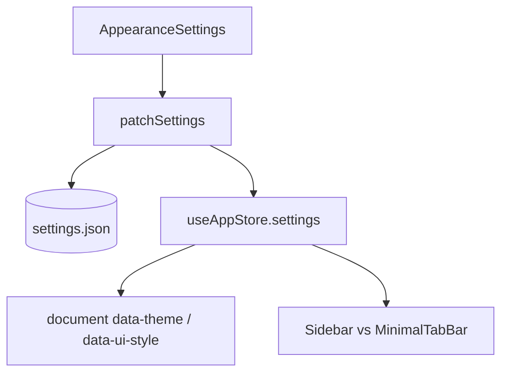
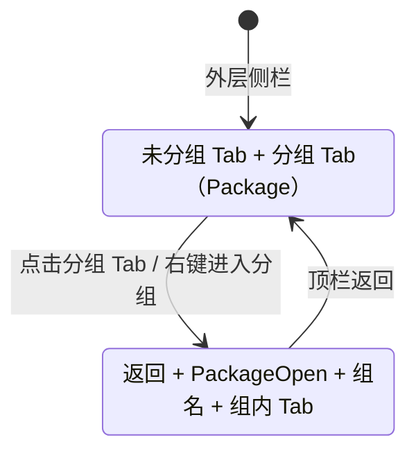

# 功能：外观与布局

主题、UI 风格、布局模式、强调色、字体、对话框动画，以及侧栏 Tab 分组。

## 功能列表

- 明暗主题 `light` / `dark`
- UI 风格：`minimal` | `niozy` | `windowsClassic` | `waFu` | `cyberpunk` | `glass`（玻璃，半透明毛玻璃）
- 布局：`default` | `focus` | `minimal`（极简 Tab 栏）
- 侧栏宽度、强调色、全局字号/字重
- 是否显示应用标题、对话框动画
- 多语言切换（写入 `settings.locale`）
- **侧栏终端 Tab 分组**：右键「添加到分组」、分组 Tab 展示与进入/返回、分组内新建终端默认归入当前分组

## 进程归属

**渲染层**为主；设置持久化经主进程 `settings:save`。Tab 分组状态仅存于渲染进程内存（重启后清空）。

| 文件 | 作用 |
|------|------|
| `src/components/settings/AppearanceSettings.tsx` | 设置 UI |
| `src/lib/ui-style.ts` | 运行时 class 与 `data-ui-style` |
| `src/lib/layout-mode.ts` | 布局判断 |
| `electron/shared/ui-style.ts` | 共享枚举与规范化 |
| `src/stores/tab-group-store.ts` | 分组列表、进入/退出分组视图 |
| `src/lib/tab-groups.ts` | 分组工具函数与类型 |
| `src/lib/tab-group-actions.ts` | 关闭分组（含组内全部终端） |
| `src/hooks/useSidebarTabItems.ts` | 外层/分组内侧栏列表项计算 |
| `src/components/layout/TabGroupItem.tsx` | 分组 Tab 行与右键菜单 |
| `src/components/layout/AddToGroupDialog.tsx` | 添加到分组对话框 |

## 架构与数据流



```mermaid
stateDiagram-v2
  [*] --> default: layoutMode=default
  [*] --> focus: layoutMode=focus
  [*] --> minimal: layoutMode=minimal
  default: 侧栏 + 主内容
  focus: 可折叠侧栏
  minimal: MinimalTabBar 顶栏 Tab
```

### 侧栏 Tab 分组



- **外层**：未归入分组的 Tab 与分组 Tab（图标 `Package`）并列展示；已分组终端不再直接显示。
- **分组内**：顶栏左侧返回按钮，分组名称左侧显示 `PackageOpen`；列出该组全部终端 Tab。
- **终端 Tab 右键**：`PackagePlus`「添加到分组」/「移动到分组」，弹出对话框选择已有分组或新建。
- **分组 Tab 右键**：进入分组、`PackageX` 关闭分组（二次确认，关闭组内全部终端 Tab）。
- **分组内新建**：在分组视图中「新建终端」或「新建连接」打开的终端 Tab 自动加入当前分组。
- **单例 Tab**（设置、加密通信等）：在分组视图中新开的单例 Tab 可正常显示；返回外层时自动关闭（进入分组前已存在的除外）。

### UI 风格 `glass`（玻璃）

原 `liquidGlass`（液态玻璃）已重命名为 `glass`，并替换为中性半透明磨砂玻璃视觉。

| 项 | 说明 |
|----|------|
| 枚举值 | `glass`（`settings.json` 中 `uiStyle`） |
| DOM 属性 | `html[data-ui-style="glass"]` |
| 兼容迁移 | 旧值 `liquidGlass` 加载时自动规范为 `glass` |
| 样式入口 | `src/index.css` 变量与 `.ui-glass-*`；`getUiClasses('glass')` — `src/lib/ui-style.ts` |
| 窗口底色 | `getWindowBackgroundColor` — `electron/shared/ui-style.ts` |

视觉特征：面板更高透明度 + `backdrop-blur`、中性灰蓝渐变底纹、细白描边与内高光、`rounded-xl` 矩形控件（非胶囊）。强调色预设为柔和蓝灰系（`ACCENT_PRESETS_GLASS`）。

## 实验特性

否。

## 配置文件片段

```json
{
  "locale": "zh",
  "theme": "light",
  "uiStyle": "glass",
  "layoutMode": "default",
  "sidebarWidth": 260,
  "accentColor": "#5C6B7A",
  "fontSize": 13,
  "showAppTitle": true,
  "enableDialogAnimations": true
}
```

应用主题到文档：`applyThemeToDocument` — `src/stores/app-store.ts`。

## 数据存储

- **外观与布局**：`settings.json` 上述字段。
- **Tab 分组**：`useTabGroupStore` 内存状态（`groups`、`activeGroupId`），不写入磁盘。

## 核心代码

### 布局组件

- 默认：`src/components/layout/Sidebar.tsx`
- 极简：`src/components/layout/MinimalTabBar.tsx`
- 侧栏 Tab 列表：`src/components/layout/SidebarTabList.tsx`（含分组顶栏与返回）
- 终端 Tab 行：`src/components/layout/TerminalTabItem.tsx`（添加到分组菜单）
- 分组 Tab 行：`src/components/layout/TabGroupItem.tsx`

### App 布局分支

`src/App.tsx` 中根据 `isMinimalLayout(settings)` 渲染 `MinimalTabBar` 或 `Sidebar`。

### 设置面板

`src/components/settings/AppearanceSettings.tsx`

国际化：`src/lib/i18n.ts`、`src/locales/zh.json` 等（`uiStyle.glass`、`tab.addToGroup`、`tab.enterGroup`、`tab.closeGroup` 等键）。
