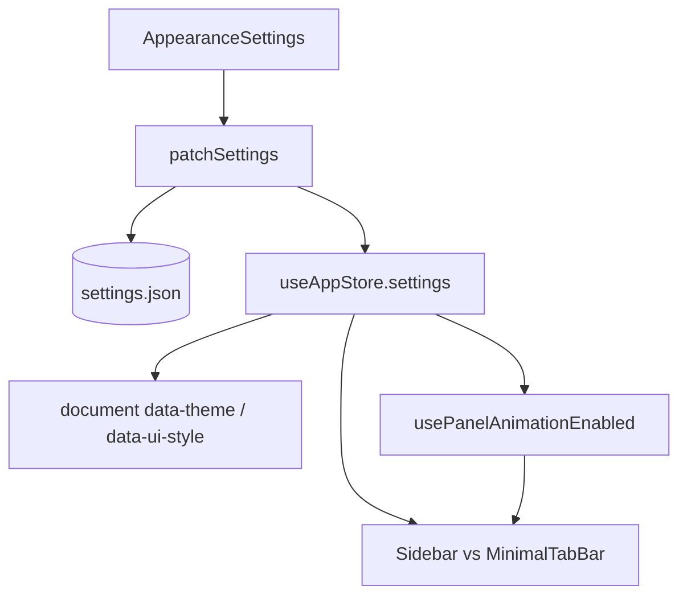
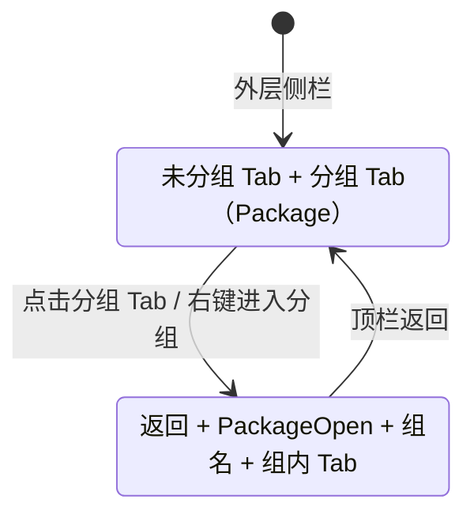

# 功能：外观与布局

主题、UI 风格、布局模式、强调色、字体、界面过渡动画，以及侧栏 Tab 分组。

## 功能列表

- 明暗主题 `light` / `dark`
- UI 风格：`minimal` | `niozy` | `windowsClassic` | `waFu` | `cyberpunk` | `glass`（玻璃，半透明毛玻璃）| `claude`（Claude 暖奶油白编辑风）| `neumorphism`（拟态，Neumorphism Soft UI）
- 布局：`default` | `focus` | `minimal`（极简 Tab 栏）
- 侧栏宽度、强调色、全局字号/字重
- 是否显示应用标题
- **动态标题**（`enableDynamicTitle`）：在标题栏程序名位置轮播 `NioZy → Terminal → Workspace → AI Agent`，默认开启；关闭后回退为静态 `NioZy`
- **动画效果**（`enableDialogAnimations`）：统一控制弹框、面板切换、侧栏与布局过渡；关闭或系统 `prefers-reduced-motion` 时均为即时切换
- **平滑字体**（`enableSmoothFonts`）：启用高 DPI 支持与 DirectWrite 平滑渲染，界面文字更接近 macOS 观感（需重启应用）
- **平滑滚动**（`enableSmoothScrolling`）：启用 Chromium 原生平滑滚动并让 xterm 终端视口平滑过渡滚动（需重启应用）
- 多语言切换（写入 `settings.locale`）
- **侧栏终端 Tab 分组**：右键「添加到分组」、分组 Tab 展示与进入/返回、分组内新建终端默认归入当前分组

## 进程归属

**渲染层**为主；设置持久化经主进程 `settings:save`。Tab 分组状态仅存于渲染进程内存（重启后清空）。

| 文件 | 作用 |
|------|------|
| `src/components/settings/AppearanceSettings.tsx` | 设置 UI（含动画开关） |
| `src/components/effects/RotatingText.tsx` | 标题栏文字轮播动画（字符分割 + 逐字弹簧过渡） |
| `src/components/layout/TitleBar.tsx` | 顶栏标题显示与动态标题接入 |
| `src/lib/ui-style.ts` | 运行时 class 与 `data-ui-style` |
| `src/lib/layout-mode.ts` | 布局判断与 `applyLayoutFromSettings` |
| `src/lib/dialog-animations.ts` | 弹框动画 class 与 `useDialogAnimationEnabled` |
| `src/lib/panel-animations.ts` | 面板/侧栏动画参数与 `usePanelAnimationEnabled` |
| `electron/font-smoothing.ts` | 平滑字体 Chromium 开关（启动前读取 `enableSmoothFonts`） |
| `electron/smooth-scrolling.ts` | 平滑滚动 Chromium 开关（启动前读取 `enableSmoothScrolling`，追加 `enable-smooth-scrolling`） |
| `scripts/embed-win-dpi-manifest.mjs` | Windows 打包时嵌入 PerMonitorV2 高 DPI 清单 |
| `src/components/ui/animated-tab-panel.tsx` | 单例 Tab 右侧面板进入/ lazy 加载 |
| `src/components/ui/animated-panel-section.tsx` | 设置子页、仓库视图、侧栏分组等区块切换 |
| `src/components/ui/animated-layout-chrome.tsx` | 布局模式与侧栏槽位显隐 |
| `electron/shared/ui-style.ts` | 共享枚举与规范化 |
| `src/stores/tab-group-store.ts` | 分组列表、进入/退出分组视图 |
| `src/lib/tab-groups.ts` | 分组工具函数与类型 |
| `src/lib/tab-group-actions.ts` | 关闭分组（含组内全部终端） |
| `src/hooks/useSidebarTabItems.ts` | 外层/分组内侧栏列表项计算 |
| `src/components/layout/TabGroupItem.tsx` | 分组 Tab 行与右键菜单 |
| `src/components/layout/AddToGroupDialog.tsx` | 添加到分组对话框 |

## 架构与数据流



```mermaid
stateDiagram-v2
  [*] --> default: layoutMode=default
  [*] --> focus: layoutMode=focus
  [*] --> minimal: layoutMode=minimal
  default: 侧栏展开 + 主内容
  focus: 侧栏默认收起
  minimal: MinimalTabBar 顶栏 Tab
```

### 动画效果

开关字段：`settings.enableDialogAnimations`（设置 → 外观 → **动画效果**）。开启后下列过渡生效；关闭或系统减少动态效果时跳过动画。

| 场景 | 实现 | 主要文件 |
|------|------|----------|
| 弹框开关 | CSS `@keyframes` + Radix `data-state` | `src/index.css`、`src/lib/dialog-animations.ts`、`dialog.tsx` / `alert-dialog.tsx` |
| 单例 Tab 右侧（设置、聊天、仓库等） | `motion/react` 自下淡入；lazy 加载时 spinner | `AnimatedTabPanel` — `src/App.tsx` |
| 设置子页切换 | 横向轻移 + 淡入淡出 | `AnimatedPanelSection` — `SettingsPanel.tsx` |
| 仓库列表/详情、加载态 | 区块切换与 loading ↔ 内容 | `RepoManagementPanel`、`RepoListView`、`GitGraphView` |
| 侧栏进入分组 / 返回外层 | 方向感知横向推入（进入自右、返回自左） | `AnimatedSidebarViewSwap` — `SidebarTabList.tsx` |
| 布局模式切换（default/focus ↔ minimal） | 侧栏槽位自左淡入淡出；极简 Tab 栏自上淡入淡出 | `AnimatedSidebarSlot`、`AnimatedMinimalTabBar` — `App.tsx` |
| 侧栏收缩 / 展开 | 侧栏容器 `width` 过渡（拖拽改宽时无动画） | `Sidebar.tsx` |

### 动态标题

开关字段：`settings.enableDynamicTitle`（设置 → 外观 → **开启动态标题**，位于“显示程序标题”下方子开关），默认值 `true`。

- 开启且 `showAppTitle=true` 时，标题栏左侧文本使用 `RotatingText` 组件轮播 `NioZy`、`Terminal`、`Workspace`、`AI Agent`。
- 轮播周期为 `2000ms`，按字符拆分，自末字符开始依次上移进入、向上退出，过渡参数参考 React Bits demo：`spring(damping=30, stiffness=400)` 与 `0.025s` 逐字错峰。
- 为避免不同单词长度导致标题栏抖动，组件会先渲染一份不可见最长文本占位，再将当前动画文本绝对定位叠放其上。
- 若关闭 `enableDialogAnimations` 或系统启用 `prefers-reduced-motion`，仍保留文本切换，但字符过渡会退化为即时切换。

依赖：`motion`（`import from 'motion/react'`）。弹框仍用 CSS，与其余面板动画共用同一开关。

### 平滑字体

开关字段：`settings.enableSmoothFonts`（设置 → 外观 → **开启平滑字体**）。开启后需**完全重启**应用；渲染进程即时应用 CSS，Chromium 开关在下次启动生效。

| 层级 | 行为 |
|------|------|
| 主进程（`electron/font-smoothing.ts`） | `disable-gpu-rasterization`；Windows 下另启 `IncreaseWindowsTextContrast`、`UseGammaContrastRegistrySettings`、`enable-lcd-text`（DirectWrite / ClearType 增强）。DPI 缩放由 PerMonitorV2 清单自动跟随系统，**不**设置 `force-device-scale-factor`（非数字会回退为 1.0 导致 UI 缩小） |
| 渲染进程 | `html[data-smooth-fonts="true"]` → `-webkit-font-smoothing: antialiased`、`text-rendering: optimizeLegibility`（`applyThemeToDocument`） |
| Windows 打包 | `afterPack` 调用 `scripts/embed-win-dpi-manifest.mjs`，将可执行文件清单升级为 `PerMonitorV2` 原生 DPI 感知 v2 |

动画时序（面板类）：进入 0.2s ease-out，退出 0.1s ease-in，与弹框 `dialog-content-in/out` 对齐。

### 平滑滚动

开关字段：`settings.enableSmoothScrolling`（设置 → 外观 → **开启平滑滚动**）。开启后需**完全重启**应用。

| 层级 | 行为 |
|------|------|
| 主进程（`electron/smooth-scrolling.ts`） | `app.commandLine.appendSwitch('enable-smooth-scrolling')`，启用 Chromium 原生平滑滚动（滚轮 / 触控板惯性） |
| 渲染进程 | `html[data-smooth-scroll='true']` → `.xterm-viewport { scroll-behavior: smooth }`（`applyThemeToDocument` / `src/index.css`），xterm 终端视口滚动平滑过渡 |

### 侧栏 Tab 分组



- **外层**：未归入分组的 Tab 与分组 Tab（图标 `Package`）并列展示；已分组终端不再直接显示。
- **分组内**：顶栏左侧返回按钮，分组名称左侧显示 `PackageOpen`；列出该组全部终端 Tab。
- **进入/返回**：开启动画时，分组顶栏与 Tab 列表作为整体横向过渡（`sidebarNavVariants`）。
- **终端 Tab 右键**：`PackagePlus`「添加到分组」/「移动到分组」，弹出对话框选择已有分组或新建。
- **分组 Tab 右键**：进入分组、`PackageX` 关闭分组（二次确认，关闭组内全部终端 Tab）。
- **分组内新建**：在分组视图中「新建终端」或「新建连接」打开的终端 Tab 自动加入当前分组。
- **单例 Tab**（设置、加密通信等）：在分组视图中新开的单例 Tab 可正常显示；返回外层时自动关闭（进入分组前已存在的除外）。

### UI 风格 `glass`（玻璃）

原 `liquidGlass`（液态玻璃）已重命名为 `glass`，并替换为中性半透明磨砂玻璃视觉。

| 项 | 说明 |
|----|------|
| 枚举值 | `glass`（`settings.json` 中 `uiStyle`） |
| DOM 属性 | `html[data-ui-style="glass"]` |
| 兼容迁移 | 旧值 `liquidGlass` 加载时自动规范为 `glass` |
| 样式入口 | `src/index.css` 变量与 `.ui-glass-*`；`getUiClasses('glass')` — `src/lib/ui-style.ts` |
| 窗口底色 | `getWindowBackgroundColor` — `electron/shared/ui-style.ts` |

视觉特征：面板更高透明度 + `backdrop-blur`、中性灰蓝渐变底纹、细白描边与内高光、`rounded-xl` 矩形控件（非胶囊）。强调色预设为柔和蓝灰系（`ACCENT_PRESETS_GLASS`）。

### UI 风格 `claude`（Claude 编辑风）

参考 [claude.ai](https://claude.ai/) 暖奶油白视觉体系。

| 项 | 说明 |
|----|------|
| 枚举值 | `claude`（`settings.json` 中 `uiStyle`） |
| DOM 属性 | `html[data-ui-style="claude"]` |
| 样式入口 | `src/index.css` 变量与 `.ui-claude-*`；`getUiClasses('claude')` — `src/lib/ui-style.ts` |
| AI 边栏 | `src/components/ai/ai-copilot-theme.css` 中 `html[data-ui-style='claude']` 作用域覆盖 |
| 窗口底色 | `getWindowBackgroundColor` — `electron/shared/ui-style.ts` |

设计 token：背景 `#F4F1EA`、默认强调色 `#D97757`（珊瑚橙）、全局界面字体 Noto Serif（`src/fonts/NotoSerif-VariableFont_wdth,wght.ttf`，中文回退 Noto Sans SC；终端区域除外）、统一 `12px`（`0.75rem`）圆角、4px 倍数间距。主操作按钮为墨色实心（`.ui-btn.bg-primary`），分段控件为胶囊底 + 白卡片滑块。

### UI 风格 `neumorphism`（拟态）

Neumorphism Soft UI 拟态风格：低饱和灰蓝单色底、内凹高光 + 右下外阴影浮雕（避免圆角处左上外扩白光露边），主题色仅点缀激活态与主按钮。

| 项 | 说明 |
|----|------|
| 枚举值 | `neumorphism`（`settings.json` 中 `uiStyle`） |
| DOM 属性 | `html[data-ui-style="neumorphism"]` |
| 样式入口 | `src/index.css` 变量与 `.ui-neu-*`；`getUiClasses('neumorphism')` — `src/lib/ui-style.ts` |
| 窗口底色 | `getWindowBackgroundColor` — `electron/shared/ui-style.ts` |

设计 token：

- 背景 `#E4E9F0`（暗色 `#2B3038`）；`card` 与 `background` 同色，无描边
- 默认强调色 `#6B8FAD`（柔和蓝灰）；预设见 `ACCENT_PRESETS_NEUMORPHISM`
- 圆角 `12px`（`rounded-xl` / `--radius: 1rem`）
- 阴影：`--neu-shadow-raised`（内凹高光 + 右下外阴影）、`--neu-shadow-inset`、`--neu-shadow-flat`、`--neu-shadow-panel`；`--neu-light` / `--neu-dark` 与背景混色
- 分段控件（`segmentGroupBg`）：凹陷槽 `ui-neu-inset` + `gap-1.5` / `p-1.5`，各选项独立凸起按钮，按钮间留空隙
- 主面板与终端容器均使用 `bg-card`，避免圆角处父级背景渗出

国际化：`uiStyle.neumorphism` — `src/locales/zh.json` 等。

## 实验特性

否。

## 配置文件片段

```json
{
  "locale": "zh",
  "theme": "light",
  "uiStyle": "glass",
  "layoutMode": "default",
  "sidebarWidth": 260,
  "accentColor": "#5C6B7A",
  "fontSize": 13,
  "showAppTitle": true,
  "enableDynamicTitle": true,
  "enableDialogAnimations": true,
  "enableSmoothFonts": false,
  "enableSmoothScrolling": false
}
```

应用主题到文档：`applyThemeToDocument` — `src/stores/app-store.ts`。

布局模式应用侧栏收起：`applyLayoutFromSettings` — `src/lib/layout-mode.ts`（`focus` → 收起，`default` → 展开，`minimal` 不改收起状态）。

## 数据存储

- **外观与布局**：`settings.json` 上述字段。
- **Tab 分组**：`useTabGroupStore` 内存状态（`groups`、`activeGroupId`），不写入磁盘。

## 核心代码

### 布局组件

- 默认：`src/components/layout/Sidebar.tsx`（含收缩宽度动画）
- 极简：`src/components/layout/MinimalTabBar.tsx`
- 侧栏 Tab 列表：`src/components/layout/SidebarTabList.tsx`（含分组顶栏、返回与分组切换动画）
- 终端 Tab 行：`src/components/layout/TerminalTabItem.tsx`（添加到分组菜单）
- 分组 Tab 行：`src/components/layout/TabGroupItem.tsx`

### App 布局分支

`src/App.tsx` 中根据 `isMinimalLayout(settings)` 经 `AnimatedMinimalTabBar` / `AnimatedSidebarSlot` 渲染 `MinimalTabBar` 或 `Sidebar`；单例 Tab 内容经 `AnimatedTabPanel` 挂载。

### 设置面板

`src/components/settings/AppearanceSettings.tsx`（显示程序标题、动态标题、动画开关、布局模式、UI 风格等）

国际化：`src/lib/i18n.ts`、`src/locales/zh.json` 等（`uiStyle.glass`、`uiStyle.neumorphism`、`settings.appearance.enableDynamicTitle`、`settings.appearance.enableDialogAnimations`、`tab.addToGroup`、`tab.enterGroup`、`tab.closeGroup` 等键）。
