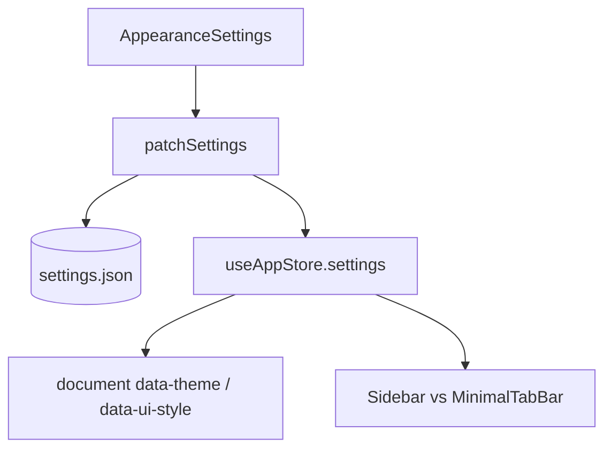

# 功能：外观与布局

主题、UI 风格、布局模式、强调色、字体与对话框动画。

## 功能列表

- 明暗主题 `light` / `dark`
- UI 风格：`minimal` | `niozy` | `xp`
- 布局：`default` | `focus` | `minimal`（极简 Tab 栏）
- 侧栏宽度、强调色、全局字号/字重
- 是否显示应用标题、对话框动画
- 多语言切换（写入 `settings.locale`）

## 进程归属

**渲染层**为主；设置持久化经主进程 `settings:save`。

| 文件 | 作用 |
|------|------|
| `src/components/settings/AppearanceSettings.tsx` | 设置 UI |
| `src/lib/ui-style.ts` | 运行时 class 与 `data-ui-style` |
| `src/lib/layout-mode.ts` | 布局判断 |
| `electron/shared/ui-style.ts` | 共享枚举与规范化 |

## 架构与数据流



```mermaid
stateDiagram-v2
  [*] --> default: layoutMode=default
  [*] --> focus: layoutMode=focus
  [*] --> minimal: layoutMode=minimal
  default: 侧栏 + 主内容
  focus: 可折叠侧栏
  minimal: MinimalTabBar 顶栏 Tab
```

## 实验特性

否。

## 配置文件片段

```json
{
  "locale": "zh",
  "theme": "light",
  "uiStyle": "minimal",
  "layoutMode": "default",
  "sidebarWidth": 260,
  "accentColor": "#5C6B7A",
  "fontSize": 13,
  "showAppTitle": true,
  "enableDialogAnimations": true
}
```

应用主题到文档：`applyThemeToDocument` — `src/stores/app-store.ts`。

## 数据存储

`settings.json` 上述字段。

## 核心代码

### 布局组件

- 默认：`src/components/layout/Sidebar.tsx`
- 极简：`src/components/layout/MinimalTabBar.tsx`（`17:125:src/components/layout/MinimalTabBar.tsx`）
- 侧栏 Tab 列表：`src/components/layout/SidebarTabList.tsx`

### App 布局分支

`src/App.tsx` 中根据 `isMinimalLayout(settings)` 渲染 `MinimalTabBar` 或 `Sidebar`。

### 设置面板

`src/components/settings/AppearanceSettings.tsx`

国际化：`src/lib/i18n.ts`、`src/locales/zh.json` 等。
