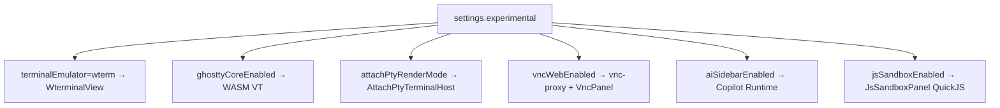
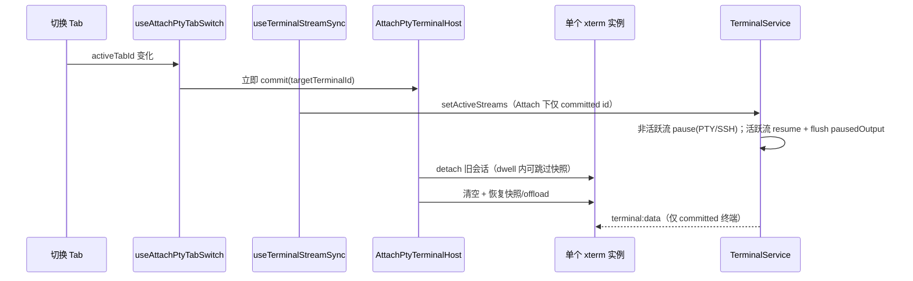
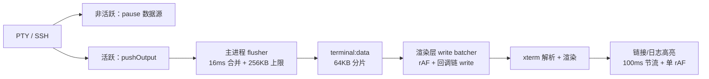

# 功能：实验特性

设置中心「实验特性」分区内的开关及关联子系统。

## 功能列表总览

| 子功能 | 配置键 | 默认 |
|--------|--------|------|
| Wterm 终端模拟器 | `experimental.terminalEmulator` | `xterm` |
| Ghostty WASM 核心 | `experimental.ghosttyCoreEnabled` | `false` |
| Ghostty 回滚上限 | `experimental.ghosttyScrollbackLimit` | `10000` |
| VNC Web Viewer | `experimental.vncWebEnabled` | `false` |
| VNC 缩放/硬件加速/光标/编码 | `vncAdaptiveScale` 等 | 见类型 |
| Attach-PTY 渲染 | `experimental.attachPtyRenderMode` | `false` |
| Attach Tab 停留时间 | `experimental.attachPtyTabSwitchDwellMs` | `300` |
| Attach WebGL 上下文池 | `experimental.attachPtyWebglContextPool` | `false` |
| Attach Scrollback 卸载 | `experimental.attachPtyScrollbackOffload` | `false` |
| AI 边栏 | `experimental.aiSidebarEnabled` | `false` |
| AI 附件 | `experimental.aiAttachmentsEnabled` | `false` |
| JS 沙箱 Tab | `experimental.jsSandboxEnabled` | `false` |

独立文档：[功能AI助手边栏.md](./功能AI助手边栏.md)、[功能终端与会话.md](./功能终端与会话.md)（Wterm/Attach）、[功能性能.md](./功能性能.md)（终端输出缓冲与 CPU 优化）。

## 架构与数据流

### 实验开关与模块映射



### Attach-PTY 切换数据流



**说明**：

- Tab 切换**立即** commit，不再等待 dwell；`attachPtyTabSwitchDwellMs` 仅用于 detach 时是否保存快照（停留不足则跳过，依赖主进程 `pausedOutput` 续流）。
- **Attach 模式推流**：`useTerminalStreamSync` 经 `resolveAttachPtyTargetTab` 同步推导目标 `terminalId`，仅该 id 进入 `activeStreamIds`；切到非终端 Tab 时传 `[]`。分屏 Tab 仍按活动 Tab 全部 pane 推流。
- **主进程反压**：`setActiveStreams` 对移出集合的会话调用 `pty.pause()` / `ssh2.stream.pause()`，避免后台 `yes` 洪水在主进程持续 `pushOutput`；回到活跃集合时 `resume()` 并 `flushBufferedOutput`。

## 进程归属

| 子功能 | 主进程 | 渲染层 |
|--------|--------|--------|
| Wterm/Ghostty | — | `WterminalView`、`wterm-ghostty-core.ts` |
| VNC | `vnc-proxy.ts` | `VncPanel.tsx` |
| Attach-PTY | `terminal-service.ts`（推流 + pause/resume） | `AttachPtyTerminalHost.tsx` |
| AI Runtime | `copilot/runtime-server.ts` | AI 边栏 |
| JS 沙箱 | — | `JsSandboxPanel.tsx`、`js-sandbox-client.ts` |

## 实验特性

**全部为实验性** — 需用户在设置中显式开启。

## 配置文件片段

完整类型：`37:103:electron/shared/experimental-settings.ts`。

```json
{
  "experimental": {
    "terminalEmulator": "xterm",
    "ghosttyCoreEnabled": false,
    "ghosttyScrollbackLimit": 10000,
    "vncWebEnabled": false,
    "vncAdaptiveScale": true,
    "vncHardwareAccel": false,
    "vncLocalCursor": true,
    "vncEncoding": "tight",
    "attachPtyRenderMode": false,
    "attachPtyTabSwitchDwellMs": 300,
    "attachPtyWebglContextPool": false,
    "attachPtyScrollbackOffload": false,
    "aiSidebarEnabled": false,
    "aiAttachmentsEnabled": false,
    "aiSidebarWidth": "medium",
    "aiRuntimePort": 3006,
    "aiProvider": "openai",
    "aiModel": "gpt-4o-mini",
    "aiBaseUrl": "",
    "aiApiKey": "",
    "jsSandboxEnabled": false
  }
}
```

## 数据存储

仅存于 `settings.json` 的 `experimental` 对象；JS 沙箱无持久化脚本库。

## 核心代码

### 规范化与 Wterm 渲染器约束

```172:179:electron/shared/experimental-settings.ts
export function normalizeRendererForWterm(
  emulator: TerminalEmulator,
  renderer: TerminalRenderer,
): TerminalRenderer {
  if (emulator === 'wterm') return WTERM_RENDERER  // 强制 dom
  return renderer
}
```

### 设置 UI

`src/components/settings/ExperimentalSettings.tsx`

### JS 沙箱 Tab

```42:46:src/App.tsx
const JsSandboxPanel = lazy(() =>
  import('@/components/sandbox/JsSandboxPanel').then(/* ... */),
)
```

`MinimalTabBar` — `jsSandboxEnabled` 时显示 Braces 按钮（`26:111:src/components/layout/MinimalTabBar.tsx`）。

实现：`src/components/sandbox/JsSandboxPanel.tsx`、`src/lib/js-sandbox-client.ts`（QuickJS WASM）。

### VNC

`experimental.vncWebEnabled` 为 true 时连接管理可添加 VNC Tab；`electron/vnc-proxy.ts` 提供 WebSocket 代理。

### Attach-PTY

**目标**：多 Tab 场景下共用一个 xterm 实例，降低内存与 WebGL 上下文数量；分屏 Tab 仍使用多个 `TerminalView`。

| 开关 | 作用 |
|------|------|
| `attachPtyRenderMode` | 单 Tab 无分屏时由 `AttachPtyTerminalHost` 承载唯一 xterm |
| `attachPtyTabSwitchDwellMs` | detach 快照 dwell（0–5000ms，默认 300） |
| `attachPtyWebglContextPool` | 单例宿主复用 WebGL 槽位，切换 Tab 不随 terminalId 释放上下文 |
| `attachPtyScrollbackOffload` | detach 时将 scrollback 卸到侧存储，减轻 xterm 内存 |

**生效条件**：`attachPtyRenderMode && terminalEmulator === 'xterm'`（Wterm 下开关禁用）。

**核心模块**：

- `src/stores/attach-pty-session-store.ts` — committed 会话与 Tab 快照
- `src/hooks/useAttachPtyTabSwitch.ts` — Tab 切换立即 commit
- `src/hooks/useTerminalStreamSync.ts` — 声明 `activeStreamIds`；Attach 下仅 committed 终端
- `src/lib/inactive-tab-memory.ts` — `collectActiveTerminalStreamIds`（含 Attach 分支）
- `src/lib/attach-pty-render.ts` — 模式判定、dwell、子开关
- `src/components/terminal/AttachPtyTerminalHost.tsx` — 全局单例 xterm 宿主
- `src/lib/attach-pty-scrollback-offload.ts` — scrollback 侧存储（`lru-cache`）
- `src/lib/attach-pty-webgl-pool.ts` — WebGL 槽位复用
- `electron/terminal-service.ts` — `setActiveStreams`、`pausedOutput`、`pause`/`resume` 反压

#### Scrollback Offload 侧存储（`lru-cache`）

开启 `attachPtyScrollbackOffload` 时，detach 的 VT/纯文本快照写入 `attach-pty-scrollback-offload.ts`，**不进 zustand**，避免大字符串触发 React 重渲染。

| 策略 | 值 |
|------|-----|
| 最大条目数 | 50 |
| 总字节上限 | 64 MB（UTF-16 估算） |
| TTL | 30 分钟未访问自动过期 |
| 驱逐 | 超出条目数或总字节时 LRU 淘汰 |

API：`offload` / `peek` / `take` / `clear` / `reset`；调试可用 `getOffloadCacheStats()`。

依赖：`lru-cache`（`package.json`）。

**与一键降级联动**：`advanced.resourceAutoDegrade` 触发「一键降级」时会自动开启 `attachPtyRenderMode`（见 [功能性能.md](./功能性能.md)）。

#### 高频输出与 CPU（xterm 通用，含 Attach 宿主）

Attach-PTY 优化**多 Tab 内存**与**后台洪水不拖垮 UI**；当前活动终端仍受 xterm 解析/渲染限制。整条管线：



| 层级 | 文件 | 策略 |
|------|------|------|
| 主进程推流集合 | `useTerminalStreamSync.ts`、`inactive-tab-memory.ts` | Attach 下仅 committed `terminalId`；非终端 Tab 为 `[]` |
| 主进程反压 | `electron/terminal-service.ts` | 非活跃流 `pty.pause()` / `ssh2.stream.pause()`；`pausedOutput` 上限 512KB |
| 主进程合并 | `electron/main/terminal-output-flush.ts` | 16ms 定时 flush；pending 上限 256KB（保留尾部） |
| 共享上限常量 | `electron/shared/terminal-output-limits.ts` | pending / IPC / write 分片阈值 |
| 渲染层写入 | `src/lib/terminal-write-batcher.ts` | rAF 合并；`write` 回调链串行；卸载时 `dropPending` |
| Shell 高亮 | `src/lib/terminal-shell-addons.ts` | 100ms 节流；`ensureRaf` 合并为单帧一次 rAF；不可见终端跳过高亮；viewport 未变时跳过重绘 |

**注意**：

- pending / `pausedOutput` 超限时旧输出会被丢弃（保留最新内容），以避免 OOM 与 xterm `write data discarded`。
- 极端日志洪水（如 `yes`）仍建议在远端限流，或调低 `terminal.scrollback`、关闭 Shell「日志级别着色」。
- 停留在洪水终端 Tab 时 CPU 仍取决于 xterm 与 Shell 高亮；切走后 Attach + pause 可显著恢复其他 Tab 的响应。

### 引擎切换提示

`TitleBarTerminalControls.setEmulator` — 切换后提示重启应用（`77:88:src/components/layout/TitleBarTerminalControls.tsx`）。
