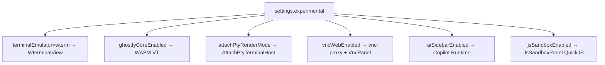
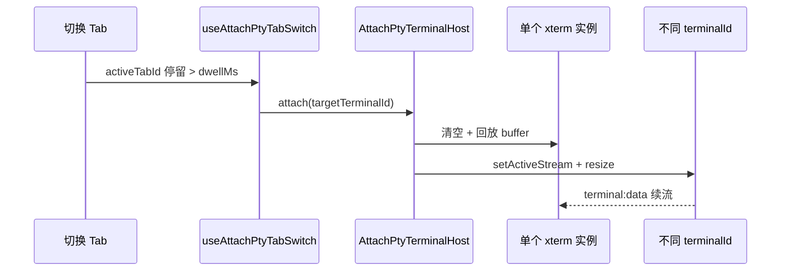

# 功能：实验特性

设置中心「实验特性」分区内的开关及关联子系统。

## 功能列表总览

| 子功能 | 配置键 | 默认 |
|--------|--------|------|
| Wterm 终端模拟器 | `experimental.terminalEmulator` | `xterm` |
| Ghostty WASM 核心 | `experimental.ghosttyCoreEnabled` | `false` |
| Ghostty 回滚上限 | `experimental.ghosttyScrollbackLimit` | `10000` |
| VNC Web Viewer | `experimental.vncWebEnabled` | `false` |
| VNC 缩放/硬件加速/光标/编码 | `vncAdaptiveScale` 等 | 见类型 |
| Attach-PTY 渲染 | `experimental.attachPtyRenderMode` | `false` |
| Attach Tab 停留时间 | `experimental.attachPtyTabSwitchDwellMs` | `300` |
| AI 边栏 | `experimental.aiSidebarEnabled` | `false` |
| AI 附件 | `experimental.aiAttachmentsEnabled` | `false` |
| JS 沙箱 Tab | `experimental.jsSandboxEnabled` | `false` |

独立文档：[功能AI助手边栏.md](./功能AI助手边栏.md)、[功能终端与会话.md](./功能终端与会话.md)（Wterm/Attach）。

## 架构与数据流

### 实验开关与模块映射



### Attach-PTY 切换数据流



## 进程归属

| 子功能 | 主进程 | 渲染层 |
|--------|--------|--------|
| Wterm/Ghostty | — | `WterminalView`、`wterm-ghostty-core.ts` |
| VNC | `vnc-proxy.ts` | `VncPanel.tsx` |
| Attach-PTY | PTY 不变 | `AttachPtyTerminalHost.tsx` |
| AI Runtime | `copilot/runtime-server.ts` | AI 边栏 |
| JS 沙箱 | — | `JsSandboxPanel.tsx`、`js-sandbox-client.ts` |

## 实验特性

**全部为实验性** — 需用户在设置中显式开启。

## 配置文件片段

完整类型：`37:103:electron/shared/experimental-settings.ts`。

```json
{
  "experimental": {
    "terminalEmulator": "xterm",
    "ghosttyCoreEnabled": false,
    "ghosttyScrollbackLimit": 10000,
    "vncWebEnabled": false,
    "vncAdaptiveScale": true,
    "vncHardwareAccel": false,
    "vncLocalCursor": true,
    "vncEncoding": "tight",
    "attachPtyRenderMode": false,
    "attachPtyTabSwitchDwellMs": 300,
    "aiSidebarEnabled": false,
    "aiAttachmentsEnabled": false,
    "aiSidebarWidth": "medium",
    "aiRuntimePort": 3006,
    "aiProvider": "openai",
    "aiModel": "gpt-4o-mini",
    "aiBaseUrl": "",
    "aiApiKey": "",
    "jsSandboxEnabled": false
  }
}
```

## 数据存储

仅存于 `settings.json` 的 `experimental` 对象；JS 沙箱无持久化脚本库。

## 核心代码

### 规范化与 Wterm 渲染器约束

```172:179:electron/shared/experimental-settings.ts
export function normalizeRendererForWterm(
  emulator: TerminalEmulator,
  renderer: TerminalRenderer,
): TerminalRenderer {
  if (emulator === 'wterm') return WTERM_RENDERER  // 强制 dom
  return renderer
}
```

### 设置 UI

`src/components/settings/ExperimentalSettings.tsx`

### JS 沙箱 Tab

```42:46:src/App.tsx
const JsSandboxPanel = lazy(() =>
  import('@/components/sandbox/JsSandboxPanel').then(/* ... */),
)
```

`MinimalTabBar` — `jsSandboxEnabled` 时显示 Braces 按钮（`26:111:src/components/layout/MinimalTabBar.tsx`）。

实现：`src/components/sandbox/JsSandboxPanel.tsx`、`src/lib/js-sandbox-client.ts`（QuickJS WASM）。

### VNC

`experimental.vncWebEnabled` 为 true 时连接管理可添加 VNC Tab；`electron/vnc-proxy.ts` 提供 WebSocket 代理。

### Attach-PTY

`src/stores/attach-pty-session-store.ts`、`src/hooks/useAttachPtyTabSwitch.ts`、`src/lib/attach-pty-render.ts`。

仅当 `attachPtyRenderMode && terminalEmulator === 'xterm'` 生效。

### 引擎切换提示

`TitleBarTerminalControls.setEmulator` — 切换后提示重启应用（`77:88:src/components/layout/TitleBarTerminalControls.tsx`）。
