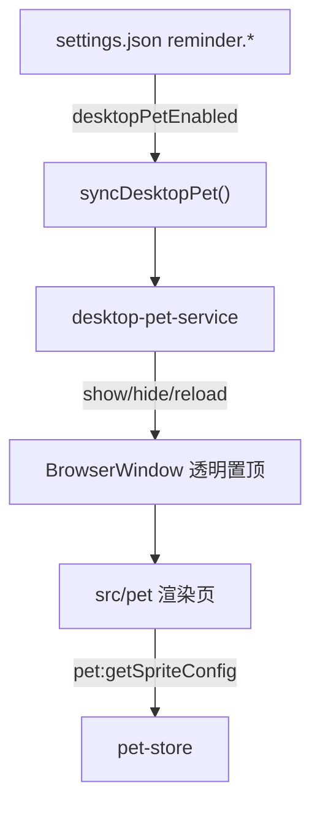
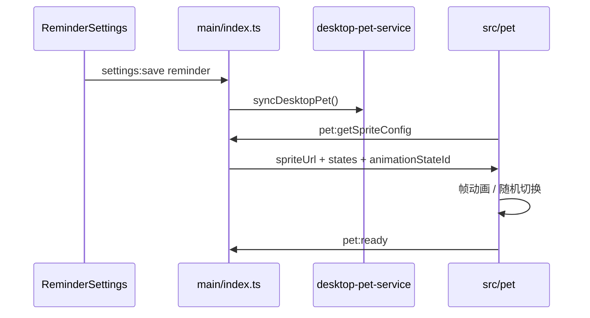
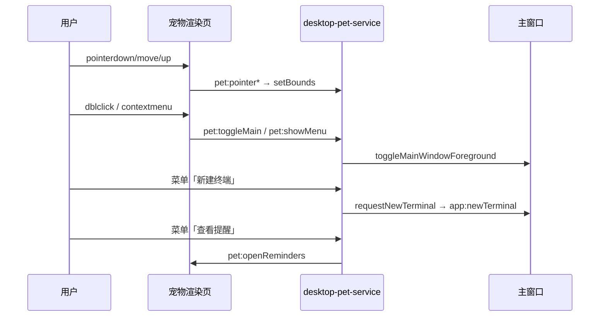
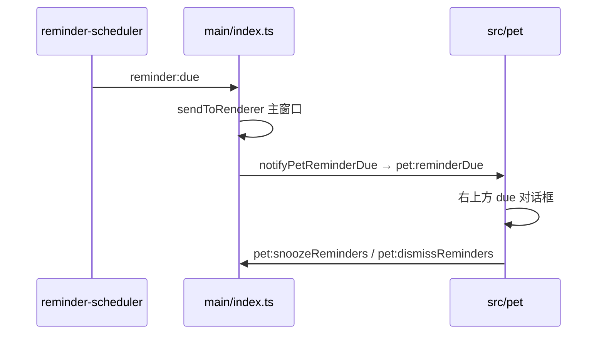

# 功能：桌面宠物

在桌面显示透明悬浮宠物窗口，播放 Petdex/Codex 精灵图动画；支持导入与管理宠物、切换动画状态，并与提醒事项联动（查看列表、到点弹窗）。

详细设置入口：**设置 → 提醒**（与提醒事项共用 `reminder` 配置段）。完整说明见 [功能提醒事项.md](./功能提醒事项.md) 中的桌面宠物相关小节。

## 功能列表

- **开启桌面宠物**（`reminder.desktopPetEnabled`）
- **导入精灵图**：Petdex 格式 WebP（1536×1872，8×9 网格，单帧 192×208），保存至 `pets/<名称>/spritesheet.webp`
- **宠物管理**：切换当前宠物、删除宠物（含目录与精灵图）
- **动画状态**：按精灵图行解析 9 种默认状态（`idle` 等），可选手动选择；可选 `pet.json` 覆盖 `states`
- **随机状态**：开启后每 10s 随机切换一行动画（`PET_RANDOM_STATE_INTERVAL_MS`）
- **交互**：左键拖动定位；双击或右键菜单切换主窗口显示/隐藏（与全局快捷键 Ctrl+T 相同逻辑）
- **右键菜单**：显示/隐藏 NioZy、新建终端、查看提醒、关闭桌面宠物
- **查看提醒**：在宠物渲染页展开提醒列表（未关闭项，按时间排序）
- **到点提醒**：提醒功能开启且桌面宠物开启时，在宠物右上方弹出对话框（推迟/关闭），与主窗口 Toast/弹框并行

## 进程归属

| 层级 | 文件 |
|------|------|
| **主进程** | `electron/desktop-pet-service.ts`（窗口、菜单、拖拽、尺寸） |
| **主进程** | `electron/pet-store.ts`（导入/删除/列表/精灵配置） |
| **共享** | `electron/shared/pet-atlas.ts`、`pet-animation-states.ts`、`pet-animation-states-resolve.ts` |
| **共享** | `electron/shared/pet-window-layout.ts`、`pet-ui-labels.ts`、`pet-reminder-dto.ts` |
| **Preload** | `electron/preload/pet-preload.ts` → `window.petAPI` |
| **宠物渲染页** | `src/pet/index.html`、`main.ts`、`pet.css`、`pet-reminder-ui.ts` |
| **主窗口设置** | `src/components/settings/ReminderSettings.tsx`、`PetSpritePreview.tsx` |
| **全局快捷键复用** | `electron/global-shortcuts.ts` → `toggleMainWindowForeground` |

构建：`electron.vite.config.ts` 额外入口 `src/pet/index.html`、`electron/preload/pet-preload.ts`。

## 架构与数据流

### 宠物窗口生命周期





### 交互与右键菜单



### 提醒联动



## 实验特性

否（入口在 **设置 → 提醒**）。

## 配置文件片段

`settings.json` → `reminder`（宠物相关字段）：

```json
{
  "reminder": {
    "desktopPetEnabled": false,
    "desktopPetId": null,
    "desktopPetAnimationState": "idle",
    "desktopPetRandomState": false,
    "desktopPetPosition": { "x": 1200, "y": 800 }
  }
}
```

类型定义：`electron/shared/reminder-settings.ts`。

## 数据存储

| 路径 | 内容 |
|------|------|
| `%USERPROFILE%\.config\NioZy\pets\<id>\spritesheet.webp` | 宠物精灵图 |
| `%USERPROFILE%\.config\NioZy\pets\<id>\pet.json` | 可选，自定义 `states` 动画配置 |

```83:95:electron/config-paths.ts
export function getPetsDir(): string {
  return join(getConfigDir(), 'pets')
}
export function getPetDir(petId: string): string {
  return join(getPetsDir(), petId)
}
export function getPetSpritesheetPath(petId: string): string {
  return join(getPetDir(petId), 'spritesheet.webp')
}
```

## 精灵图规格

```1:15:electron/shared/pet-atlas.ts
/** Petdex / Codex 精灵图规格：1536×1872，8×9 网格，单帧 192×208 */
export const PET_ATLAS = {
  width: 1536,
  height: 1872,
  columns: 8,
  rows: 9,
  cellWidth: 192,
  cellHeight: 208,
} as const
export const PET_DISPLAY_SCALE = 0.5
```

桌面显示尺寸：96×104 px（`PET_DISPLAY_WIDTH` × `PET_DISPLAY_HEIGHT`）。

## 默认动画状态（9 行）

定义于 `electron/shared/pet-animation-states.ts`：`idle`、`running-right`、`running-left`、`waving`、`jumping`、`failed`、`waiting`、`running`、`review`。每状态含 `row`、`frames`、`durationsMs[]`。

读取 `pet.json` 的 Node 逻辑在 `electron/shared/pet-animation-states-resolve.ts`（仅主进程，避免渲染层引用 `fs`）。

## 窗口尺寸模式

`electron/shared/pet-window-layout.ts`：

| 模式 | 尺寸（约） | 触发 |
|------|------------|------|
| compact | 96×104 | 默认 / 关闭面板 |
| reminder list | 300×324 | 查看提醒 |
| due alert | 260×252 | 到点弹窗 |
| both | 300×472 | 列表 + 到点同时显示 |

布局 CSS：`src/pet/pet.css`（`.pet-stage` 底部对齐，`.pet-reminder-panel` 紧贴宠物上方）。

## IPC

### 主窗口（`reminder` 命名空间）

| 通道 | 说明 |
|------|------|
| `reminder:listPets` | 已导入宠物 id 列表 |
| `reminder:importPet` | 选择 WebP 并导入 |
| `reminder:deletePet` | 删除宠物目录 |
| `reminder:listPetAnimationStates` | 某宠物的动画状态列表 |
| `reminder:getPetPreviewUrl` | 设置页预览 URL |

### 宠物窗口（`pet:*`）

| 通道 | 说明 |
|------|------|
| `pet:ready` / `pet:pointerDown` / `Move` / `Up` | 就绪与拖拽 |
| `pet:toggleMain` / `pet:showMenu` | 双击与右键菜单 |
| `pet:getSpriteConfig` | 精灵图 URL、状态、随机开关 |
| `pet:getLabels` / `pet:listReminders` | 多语言文案与提醒列表 |
| `pet:dismissReminders` / `pet:snoozeReminders` | 宠物到点弹窗操作 |
| `pet:setWindowCompact` / `ReminderList` / `DueAlert` / `ReminderAndDue` | 窗口尺寸 |
| `pet:openReminders`（主→渲染事件） | 打开提醒列表 |
| `pet:reminderDue`（主→渲染事件） | 到点 payload |

Preload：`electron/preload/pet-preload.ts` 暴露 `window.petAPI`。

## 核心代码

### desktop-pet-service

- `createPetWindow()`：透明、`alwaysOnTop: pop-up-menu`、`type: toolbar`（Windows）
- `popupPetContextMenu()`：菜单项与 `openPetReminders()`、`requestNewTerminal()`
- `notifyPetReminderDue()`：条件 `reminder.enabled && desktopPetEnabled`
- `saveDesktopPetPosition()`：拖拽结束后写入 `desktopPetPosition`

### pet-store

- `pickAndImportPet()`：对话框选 WebP，复制到 `pets/<id>/`
- `getDesktopPetSpriteConfig()`：占位模式或 sprite 模式配置
- `deletePet()` / `listPetAnimationStates()`

### 宠物渲染页

- `src/pet/main.ts`：精灵帧动画、`setTimeout` 按 `durationsMs` 切帧
- `src/pet/pet-reminder-ui.ts`：提醒列表与到点对话框 DOM

## 注意事项

- 透明窗口使用极低 alpha 背景（`rgba(255,255,255,0)` + 命中层）避免 Windows 鼠标穿透。
- `pet-animation-states.ts` 不得直接 `import fs`；文件读取仅在 `pet-animation-states-resolve.ts`。
- 到点弹窗在宠物侧独立展示，不替代主窗口 `notifyMode`（toast/dialog）行为。
