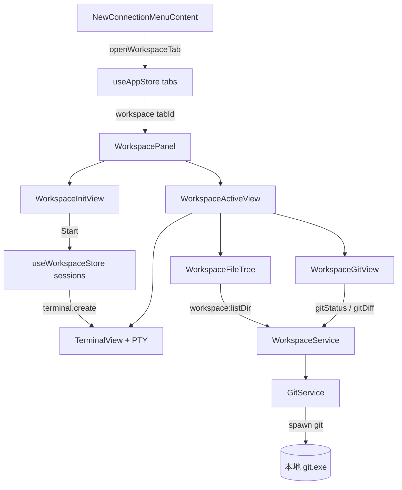
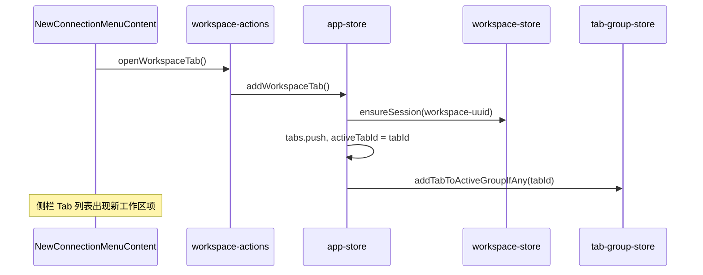
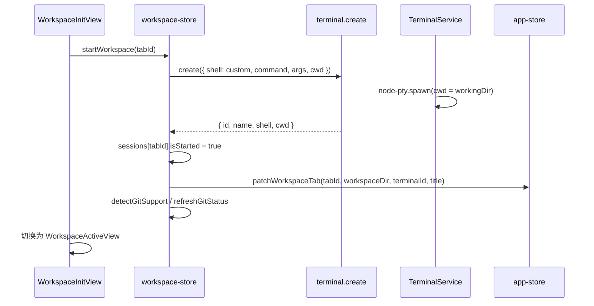
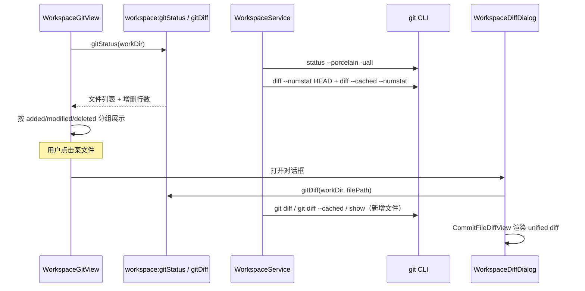

# 功能：工作区

面向终端 AI Coding 的工作区：在指定目录下启动开发工具终端，右侧浏览目录树与 Git 未提交变更。

## 功能列表

- 需在 **设置 · 工作区** 中开启「启用工作区」
- **新建连接** 菜单中，默认终端 Shell（PowerShell / CMD / pwsh）**下方** 显示「工作区」入口（**非**侧栏固定按钮）
- 可创建 **多个** 工作区 Tab（`workspace-{uuid}`），各 Tab 状态独立
- 初始化页：居中圆角对话框，胶囊式工作目录与开发工具选择 + 自定义命令输入 + Start
- 支持开发工具：Claude Code、Open Code、Pi Agent、Cursor Agent（命令分别为 `claude`、`opencode`、`pi`、`agent`）
- Start 后：左侧内嵌 xterm 终端，右侧文件树；可选 Git 工作区 Tab 切换
- 文件树：懒加载子目录，按 Tab 缓存已加载目录，切换 Tab 后可快速恢复
- Git 工作区（可选开关）：未提交文件按新增 / 修改 / 删除分组，显示 `+N -M` 行数；点击文件查看 unified diff
- 关闭已启动的工作区 Tab：二次确认后销毁 PTY（与终端 Tab 关闭一致）
- Git 路径复用 **设置 · 文件系统 → 仓库设置** 中的 `gitPath`（留空则自动检测）

## 进程归属

| 层级 | 文件 |
|------|------|
| **主进程** | `electron/workspace-service.ts`（目录列表、Git 状态/diff）、`electron/git-service.ts`（解析 git 路径） |
| **渲染层** | `src/components/workspace/` 面板组件、`src/stores/workspace-store.ts` |
| **Tab / 入口** | `src/stores/app-store.ts`、`src/components/layout/NewConnectionMenuContent.tsx`、`src/components/layout/WorkspaceTabItem.tsx` |

## 架构与数据流

### 模块总览



### 创建工作区 Tab



### Start 启动流程



### Git 工作区与 diff



## 实验特性

否。默认关闭，需在 **设置 · 工作区** 中开启「启用工作区」。

## 配置文件片段

`settings.json` → `workspace`：

```json
{
  "workspace": {
    "workspaceEnabled": false,
    "gitWorkspaceEnabled": false
  }
}
```

- `workspaceEnabled`：为 `true` 时在「新建连接」菜单显示工作区入口；关闭时会关闭所有已打开的工作区 Tab
- `gitWorkspaceEnabled`：为 `true` 时工作区右侧可切换「文件树 / Git 工作区」
- Git 可执行文件路径使用 `filesystem.gitPath`（与仓库管理共用），见 `electron/shared/filesystem-settings.ts`

类型定义：`electron/shared/workspace-settings.ts`。

## 数据存储

| 存储 | 内容 | 持久化 |
|------|------|--------|
| `settings.json` → `workspace` | 功能开关 | 是 |
| `useWorkspaceStore.sessions` | 各 Tab 的运行时状态（目录、工具、终端 id、文件树缓存、Git 列表） | **否**（内存） |
| `useAppStore.tabs` | 工作区 Tab 元数据（`type: workspace`、`workspaceDir`、`terminalId`） | **否** |

**刻意不实现**：应用重启后工作区状态不恢复（无 `resume-workspace.json` 等持久化）。

## 核心状态模型

### AppTab（`src/stores/app-store.ts`）

工作区 Tab 类型为 `workspace`，id 格式 `workspace-{uuid}`，可存在多个：

```typescript
interface AppTab {
  id: string           // workspace-{uuid}
  type: 'workspace'
  title: string        // 默认「工作区」；Start 后为目录名
  workspaceDir?: string
  terminalId?: string
}
```

### WorkspaceSession（`src/stores/workspace-store.ts`）

每个工作区 Tab 对应 `sessions[tabId]`：

| 字段 | 说明 |
|------|------|
| `workingDir` | 工作目录，默认用户主目录 |
| `selectedTool` | `claude` / `opencode` / `pi` / `agent` |
| `commandLine` | 自定义命令行（可含参数） |
| `isStarted` | 是否已点击 Start |
| `terminalId` | 关联 PTY id |
| `rightPanel` | `files` 或 `git` |
| `fileTreeCache` | `Record<绝对路径, WorkspaceDirEntry[]>` |
| `gitFiles` / `gitError` / `gitSupported` | Git 工作区数据 |

开发工具与命令映射（`electron/shared/workspace-types.ts`）：

| 工具 | `WorkspaceToolId` | 默认命令 |
|------|-------------------|----------|
| Claude Code | `claude` | `claude` |
| Open Code | `opencode` | `opencode` |
| Pi Agent | `pi` | `pi` |
| Cursor Agent | `agent` | `agent` |

Start 时调用 `terminal.create({ shell: 'custom', command, args, cwd: workingDir })`；`commandLine` 按空格拆分为可执行文件与参数，空则使用当前工具的默认命令。

## 渲染层组件

| 组件 | 职责 |
|------|------|
| `WorkspacePanel.tsx` | 按 `tab` 渲染；未 Start → `WorkspaceInitView`，已 Start → `WorkspaceActiveView` |
| `WorkspaceInitView.tsx` | 胶囊目录/工具下拉、命令输入框、Start |
| `WorkspaceActiveView.tsx` | 左终端 + 可拖拽分栏 + 右侧面板 |
| `WorkspaceFileTree.tsx` | 递归目录树，懒加载，缓存于 `sessions[tabId].fileTreeCache` |
| `WorkspaceGitView.tsx` | 未提交文件分类列表，刷新按钮 |
| `WorkspaceDiffDialog.tsx` | 文件 diff 对话框，复用 `CommitFileDiffView` |
| `WorkspaceTabItem.tsx` | 侧栏 Tab 项；已启动时关闭需确认 |
| `WorkspaceSettings.tsx` | 设置页两个开关 |

主区域集成（`src/App.tsx`）：对每个 `type === 'workspace'` 的 Tab 渲染独立 `AnimatedTabPanel` + `WorkspacePanel tab={tab}`。

## 主进程 WorkspaceService

文件：`electron/workspace-service.ts`。依赖 `GitService` 解析 `filesystem.gitPath`。

| 方法 | 说明 |
|------|------|
| `getHomeDir()` | 返回 `os.homedir()` |
| `listDir(dirPath)` | `readdir` + `stat`，目录优先排序 |
| `pickDirectory(mainWindow)` | 系统目录选择对话框 |
| `detectGit(workDir)` | 检查 `.git` 存在且 `rev-parse --is-inside-work-tree` |
| `gitStatus(workDir)` | `git status --porcelain -uall` + `diff --numstat` 合并增删行数 |
| `gitDiff(workDir, filePath)` | 工作区/暂存区 diff；新增文件尝试 `git show :0:path` 生成伪 diff |

### 主进程 IPC

```1608:1622:electron/main/index.ts
ipcMain.handle('workspace:getHomeDir', () => workspaceService.getHomeDir())
ipcMain.handle('workspace:listDir', (_, dirPath: string) => workspaceService.listDir(dirPath))
ipcMain.handle('workspace:pickDirectory', () => workspaceService.pickDirectory(mainWindow))
ipcMain.handle('workspace:detectGit', (_, workDir: string) => {
  gitService.setGitPath(settingsStore.get().filesystem.gitPath)
  return workspaceService.detectGit(workDir)
})
ipcMain.handle('workspace:gitStatus', (_, workDir: string) => { /* ... */ })
ipcMain.handle('workspace:gitDiff', (_, workDir: string, filePath: string) => { /* ... */ })
```

每次 Git 相关调用前通过 `settingsStore.get().filesystem.gitPath` 更新 `gitService` 路径。

Preload 暴露：`electron/preload/index.ts` → `electronAPI.workspace.*`。

## Tab 生命周期与 PTY 销毁

| 场景 | 行为 |
|------|------|
| 用户关闭工作区 Tab（已 Start） | `WorkspaceTabItem` 弹确认 → `closeWorkspaceTab(tabId)` → `removeTab` |
| `removeTabs` 移除 workspace Tab | `removeTabs` 收集 `tab.terminalId` → `scheduleTerminalKills`；`scheduleTabRemovalSideEffects` 清理 `sessions[tabId]` |
| 设置关闭「启用工作区」 | `closeAllWorkspaceTabs()` 移除全部工作区 Tab |
| 切换其他 Tab | 工作区 Tab 仍挂载；PTY 推流由 `collectActiveTerminalStreamIds` 按 inactive 策略控制 |

工作区终端通过 `TerminalView` 渲染，传入合成 `AppTab`（含 `terminalId`），**不**使用 `type: 'terminal'` 的 `TerminalTabLayer` 叠层。

相关：`src/lib/inactive-tab-memory.ts` 对 `type === 'workspace'` 且存在 `terminalId` 的 Tab 纳入 PTY 推流集合。

## 设置 UI

`src/components/settings/SettingsPanel.tsx` — section `workspace`，位于「管理会话」下方。

`src/components/settings/WorkspaceSettings.tsx`：

- 「启用工作区」→ `workspace.workspaceEnabled`；关闭时 `closeAllWorkspaceTabs()`
- 「支持 Git 工作区」→ `workspace.gitWorkspaceEnabled`；依赖主开关

## 入口与动作

| 入口 | 文件 | 动作 |
|------|------|------|
| 新建连接菜单 | `NewConnectionMenuContent.tsx` | Shell 列表后分隔线 +「工作区」→ `openWorkspaceTab()` |
| 侧栏 Tab 列表 | `WorkspaceTabItem.tsx` | 展示各工作区 Tab，Start 后标题为目录名 |

**注意**：侧栏底部**没有**独立的「工作区」快捷按钮（与会话管理、仓库管理不同）；仅通过新建连接创建。

动作封装：`src/lib/workspace-actions.ts` — `openWorkspaceTab`、`closeWorkspaceTab(tabId)`、`closeAllWorkspaceTabs`。

## 类型定义

`electron/shared/workspace-types.ts` — `WorkspaceDirEntry`、`WorkspaceGitFile`、`WorkspaceGitFileStatus`、`WorkspaceListDirResponse`、`WorkspaceGitStatusResponse`、`WorkspaceGitDiffResponse`、`WorkspaceDetectGitResponse`、`WORKSPACE_TOOL_IDS`、`WORKSPACE_TOOL_COMMANDS`。

Diff 展示复用：

- `src/components/repo/CommitFileDiffView.tsx`
- `src/lib/diff-parse.ts`、`src/lib/diff-parse-client.ts`

## 国际化

命名空间 `workspace.*`、`settings.workspace.*`、`settings.sections.workspace`、`app.workspaceTabTitle`、`sidebar.workspace`。

文案文件：`src/locales/zh.json`、`src/locales/en.json`。

## 与仓库管理功能的区别

| 维度 | 工作区 | 仓库管理 |
|------|--------|----------|
| 入口 | 新建连接菜单 | 侧栏 / 极简栏 |
| Tab 数量 | 多个 `workspace-{uuid}` | 单例 `repo` |
| Git 用途 | 当前工作目录未提交变更 | 已管理仓库的历史提交与图 |
| 目录浏览 | 工作目录文件树（缓存） | 无（仅变更文件列表） |
| 持久化列表 | 无 | `repo.json` |

## 暂未实现

- 应用重启后恢复工作区 Tab、目录、终端会话
- 工作区 Tab 的会话恢复写入磁盘
