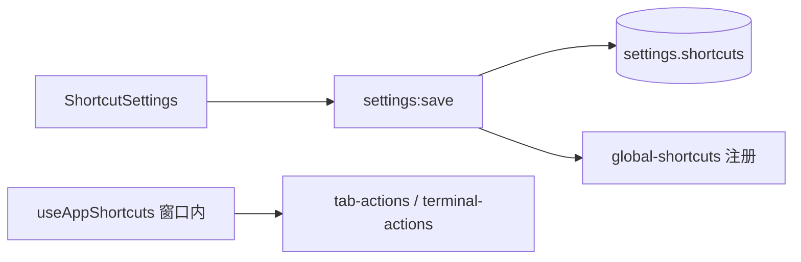
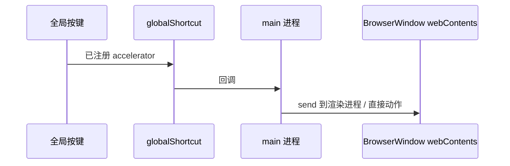

# 功能：全局快捷键

应用级键盘快捷键：新建终端、切换 Tab、拆分等（非终端内 PTY 快捷键）。

## 功能列表

- 可配置快捷键绑定（存储在 settings）
- 注册/注销全局快捷键（Electron `globalShortcut`）
- 设置页可视化录制按键（`ShortcutInput`）

## 进程归属

| 层级 | 文件 |
|------|------|
| **主进程** | `electron/global-shortcuts.ts` |
| **渲染层** | `src/hooks/useAppShortcuts.ts`、`src/components/settings/ShortcutSettings.tsx` |
| **共享** | `electron/shared/shortcuts.ts` |

## 架构与数据流





## 实验特性

否。

## 配置文件片段

`settings.json` → `shortcuts`：

```json
{
  "shortcuts": {
    "newTerminal": "Ctrl+Shift+T",
    "closeTab": "Ctrl+W",
    "nextTab": "Ctrl+Tab"
  }
}
```

默认值：`DEFAULT_SHORTCUTS` — `electron/shared/shortcuts.ts`。

## 数据存储

`settings.json` → `shortcuts` 对象。

## 核心代码

### 渲染层 Hook

`src/hooks/useAppShortcuts.ts` — 在 `App.tsx` 挂载：`78:78:src/App.tsx`。

### 设置 UI

`src/components/settings/ShortcutSettings.tsx`、`src/components/settings/ShortcutInput.tsx`

### 主进程

`electron/global-shortcuts.ts` — 根据 `settingsStore.get().shortcuts` 注册；`settings:save` 后重新绑定（`electron/main/index.ts` 内 settings 保存逻辑）。
