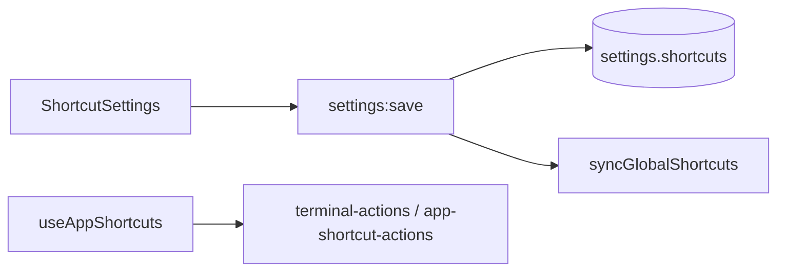
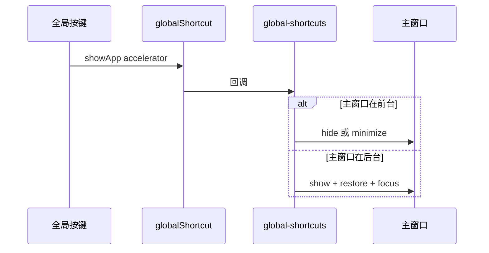
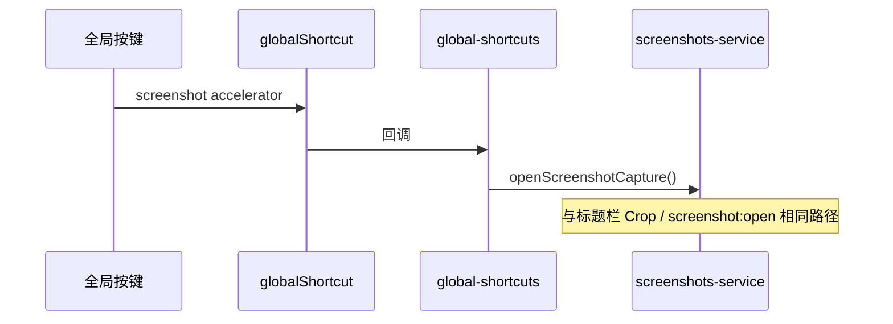

# 功能：全局快捷键

应用级键盘快捷键，分为 **系统全局**（Electron `globalShortcut`，程序在后台也可响应）与 **程序内**（主窗口 `keydown` 监听，仅焦点在 NioZy 时生效）。本文档覆盖两者；终端内 PTY 原生快捷键不在此列。

## 功能列表

### 系统全局快捷键

| 设置键 | 默认值 | 设置入口 | 说明 |
|--------|--------|----------|------|
| `shortcuts.global.showApp` | `CommandOrControl+T` | **设置 → 快捷键** | 切换主窗口显示/隐藏：已在前台则退到后台，否则显示到前台（不改变当前标签页） |
| `shortcuts.global.screenshot` | `""`（未设置） | **设置 → 快捷键**（需 **辅助功能 → 开启屏幕截图** 才显示该项） | 打开屏幕截图覆盖层；程序在后台也可触发。详见 [功能截图.md](./功能截图.md) |

全局快捷键约束：

- 须含修饰键（Ctrl / Alt / Shift / Meta 等），不能仅为单个按键；校验见 `isValidGlobalAccelerator`（`src/lib/shortcut-utils.ts`）
- 清空输入框表示取消绑定；截图快捷键默认为空，需用户自行录制

### 程序内快捷键

存储于 `shortcuts.app`，在 `useAppShortcuts` 中监听，包括：复制/粘贴、行首/行尾、清空终端、新建终端、打开设置、上/下一个终端 Tab、**命令面板**等。默认值见 `DEFAULT_SHORTCUTS`。

### 通用能力

- 可配置快捷键绑定（存储在 `settings.json` → `shortcuts`）
- 注册/注销系统全局快捷键（`electron/global-shortcuts.ts`）
- 设置页可视化录制按键（`ShortcutInput`）

## 进程归属

| 层级 | 文件 |
|------|------|
| **主进程** | `electron/global-shortcuts.ts` |
| **主进程** | `electron/screenshots-service.ts`（截图全局快捷键回调） |
| **主进程** | `electron/main/index.ts`（启动与 `settings:save` 时 `syncGlobalShortcuts`） |
| **渲染层** | `src/hooks/useAppShortcuts.ts`（程序内快捷键） |
| **渲染层** | `src/components/settings/ShortcutSettings.tsx`、`ShortcutInput.tsx` |
| **共享** | `electron/shared/shortcuts.ts`（类型与 `DEFAULT_SHORTCUTS`） |
| **工具** | `src/lib/shortcut-utils.ts`（解析、匹配、全局校验） |

桌面宠物双击/右键菜单「显示/隐藏 NioZy」复用 `toggleMainWindowForeground`（`electron/global-shortcuts.ts`），与 `showApp` 全局快捷键逻辑相同。见 [功能宠物.md](./功能宠物.md)。

## 架构与数据流

### 设置保存与注册



下列情况会调用 `syncGlobalShortcuts`：

- 应用启动（`createWindow` 之后）
- `settings:save` 且 `shortcuts.global.showApp` 或 `shortcuts.global.screenshot` 变更
- `settings:save` 且 `assistive.screenshotEnabled` 变更（控制截图快捷键是否注册）

### 显示/隐藏主窗口（showApp）



### 屏幕截图（screenshot）

仅在 `assistive.screenshotEnabled !== false` **且** `shortcuts.global.screenshot` 非空时注册。



## 实验特性

否。

## 配置文件片段

`settings.json` → `shortcuts`：

```json
{
  "shortcuts": {
    "global": {
      "showApp": "CommandOrControl+T",
      "screenshot": ""
    },
    "app": {
      "copyToClipboard": "CommandOrControl+Shift+C",
      "pasteFromClipboard": "CommandOrControl+Shift+V",
      "lineStart": "Home",
      "lineEnd": "End",
      "clearTerminal": "CommandOrControl+K",
      "newTerminal": "CommandOrControl+Shift+T",
      "openSettings": "CommandOrControl+,",
      "prevTerminalTab": "CommandOrControl+Left",
      "nextTerminalTab": "CommandOrControl+Right",
      "commandPalette": "CommandOrControl+Shift+P"
    }
  }
}
```

| 键 | 默认值 | 说明 |
|----|--------|------|
| `global.showApp` | `CommandOrControl+T` | 显示/隐藏主窗口 |
| `global.screenshot` | `""` | 屏幕截图；空表示未设置，不注册全局快捷键 |
| `app.commandPalette` | `CommandOrControl+Shift+P` | 打开/关闭命令面板 |

默认值定义：`DEFAULT_SHORTCUTS` — `electron/shared/shortcuts.ts`。

截图功能总开关在 `assistive.screenshotEnabled`（见 [辅助功能.md](./辅助功能.md)），关闭后标题栏 Crop 按钮隐藏、全局截图快捷键注销，且快捷键设置页不显示截图项。

## 数据存储

`settings.json` → `shortcuts` 对象（`global` + `app`）。

## 核心代码

### 主进程：注册与同步

`electron/global-shortcuts.ts` — `registerGlobalShortcut` / `syncGlobalShortcuts` / `unregisterGlobalShortcuts`：

- `showApp`：调用 `toggleMainWindowForeground`
- `screenshot`：在辅助开关开启且 accelerator 非空时，调用 `openScreenshotCapture()`

应用退出时 `unregisterGlobalShortcuts()` 注销全部全局快捷键。

`electron/main/index.ts` — 启动与保存后同步：

```589:589:electron/main/index.ts
  syncGlobalShortcuts(settingsStore, () => mainWindow)
```

```923:931:electron/main/index.ts
  const globalShortcutsChanged =
    partial.shortcuts !== undefined &&
    (shortcutsBefore.showApp !== updated.shortcuts.global.showApp ||
      shortcutsBefore.screenshot !== updated.shortcuts.global.screenshot)
  const screenshotEnabledChanged =
    partial.assistive?.screenshotEnabled !== undefined &&
    screenshotEnabledBefore !== updated.assistive.screenshotEnabled
  if (globalShortcutsChanged || screenshotEnabledChanged) {
    syncGlobalShortcuts(settingsStore, () => mainWindow)
  }
```

### 渲染层 Hook（程序内）

`src/hooks/useAppShortcuts.ts` — 在 `App.tsx` 挂载，监听 `shortcuts.app` 各绑定；`commandPalette` 可在输入框聚焦时切换面板。

`src/components/layout/CommandPalette.tsx` — 命令面板 UI（模糊搜索、常用命令、多 UI 风格适配）。

`src/lib/command-palette-commands.ts` — 命令定义与执行。

### 设置 UI

`src/components/settings/ShortcutSettings.tsx`：

- 全局区：`showApp` 始终显示；`screenshot` 仅在 `assistive.screenshotEnabled !== false` 时显示
- 程序内区：`APP_SHORTCUT_KEYS` 列表项

`src/components/settings/ShortcutInput.tsx` — 点击输入框录制按键，输出 Electron 加速器格式（如 `CommandOrControl+Shift+T`）。

## 相关文档

- [功能截图.md](./功能截图.md) — 截图会话、标注与剪贴板
- [辅助功能.md](./辅助功能.md) — `screenshotEnabled` 总开关
- [功能宠物.md](./功能宠物.md) — 复用 `toggleMainWindowForeground`
