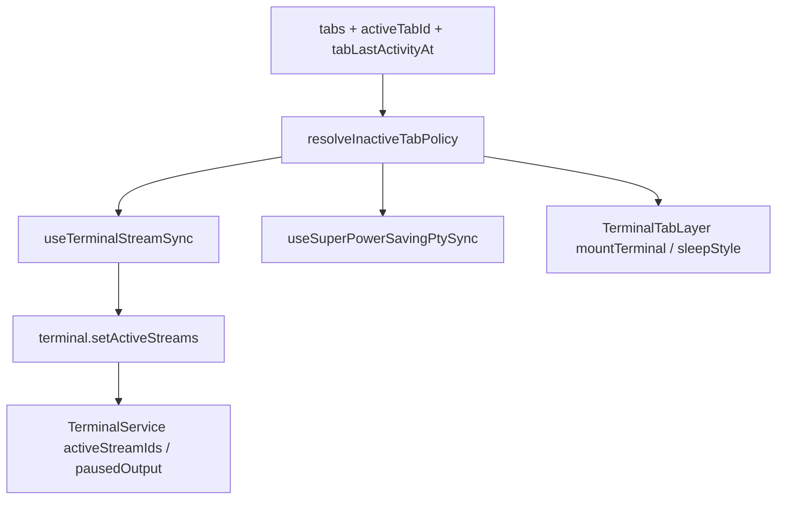
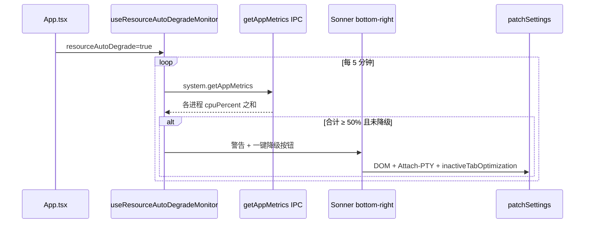
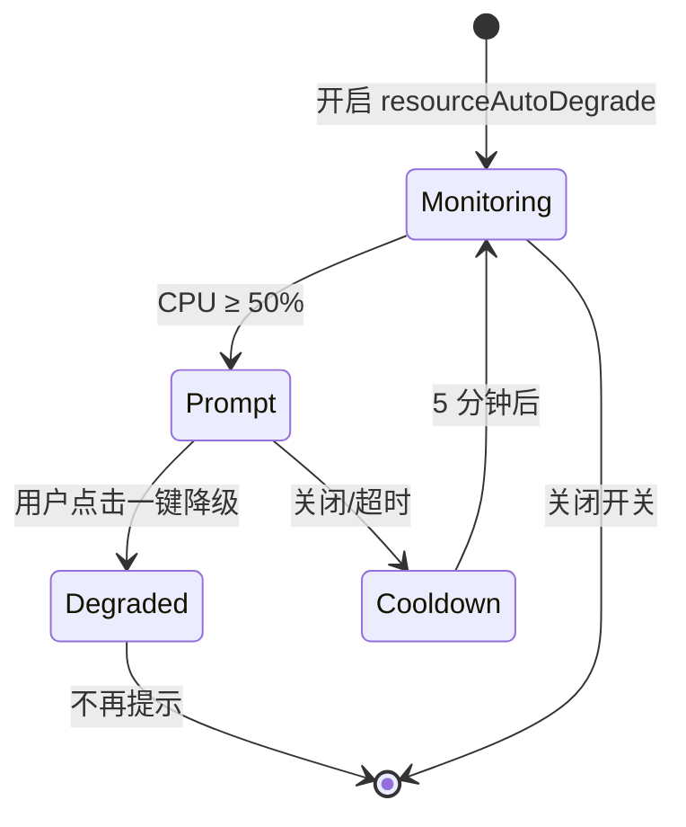

# 功能：性能

非活跃 Tab 策略、终端输出缓冲、Chromium/Electron 调优、本程序 CPU 监测与一键降级。

## 功能列表

| 功能 | 设置位置 | 配置键 | 默认 |
|------|----------|--------|------|
| 非活动 Tab 优化 | 设置 → 性能 | `performance.inactiveTabOptimization` | `false` |
| 非活动 Tab 休眠 | 设置 → 性能 | `performance.inactiveTabSleep` | `false` |
| 超级省电 | 设置 → 性能 | `performance.superPowerSaving` | `false` |
| 检测资源占用并自动降级 | 设置 → 高级 | `advanced.resourceAutoDegrade` | `false` |
| 状态栏实时系统信息 | 设置 → 高级 | `advanced.statusBarLiveStats` | `true` |

### 非活动 Tab 优化

超过 **5 分钟**无操作的非活动 Tab 卸载终端视图（销毁 xterm/wterm），切回时重建；PTY 保持连接，输出在主进程缓冲。空闲判定见 `INACTIVE_TAB_OPTIMIZATION_IDLE_MS`（`src/lib/inactive-tab-memory.ts`）。

### 非活动 Tab 休眠

启用 Chromium 后台节流（`backgroundThrottling`），并对非活动 Tab 暂停实时 PTY 推流（保留 PTY 与 xterm 挂载）；非活动层应用 `content-visibility: hidden`（`.niozy-terminal-tab-sleep`）。

### 超级省电

仅挂载**当前 Tab**的终端视图；Xterm 临时使用 DOM 渲染。非活动 Tab **结束 PTY**，切回时按原配置重建。

### 检测资源占用并自动降级

开启后每 **5 分钟**轮询一次本程序各进程 CPU 占用（`app.getAppMetrics()` 之和）。若超过 **50%** 且尚未处于降级配置，在右下角 Sonner 提示；用户点击「一键降级」后同时：

- `terminal.renderer` → `dom`
- `experimental.attachPtyRenderMode` → `true`
- `performance.inactiveTabOptimization` → `true`

提示关闭或自动消失后 **5 分钟内**不重复弹出；三项均已开启时不再提示。

## 进程归属

| 层级 | 文件 |
|------|------|
| **主进程** | `electron/chromium-tuning.ts`、`electron/app-metrics.ts`、`electron/main/terminal-output-flush.ts`、`electron/terminal-service.ts`（`setActiveStreams` / `pausedOutput`） |
| **渲染层** | `src/lib/inactive-tab-memory.ts`、`src/hooks/useTerminalStreamSync.ts`、`src/hooks/useSuperPowerSavingPtySync.ts`、`src/hooks/useResourceAutoDegradeMonitor.ts`、`src/lib/resource-auto-degrade.ts` |
| **UI** | `src/components/settings/PerformanceSettings.tsx`、`src/components/settings/AdvancedSettings.tsx`、`InactiveTerminalPlaceholder.tsx`、`SuperPowerSavingPlaceholder.tsx` |

## 架构与数据流

### 非活动 Tab 推流策略



### 资源自动降级





## 实验特性

**Attach-PTY 渲染模式**（`experimental.attachPtyRenderMode`）为实验特性，可与「一键降级」联动开启。详见 [功能实验特性.md](./功能实验特性.md)、[功能终端与会话.md](./功能终端与会话.md)。

## 配置文件片段

```json
{
  "performance": {
    "inactiveTabOptimization": false,
    "inactiveTabSleep": false,
    "superPowerSaving": false
  },
  "advanced": {
    "resourceAutoDegrade": false,
    "statusBarLiveStats": true
  }
}
```

类型：`electron/shared/performance-settings.ts`、`electron/shared/api-types.ts`（`advanced`）。

## 数据存储

`settings.json` → `performance`、`advanced`；无额外文件。

## 核心代码

### 非活动 Tab 策略

`src/lib/inactive-tab-memory.ts` — `resolveInactiveTabPolicy`、`collectActiveTerminalStreamIds`。

`src/components/terminal/TerminalTabLayer.tsx` — 按策略挂载/占位/休眠样式。

### 推流与超级省电

`src/hooks/useTerminalStreamSync.ts` — 向主进程声明需实时推流的终端 id。

`src/hooks/useSuperPowerSavingPtySync.ts` — 超级省电下挂起/恢复 PTY。

`App.tsx` 挂载：`useTerminalStreamSync`、`useSuperPowerSavingPtySync`、`useResourceAutoDegradeMonitor`。

### 资源自动降级

`src/lib/resource-auto-degrade.ts` — `RESOURCE_AUTO_DEGRADE_CPU_THRESHOLD`（50）、`sumAppCpuPercent`、`buildPerformanceDegradePatch`。

`src/hooks/useResourceAutoDegradeMonitor.ts` — 轮询间隔 `POLL_MS = 5 * 60 * 1000`，冷却 `TOAST_COOLDOWN_MS = 5 * 60 * 1000`。

`electron/app-metrics.ts` — `getAppMetricsSnapshot()` 供 IPC `system:getAppMetrics`。

### Chromium 调优

`electron/chromium-tuning.ts` — `inactiveTabSleep` 为 `true` 时启用 `backgroundThrottling`；为 `false` 时追加 `disable-background-timer-throttling` 等开关。

### 主进程输出缓冲

`electron/main/terminal-output-flush.ts` — 批量 flush `terminal:data`。

`electron/terminal-service.ts` — 非活跃流写入 `pausedOutput`，激活时 `flushBufferedOutput`。
