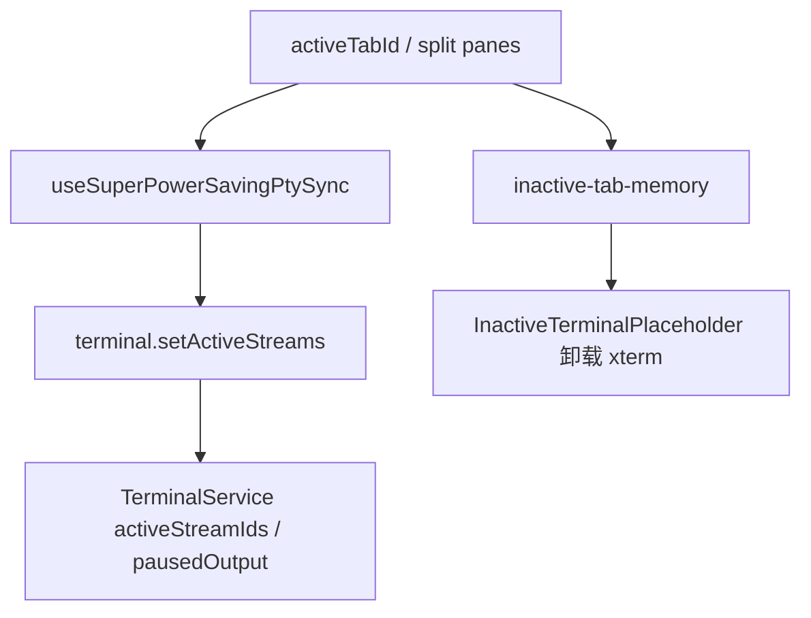
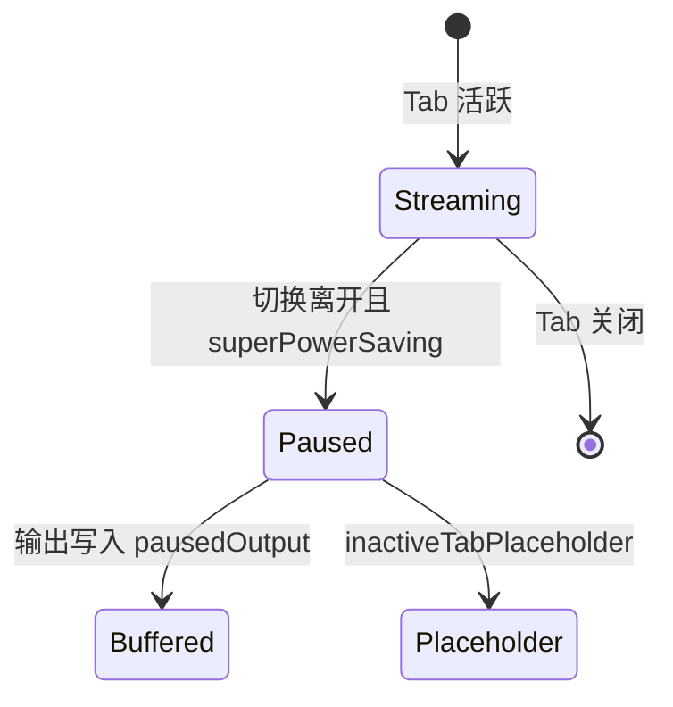

# 功能：性能

非活跃 Tab 内存策略、终端输出缓冲、Chromium/Electron 调优项。

## 功能列表

- **超级省电模式**：非活跃 Tab 暂停 PTY 推流
- **非活跃 Tab 占位**：卸载 xterm 实例仅保留占位 UI
- Inactive tab 内存释放延迟
- 与 `settings.performance` 联动的磁盘读写（`performance-settings-disk.ts`）

## 进程归属

| 层级 | 文件 |
|------|------|
| **主进程** | `electron/performance-settings-disk.ts`、`electron/chromium-tuning.ts`、`electron/main/terminal-output-flush.ts` |
| **渲染层** | `src/hooks/useSuperPowerSavingPtySync.ts`、`src/lib/super-power-saving-pty.ts`、`src/lib/inactive-tab-memory.ts`、`InactiveTerminalPlaceholder.tsx` |
| **设置** | `src/components/settings/PerformanceSettings.tsx` |

## 架构与数据流





## 实验特性

否。

## 配置文件片段

```json
{
  "performance": {
    "superPowerSaving": false,
    "inactiveTabPlaceholder": true,
    "inactiveTabMemoryReleaseMs": 60000
  }
}
```

类型：`electron/shared/performance-settings.ts`。

## 数据存储

`settings.json` → `performance`；无额外文件。

## 核心代码

### 渲染层同步

`src/hooks/useSuperPowerSavingPtySync.ts` — 根据活跃 Tab 调用 `terminal.setActiveStream(s)`。

`App.tsx` 挂载：`82:82:src/App.tsx`。

### 非活跃占位

`src/components/terminal/InactiveTerminalPlaceholder.tsx`

`src/lib/inactive-tab-memory.ts`

### 主进程输出缓冲

`electron/main/terminal-output-flush.ts` — 批量 flush `terminal:data`。
