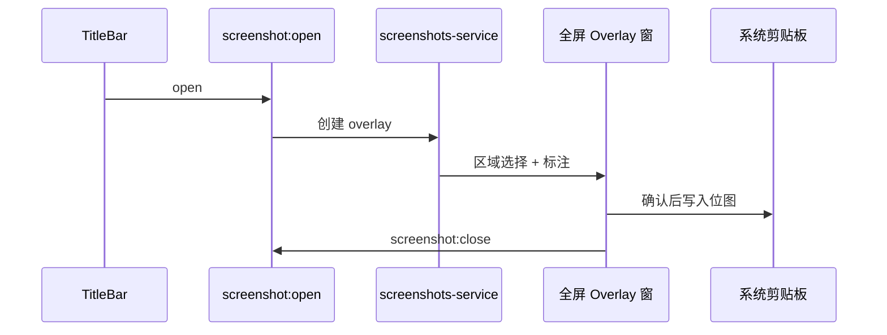

# 功能：截图工具

区域截图、简单标注、复制到剪贴板。

## 功能列表

- 从标题栏打开全屏截图覆盖层
- 框选区域、标注、确认后写入剪贴板
- 关闭覆盖层恢复主窗口

## 进程归属

| 层级 | 文件 |
|------|------|
| **主进程** | `electron/screenshots-service.ts` |
| **渲染层** | 截图 UI 由主进程创建 BrowserWindow 或 overlay（见 service 实现） |

## 架构与数据流



## 实验特性

否。

## 配置文件片段

无独立配置项。

## 数据存储

无持久化；截图结果仅进系统剪贴板。

## 核心代码

### 主进程 IPC

```989:995:electron/main/index.ts
ipcMain.on('screenshot:open', () => { /* screenshotsService.open */ })
ipcMain.on('screenshot:close', () => { /* ... */ })
```

### 标题栏入口

`TitleBarTerminalControls` — 截图按钮调用 `getElectronAPI().screenshot.open()`（搜索 `Crop` 图标相关代码）。

### 服务实现

`electron/screenshots-service.ts` — 窗口管理与屏幕捕获逻辑。
