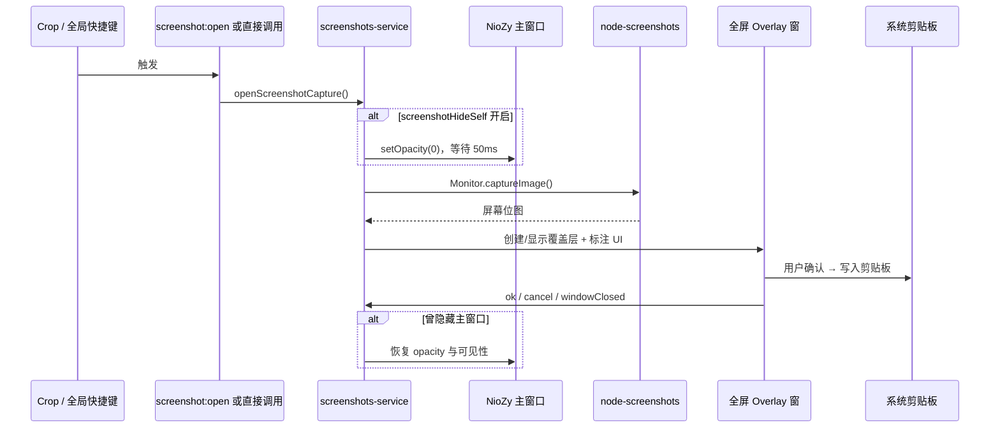
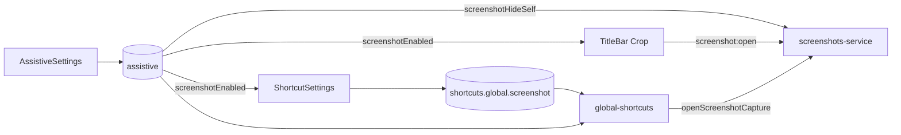

# 功能：截图工具

区域截图、简单标注、确认后复制到系统剪贴板。基于 [`electron-screenshots`](https://www.npmjs.com/package/electron-screenshots)（底层使用 `node-screenshots` 抓取屏幕位图）。

## 功能列表

### 入口

| 入口 | 条件 | 说明 |
|------|------|------|
| 标题栏 **Crop** 按钮 | `assistive.screenshotEnabled !== false` | 主窗口内点击，经 `screenshot:open` IPC 启动 |
| **设置 → 快捷键 → 屏幕截图（全局）** | 同上，且用户已配置非空快捷键 | 系统级 `globalShortcut`，程序在后台也可触发；默认未设置。见 [功能快捷键.md](./功能快捷键.md) |

两条入口最终均调用主进程 `openScreenshotCapture()`，行为一致。

### 截图能力

- 框选区域，支持矩形/椭圆/箭头/画笔/文字/马赛克等标注
- 确认（Done）后将选区位图写入系统剪贴板
- 取消或关闭覆盖层后结束截图会话
- **可选**：**设置 → 辅助功能 → 屏幕截图是否隐藏自身** — 开启后在开始截屏前暂时隐藏 NioZy 主窗口，避免程序本身出现在截图背景中

### 禁用行为

关闭 **辅助功能 → 开启屏幕截图**（`screenshotEnabled`）后：

- 标题栏 Crop 按钮隐藏
- 全局截图快捷键注销（即使 `shortcuts.global.screenshot` 已配置）
- 快捷键设置页不显示「屏幕截图（全局）」项

## 进程归属

| 层级 | 文件 |
|------|------|
| **主进程** | `electron/screenshots-service.ts` |
| **主进程** | `electron/main/index.ts`（IPC、`configureScreenshotsService`） |
| **主进程** | `electron/global-shortcuts.ts`（全局截图快捷键 → `openScreenshotCapture`） |
| **设置** | `electron/shared/assistive-settings.ts`、`src/components/settings/AssistiveSettings.tsx` |
| **快捷键设置** | `src/components/settings/ShortcutSettings.tsx`（`shortcuts.global.screenshot`） |
| **渲染层** | `src/components/layout/TitleBarTerminalControls.tsx`（Crop 按钮） |
| **Preload** | `electron/preload/index.ts` → `screenshot.open` / `screenshot.close` |
| **截图 UI** | 由 `electron-screenshots` 在主进程创建全屏 `BrowserWindow` + `BrowserView`（`react-screenshots`） |

## 架构与数据流

### 截图会话



### 设置、入口与全局快捷键



`syncGlobalShortcuts` 仅在 `screenshotEnabled` 为开且 `shortcuts.global.screenshot` 非空时注册截图快捷键；`screenshotEnabled` 或快捷键变更时由 `settings:save` 重新同步。

## 实验特性

否。

## 配置文件片段

### 辅助功能开关

截图总开关与隐藏自身位于 `settings.json` → `assistive`：

```json
{
  "assistive": {
    "screenshotEnabled": true,
    "screenshotHideSelf": false
  }
}
```

| 键 | 默认值 | 说明 |
|----|--------|------|
| `screenshotEnabled` | `true` | 关闭后隐藏标题栏截图按钮、注销全局截图快捷键，并禁用截图功能 |
| `screenshotHideSelf` | `false` | 开启后，调用 `startCapture()` 前将主窗口 `setOpacity(0)`；完成/取消/关闭后恢复原有透明度 |

类型定义：`electron/shared/assistive-settings.ts`。

界面入口：**设置 → 辅助功能**；`screenshotHideSelf` 仅在 `screenshotEnabled` 为开时显示（缩进子项）。总览见 [辅助功能.md](./辅助功能.md)。

### 全局截图快捷键

存储于 `settings.json` → `shortcuts.global.screenshot`，默认 `""`（未设置）。配置与注册逻辑见 [功能快捷键.md](./功能快捷键.md)。

```json
{
  "shortcuts": {
    "global": {
      "screenshot": ""
    }
  }
}
```

## 数据存储

无持久化；截图结果仅写入系统剪贴板，不落盘。

## 实现要点

### 捕获顺序

`electron-screenshots` 的 `startCapture()` 会 **先** 抓取当前显示器位图，**再** 创建全屏标注窗口。因此：

- 若主窗口在捕获瞬间仍可见，会出现在背景图中
- 截图覆盖层本身不会出现在初始背景里（覆盖层在捕获之后创建）

`screenshotHideSelf` 通过在 `startCapture()` 前将主窗口透明度设为 `0`（比 `hide()` 在 Windows 上更可靠），并延迟约 50ms 等待合成器刷新，从而避免截到 NioZy 自身。

### 主窗口恢复

在 `ok`、`cancel`、`windowClosed` 事件中恢复主窗口；捕获失败、`endCapture()` 或应用退出时也会尝试恢复，并保留用户 **外观 → 窗口透明度** 对应的 opacity。

## 核心代码

### 主进程 IPC

```1229:1238:electron/main/index.ts
ipcMain.on('screenshot:open', () => {
  void openScreenshotCapture().catch((err) => {
    mainLog.error('Failed to start screenshot capture', logErrorPayload(err))
  })
})

ipcMain.on('screenshot:close', () => {
  void closeScreenshotCapture().catch((err) => {
    mainLog.error('Failed to close screenshot capture', logErrorPayload(err))
  })
})
```

启动时注入主窗口与隐藏开关：

```590:600:electron/main/index.ts
  configureScreenshotsService({
    getMainWindow: () => mainWindow,
    shouldHideSelf: () => settingsStore.get().assistive.screenshotHideSelf === true,
  })
  ...
  initScreenshotsService(settingsStore.get().locale)
```

### 全局快捷键入口

`electron/global-shortcuts.ts` — `syncGlobalShortcuts` 在 `screenshotEnabled` 且 accelerator 非空时注册，回调直接调用 `openScreenshotCapture()`（与 IPC 路径相同，不经过渲染进程）。

### 标题栏入口

`src/components/layout/TitleBarTerminalControls.tsx` — `assistive.screenshotEnabled !== false` 时显示 Crop 按钮，调用 `getElectronAPI().screenshot.open()`。

### 服务实现

`electron/screenshots-service.ts` — 封装 `electron-screenshots` 实例、`openScreenshotCapture` / `closeScreenshotCapture`、多语言文案，以及可选的主窗口隐藏/恢复逻辑。

## 相关文档

- [功能快捷键.md](./功能快捷键.md) — 全局快捷键配置、`syncGlobalShortcuts` 与校验规则
- [辅助功能.md](./辅助功能.md) — 辅助功能分区与 `assistive` 字段总览
