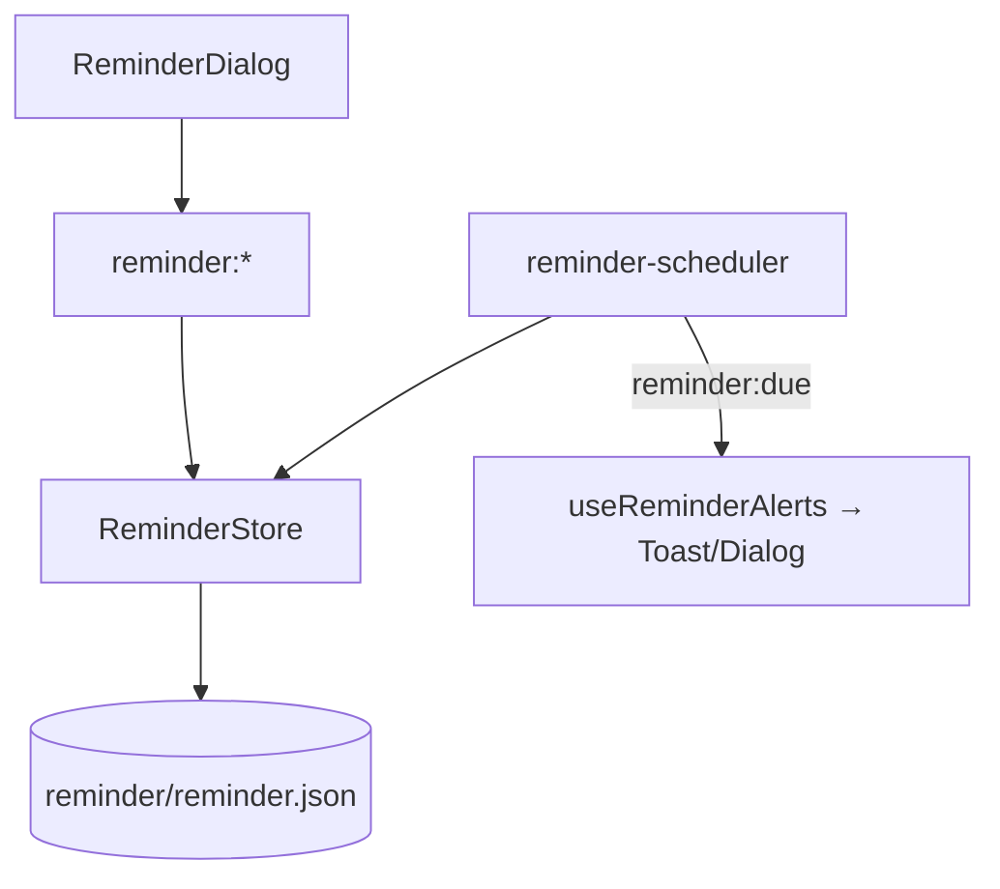
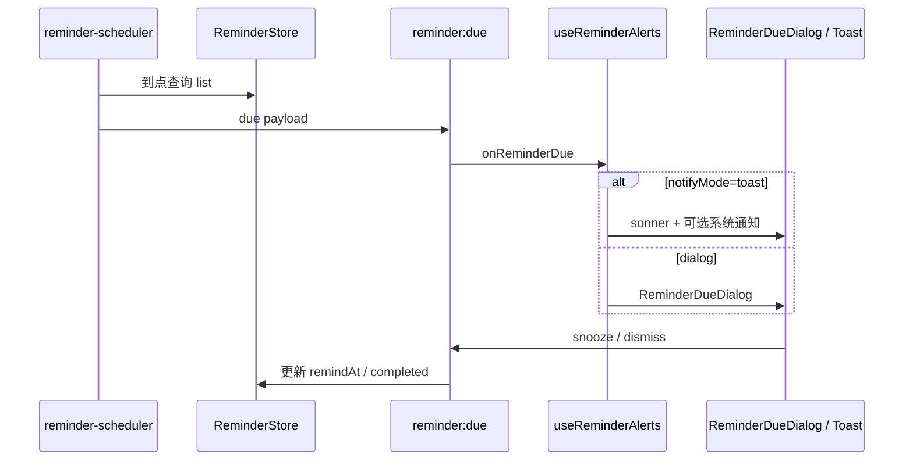

# 功能：提醒事项

定时提醒、重复规则、Toast/对话框/系统通知、自定义提醒图。

## 功能列表

- 提醒 CRUD（标题、时间、重复、优先级）
- 主进程调度到点事件 `reminder:due`
- 渲染层 Toast 或模态对话框
- 可选 Windows 系统通知与提示音
- 延后（snooze）、忽略、清除已完成
- 顶栏铃铛入口（`reminder.enabled`）

## 进程归属

| 层级 | 文件 |
|------|------|
| **主进程** | `electron/reminder-store.ts`、`electron/reminder-scheduler.ts`、`electron/reminder-image-service.ts` |
| **渲染层** | `src/components/reminder/ReminderDialog.tsx`、`ReminderDueDialog.tsx`、`ReminderSettings.tsx` |
| **Hooks** | `src/hooks/useReminderAlerts.ts`、`src/lib/reminder-due-toast.tsx` |
| **Store** | `src/stores/reminder-store.ts`（UI 缓存，与 IPC 同步） |

## 架构与数据流





## 实验特性

否（设置中心独立分区，非「实验特性」页）。

## 配置文件片段

`settings.json` → `reminder`：

```json
{
  "reminder": {
    "enabled": false,
    "systemNotification": false,
    "notifyMode": "toast",
    "soundEnabled": false,
    "toastDurationSec": 3,
    "customImageExt": null
  }
}
```

类型：`5:25:electron/shared/reminder-settings.ts`。

## 数据存储

| 路径 | 内容 |
|------|------|
| `%USERPROFILE%\.config\NioZy\reminder\reminder.json` | 提醒列表 |
| `%USERPROFILE%\.config\NioZy\reminder\reminder.{jpg\|png\|gif}` | 自定义提醒图 |

```45:57:electron/config-paths.ts
export function getReminderDir(): string {
  return join(getConfigDir(), 'reminder')
}
export function getReminderFilePath(): string {
  return join(getReminderDir(), 'reminder.json')
}
```

## 核心代码

### ReminderStore（主进程）

```27:59:electron/reminder-store.ts
export class ReminderStore {
  load(): void  // reminder.json
  list(): ReminderItem[]
  save(item): ReminderItem
  delete(id: string): void
```

### IPC

```901:974:electron/main/index.ts
ipcMain.handle('reminder:list', () => reminderStore.list())
ipcMain.handle('reminder:save', (_, item) => { /* ... */ })
ipcMain.handle('reminder:snooze', (_, ids, minutes) => { /* ... */ })
ipcMain.handle('reminder:pickImage', async () => { /* ... */ })
```

Preload 事件：`reminder:due` — `61:64:electron/preload/index.ts`。

### 渲染层

`src/hooks/useReminderAlerts.ts` — 订阅 `onReminderDue`。

`src/components/reminder/ReminderDialog.tsx` — 管理 UI（约 458 行）。

`TitleBarTerminalControls` — `showReminders`（`62:62:src/components/layout/TitleBarTerminalControls.tsx`）。
