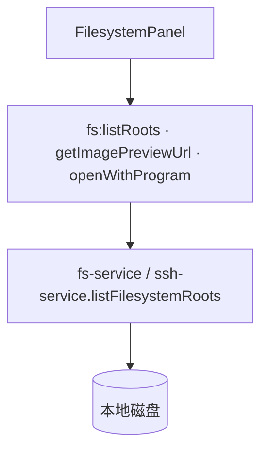
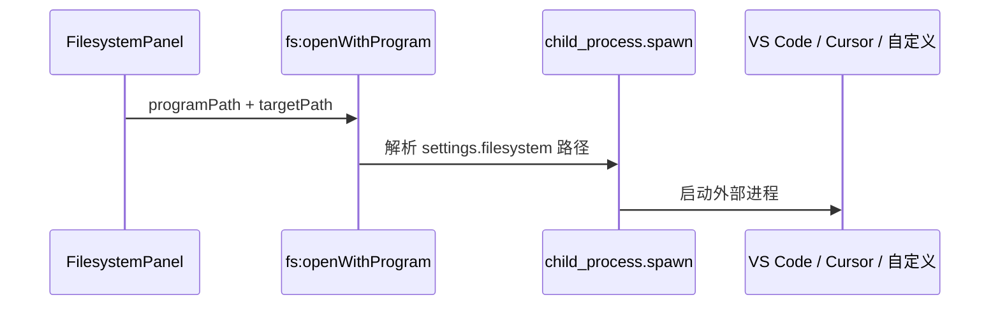

# 功能：文件系统 Tab

本地目录浏览、图片预览、用外部程序打开文件/文件夹。

## 功能列表

- 独立「文件系统」Tab（侧栏/极简栏入口）
- 列出盘符与目录树
- 图片缩略/预览对话框
- 用 VS Code / Cursor / 自定义程序打开
- 拖拽到终端 Tab 解析为目录（`fs:resolveTerminalDropDirectory`）
- 拖放文件到终端（`terminal-drop-actions`）

## 进程归属

| 层级 | 文件 |
|------|------|
| **主进程** | `electron/fs-service.ts`、`electron/open-directory.ts`、`electron/local-file-protocol.ts` |
| **渲染层** | `src/components/filesystem/FilesystemPanel.tsx` |

## 架构与数据流





## 实验特性

否。

## 配置文件片段

`settings.json` → `filesystem`：

```json
{
  "filesystem": {
    "defaultOpenProgram": "",
    "vscodePath": "",
    "cursorPath": "",
    "showHiddenFiles": false
  }
}
```

类型：`electron/shared/filesystem-settings.ts`。

## 数据存储

无独立数据文件；仅读取用户磁盘与 `settings.filesystem` 中的程序路径。

## 核心代码

### 渲染层面板

`src/components/filesystem/FilesystemPanel.tsx` — 目录列表与操作按钮。

`src/components/filesystem/FilesystemImagePreviewDialog.tsx` — 图片预览。

### 主进程

```1083:1122:electron/main/index.ts
ipcMain.handle('fs:listRoots', () => sshService.listFilesystemRoots())
ipcMain.handle('fs:getImagePreviewUrl', (_, filePath: string) => /* ... */)
ipcMain.handle('fs:openWithProgram', (_, programPath, targetPath) => /* ... */)
ipcMain.handle('fs:resolveTerminalDropDirectory', (_, filePath: string) => /* ... */)
```

### 设置 UI

`src/components/settings/FilesystemSettings.tsx`

### App 集成

```37:41:src/App.tsx
const FilesystemPanel = lazy(() =>
  import('@/components/filesystem/FilesystemPanel').then(/* ... */),
)
```

`useAppStore.addFilesystemTab` — `src/stores/app-store.ts`。
