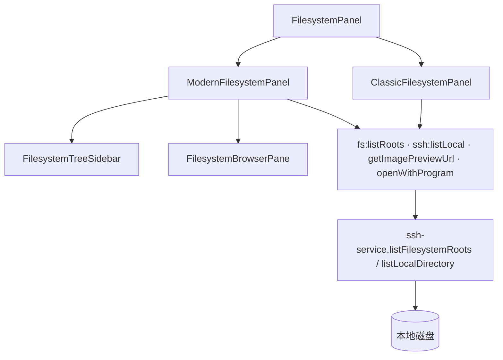
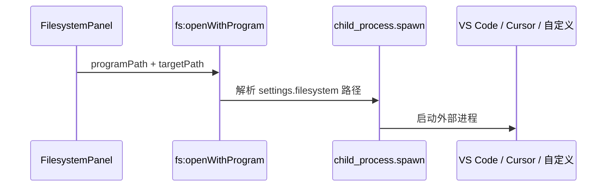

# 功能：文件系统 Tab

本地目录浏览、图片预览、用外部程序打开文件/文件夹。

> 同一设置页内的 **仓库管理**（Git 仓库列表、提交图、分支切换等）见 [功能仓库管理.md](./功能仓库管理.md)。

## 功能列表

- 独立「文件系统」Tab（侧栏/极简栏入口）
- 列出盘符与目录树
- **现代风格 UI**（可选）：左侧文件树 + 右侧文件浏览器，参考资源管理器 / NAS Web 文件管理器
  - 右侧初始展示「此电脑」与本地磁盘驱动器（C:、D: 等）
  - 支持**列表**与**网格**两种视图（现代 UI 默认网格）
  - 树节点与右侧目录内容均为**懒加载**（展开或进入目录时才请求 `ssh:listLocal`）
  - 默认隐藏 `$Recycle.Bin` 回收站目录
  - 列表/网格切换控件使用 `useUiClasses()` 分段样式，随全局 UI 风格（minimal、niozy、glass、claude 等）变化
- 经典 UI（默认）：单栏可展开目录树
- 图片缩略/预览对话框
- 用 VS Code / Cursor / 自定义程序打开
- 拖拽到终端 Tab 解析为目录（`fs:resolveTerminalDropDirectory`）
- 拖放文件到终端（`terminal-drop-actions`）

## 进程归属

| 层级 | 文件 |
|------|------|
| **主进程** | `electron/fs-service.ts`、`electron/open-directory.ts`、`electron/local-file-protocol.ts`、`electron/ssh-service.ts`（`listLocalDirectory`） |
| **渲染层** | `src/components/filesystem/FilesystemPanel.tsx` 及子组件（见下） |

## 架构与数据流





### UI 模式切换

`FilesystemPanel` 根据 `settings.filesystem.modernFilesystemUiEnabled` 渲染：

| 模式 | 组件 | 说明 |
|------|------|------|
| 经典（默认） | `ClassicFilesystemPanel` | 原单栏目录树 |
| 现代 | `ModernFilesystemPanel` | 左右分栏；左侧仅目录树，右侧完整文件列表 |

设置入口：**设置 → 文件系统 → 使用现代风格文件系统 UI**（需先开启本地文件系统）。

## 实验特性

否。

## 配置文件片段

`settings.json` → `filesystem`：

```json
{
  "filesystem": {
    "localFilesystemEnabled": true,
    "modernFilesystemUiEnabled": false,
    "imagePreviewEnabled": true,
    "openWithVsCode": true,
    "openWithCursor": true,
    "vsCodePath": "",
    "cursorPath": "",
    "customOpeners": [],
    "repoManagementEnabled": false,
    "gitPath": ""
  }
}
```

类型：`electron/shared/filesystem-settings.ts`。

## 数据存储

无独立数据文件；仅读取用户磁盘与 `settings.filesystem` 中的程序路径。

## 核心代码

### 渲染层面板

| 文件 | 作用 |
|------|------|
| `FilesystemPanel.tsx` | 按设置路由经典 / 现代 UI |
| `ClassicFilesystemPanel.tsx` | 经典单栏目录树 |
| `ModernFilesystemPanel.tsx` | 现代分栏主面板、树与浏览器状态同步 |
| `FilesystemTreeSidebar.tsx` | 左侧懒加载目录树 |
| `FilesystemBrowserPane.tsx` | 右侧浏览器（面包屑、上一级、刷新、列表/网格） |
| `FilesystemEntryContextMenu.tsx` | 共享右键菜单（终端、VS Code、Cursor、自定义） |
| `filesystem-tree-utils.ts` | 树节点工具、路径链、条目过滤（含 `$Recycle.Bin`） |
| `FilesystemImagePreviewDialog.tsx` | 图片预览 |

### 主进程

```typescript
ipcMain.handle('fs:listRoots', () => sshService.listFilesystemRoots())
ipcMain.handle('ssh:listLocal', (_, dirPath) => sshService.listLocalDirectory(dirPath))
ipcMain.handle('fs:getImagePreviewUrl', (_, filePath) => /* ... */)
ipcMain.handle('fs:openWithProgram', (_, programPath, targetPath) => /* ... */)
ipcMain.handle('fs:resolveTerminalDropDirectory', (_, filePath) => /* ... */)
```

现代 UI 右侧「此电脑」视图使用 `fs:listRoots`；进入具体目录后使用 `ssh:listLocal`（与 SCP 传输面板本机侧相同）。

### 设置 UI

`src/components/settings/FilesystemSettings.tsx`

### App 集成

```typescript
const FilesystemPanel = lazy(() =>
  import('@/components/filesystem/FilesystemPanel').then(/* ... */),
)
```

`useAppStore.addFilesystemTab` — `src/stores/app-store.ts`。

### 其他依赖

- `src/lib/scp-local-path.ts` — 「此电脑」根路径、`parentScpLocalPath` 上一级导航
- `src/hooks/usePaneResize.ts` — 现代 UI 左侧树宽度拖拽
- `src/lib/ui-style.ts` — `useUiClasses()` 分段控件样式
