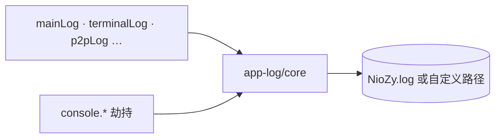
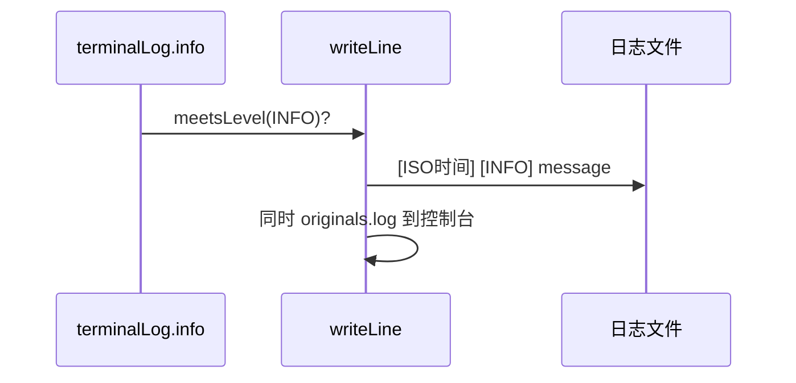

# 功能：日志

主进程控制台重定向到日志文件，分模块 Logger，设置页打开日志目录。

## 功能列表

- 开关日志写入
- 日志级别 DEBUG / INFO / WARN / ERROR
- 自定义日志文件路径（空则程序运行目录下 `NioZy.log`）
- 分模块：`main`、`terminal`、`vault`、`p2p`、`preview`、`update` 等
- 设置页「打开日志目录」

## 进程归属

**主进程** — `electron/app-log/`。

| 文件 | 作用 |
|------|------|
| `electron/app-log/core.ts` | 流式写文件、console 劫持 |
| `electron/app-log/loggers.ts` | 命名 logger 导出 |
| `src/components/settings/LogSettings.tsx` | 设置 UI |

## 架构与数据流





## 实验特性

否。

## 配置文件片段

```json
{
  "logging": {
    "enabled": false,
    "level": "INFO",
    "filePath": ""
  }
}
```

```7:19:electron/shared/logging-settings.ts
export interface LoggingSettings {
  enabled: boolean
  level: LogLevel
  filePath: string  // 空 → 运行目录 NioZy.log
}
```

## 数据存储

| 路径 | 说明 |
|------|------|
| `{cwd}/NioZy.log` | 默认（`filePath` 为空） |
| 用户自定义绝对路径 | `logging.filePath` 指定 |

打开目录 IPC：`logging:openLogDirectory` — `655:655:electron/main/index.ts`。

## 核心代码

### 写日志核心

```39:50:electron/app-log/core.ts
function meetsLevel(level: LogLevel): boolean { /* ... */ }
function writeLine(level: LogLevel, args: unknown[]): void {
  if (!config.enabled || !logStream || !meetsLevel(level)) return
  logStream.write(`[${timestamp}] [${level}] ...`)
}
```

### 设置 UI

`src/components/settings/LogSettings.tsx`
