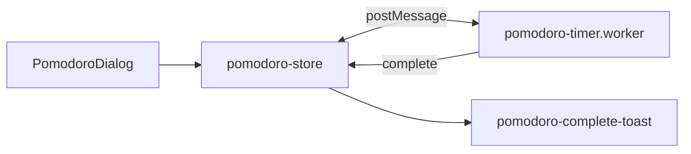
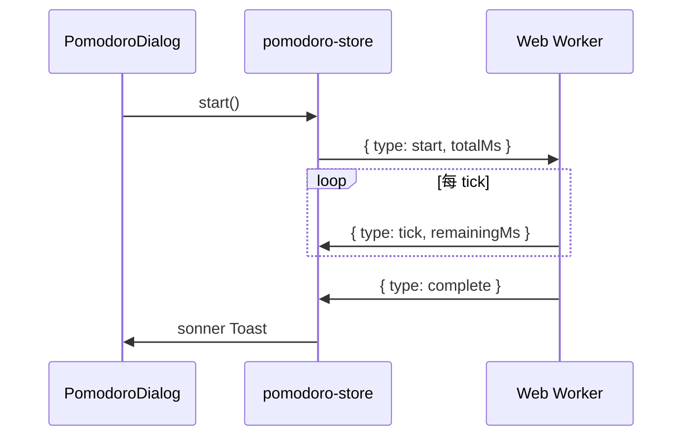

# 功能：番茄钟

Web Worker 独立计时，圆环进度 UI，完成时 Toast 提醒。

## 功能列表

- 时长 5 分钟–2 小时可调
- 开始 / 暂停 / 恢复 / 重置
- 圆环进度显示
- 完成通知（sonner Toast）
- 与设置中心无独立分区（入口在标题栏）

## 进程归属

**纯渲染层** + **Web Worker**（不涉及主进程 IPC）。

| 文件 | 作用 |
|------|------|
| `src/workers/pomodoro-timer.worker.ts` | 计时逻辑 |
| `src/stores/pomodoro-store.ts` | Zustand 状态 |
| `src/components/layout/PomodoroDialog.tsx` | UI |
| `src/lib/pomodoro-timer-types.ts` | 消息类型 |
| `src/lib/pomodoro-complete-toast.ts` | 完成提示 |

## 架构与数据流





## 实验特性

否。

## 配置文件片段

无持久化配置；时长仅在会话内由 `pomodoro-store` 保存。

## 数据存储

无磁盘存储。

## 核心代码

### Store 与 Worker

```11:22:src/stores/pomodoro-store.ts
interface PomodoroState {
  status: PomodoroStatus
  durationMinutes: number
  totalMs: number
  remainingMs: number
  init: () => void
  setDurationMinutes: (minutes: number) => void
  start: () => void
  pause: () => void
  resume: () => void
  reset: () => void
}
```

```26:33:src/stores/pomodoro-store.ts
function notifyPomodoroComplete(totalMs: number) {
  window.setTimeout(() => {
    void import('@/lib/pomodoro-complete-toast').then(({ showPomodoroCompleteToast }) => {
      showPomodoroCompleteToast(totalMs)
    })
  }, 0)
}
```

### 标题栏入口

`TitleBarTerminalControls` — `PomodoroDialog` 状态 `pomodoroOpen`（`23:23`、`48:48:src/components/layout/TitleBarTerminalControls.tsx`）。
