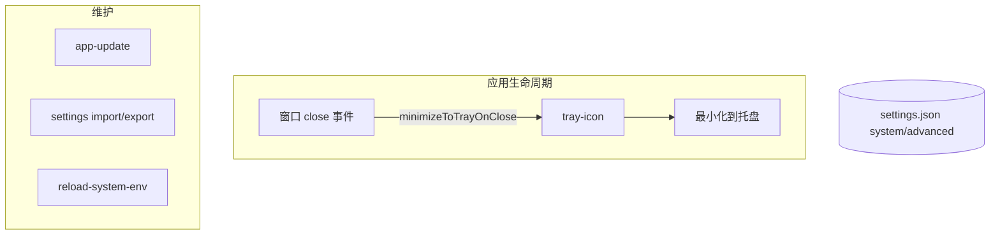
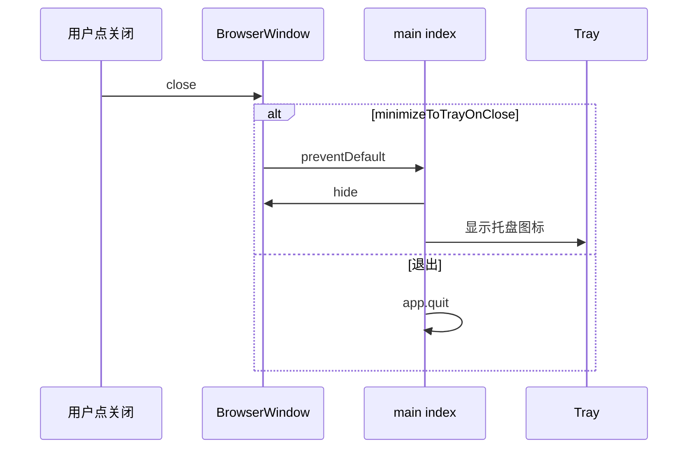

# 功能：系统与托盘

系统托盘、开机启动、关闭行为、代理、应用更新、环境变量重载、窗口状态记忆。

## 功能列表

- 系统托盘图标与菜单（新建终端、打开设置、退出）
- 关闭窗口最小化到托盘
- 开机自启动（Windows 注册表/快捷方式）
- HTTP 代理字符串
- 检查 GitHub Release 更新并下载安装包
- 设置导入/导出 JSON
- 重载系统环境变量（无需重启应用即可刷新 PATH 等）
- 记住窗口位置与大小（`advanced.preserveWindowBounds`）
- Windows 右键「使用 NioZy 打开」注册

## 进程归属

| 功能 | 主进程文件 |
|------|------------|
| 托盘 | `electron/tray-icon.ts` |
| 更新 | `electron/app-update.ts` |
| 环境变量 | `electron/reload-system-env.ts` |
| 窗口边界 | `electron/window-bounds.ts` |
| Shell 右键 | `electron/windows-shell-context-menu.ts` |
| 设置 UI | `src/components/settings/SystemSettings.tsx`、`AdvancedSettings.tsx` |

## 架构与数据流





## 实验特性

否（「高级」中的硬件加速、沙箱、透明度等为稳定高级项，非 experimental 页）。

## 配置文件片段

`settings.json`：

```json
{
  "system": {
    "proxy": "",
    "launchOnStartup": false,
    "minimizeToTrayOnClose": true
  },
  "advanced": {
    "hardwareAcceleration": true,
    "disableSandbox": false,
    "transparency": 1,
    "statusBarLiveStats": true,
    "shellContextMenu": false,
    "preserveWindowBounds": false,
    "lastWindowState": null
  }
}
```

## 数据存储

| 路径 | 内容 |
|------|------|
| `settings.json` | `system.*`、`advanced.*`（含 `lastWindowState`） |
| 用户选择的导入/导出路径 | 临时，非固定 |

更新下载目录由 `app-update.ts` 决定（通常为系统临时目录）。

## 核心代码

### 主进程启动与托盘

`electron/main/index.ts` — `createWindow`、`setupTray`、关闭时 `minimizeToTrayOnClose` 分支。

### 设置导入导出

```764:785:electron/main/index.ts
ipcMain.handle('settings:exportToFile', async () => { /* 对话框写 JSON */ })
ipcMain.handle('settings:importFromFile', async () => { /* 读 JSON 合并 */ })
```

### 更新

```982:984:electron/main/index.ts
ipcMain.handle('update:check', () => checkForAppUpdate())
ipcMain.handle('update:download', (_, payload) => /* ... */)
```

### 环境变量

```891:891:electron/main/index.ts
ipcMain.handle('system:reloadEnvironment', () => reloadSystemEnvironment())
```

### 设置 UI

- `src/components/settings/SystemSettings.tsx` — 代理、托盘、启动项
- `src/components/settings/AdvancedSettings.tsx` — 硬件加速、窗口记忆、Shell 菜单

### 应用重启

`src/lib/app-relaunch.ts` — `getElectronAPI().app.relaunch()`。
