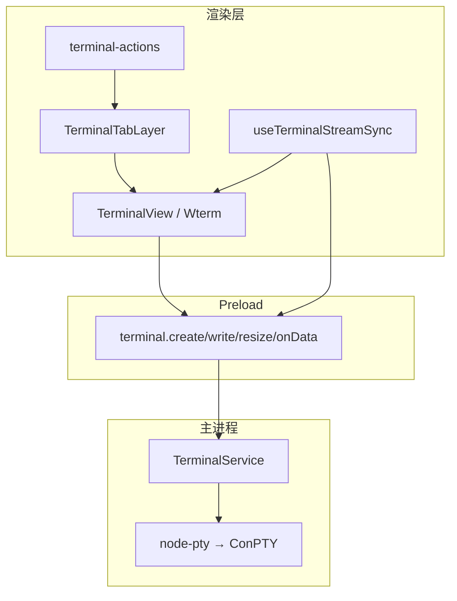
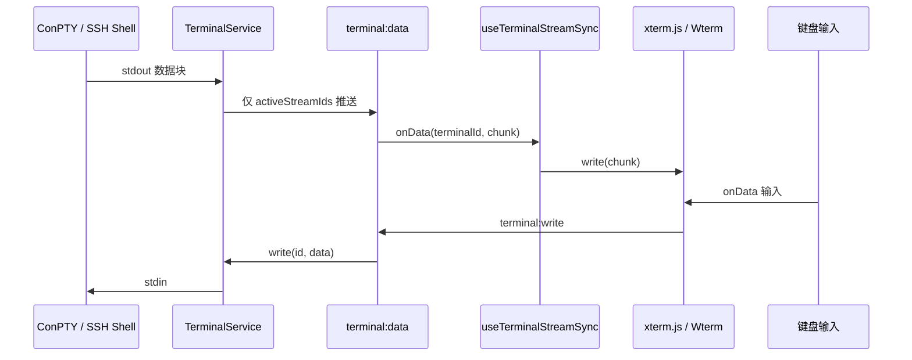
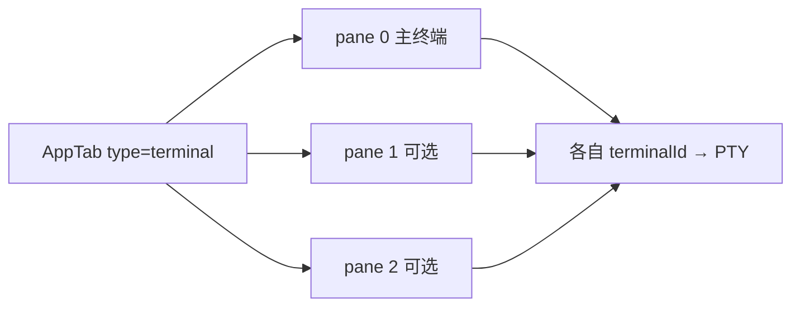
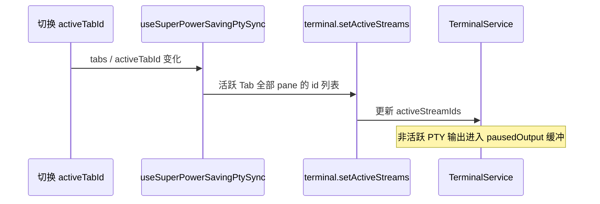
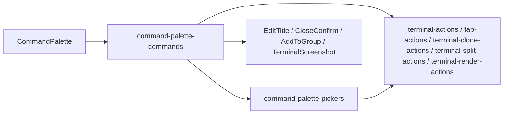
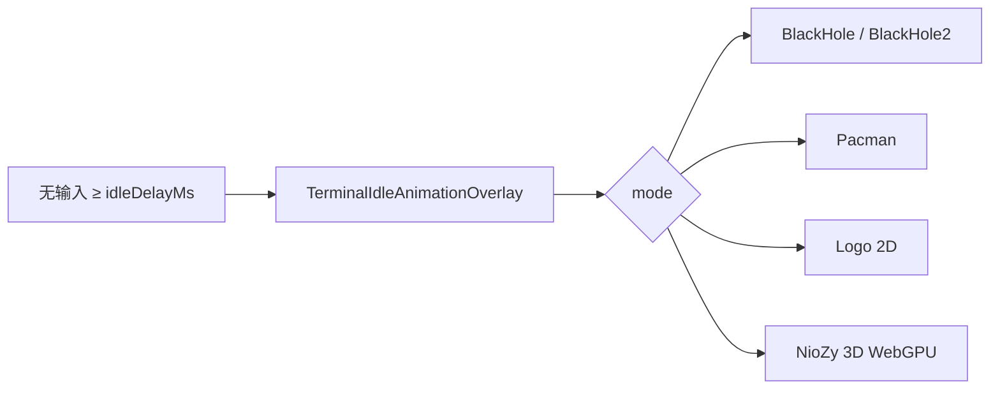

# 功能：终端与会话

多 Tab 本地/远程终端、分屏、双渲染引擎、PTY 生命周期与 Shell 集成。

## 功能列表

- 新建本地终端（PowerShell / CMD / pwsh / 自定义命令）
- 以管理员身份启动本地 PTY
- SSH 会话（见 [功能SSH连接.md](./功能SSH连接.md)）
- Tab 内横向拆分，最多 3 个 pane
- 终端输出流：仅活跃 Tab（及拆分 pane）接收 `terminal:data`
- 工作目录同步（OSC 序列 → 状态栏 CWD）
- 双引擎：xterm.js 6（DOM / WebGL，默认 WebGL）；实验性 Wterm（WASM，仅 DOM）
- **同步渲染（DEC 2026）**：`terminal.synchronizedOutputEnabled`（默认开启，仅 xterm）
- **回滚行数**：`terminal.scrollback`（0–100000，默认 1000），创建与运行时均写入 xterm `scrollback`
- 实验性 Attach-PTY：单 xterm 实例切换绑定 PTY
- 超级省电：非活跃 Tab 暂停推流（性能设置）；分屏多 pane 时非聚焦 pane 使用 DOM 以节省 WebGL 上下文
- 终端自定义背景图（可与 WebGL 同时使用；单元格半透明底色避免壁纸穿透）
- 内置 Nerd Font Mono（可覆盖系统字体）：0xProto / Comic Shanns / Departure / Fira Code / Ubuntu Mono
- **编程连字**（`terminal.ligaturesEnabled`，默认关闭）：xterm.js 通过 `@xterm/addon-ligatures` 在支持连字的 Nerd Font 下渲染 `=>`、`===`、`!=` 等连字
- **右键复制/粘贴**（`terminal.rightClickCopyPaste`，默认开启）：有选区时复制，无选区时粘贴
- **高级右键菜单**（`terminal.advancedRightClickMenu`，默认关闭）：与上一项互斥；开启后在终端内右键展示上下文菜单（复制、粘贴、复制并粘贴、搜索、导出、重放列表、终端外观）
- 右键「在此处打开 NioZy」→ 指定目录开终端（主进程 Shell 集成）
- **重启恢复终端会话**（设置 · SHELL 开关，见 [SHELL.md](./SHELL.md)）：多 Tab 并行恢复；SSH 动态密码 Tab 启动时不连接，切换时再输入密码
- **终端 Tab 右键 · 终端截图**：导出当前 pane **可见区域**为 PNG / JPG / SVG（可选配色方案、水印；四边 10px 内边距）
- **终端 Tab 右键 · 属性**：只读查看 Tab 创建时间、标题、启动命令/参数、SSH/WSL 等连接详情与工作目录
- **命令面板**（`Ctrl+Shift+P`）：模糊搜索执行终端 Tab 操作、外观设置、AI 边栏等；详见 §命令面板
- **无 Tab 欢迎页**（`terminal.welcomePage`）：可开启欢迎页并在 **NioZy 3D** / **Logo 粒子动画** 间切换；启动无会话恢复时不自动新建终端，关闭全部 Tab 后也会展示；详见 §无 Tab 欢迎页
- **终端闲置动画**（`terminal.idleAnimation`）：无输入一段时间后于终端屏幕区播放覆盖动画；含 BlackHole / Pacman / Logo / **NioZy（3D Logo）** 等模式；详见 §终端闲置动画

## 进程归属

| 层级 | 职责 |
|------|------|
| **主进程** | `node-pty` 创建 ConPTY、`TerminalService` 读写/resize/kill |
| **渲染层** | xterm/Wterm 渲染、Tab UI、输入转发、**命令面板** |
| **Preload** | `terminal:*` IPC |

## 架构与数据流

### 模块架构



### 终端输出/输入数据流



### Tab 拆分结构



### 活跃流控制（超级省电）



## 实验特性

| 开关 | 配置路径 | 说明 |
|------|----------|------|
| Wterm 模拟器 | `experimental.terminalEmulator: 'wterm'` | 仅 DOM 渲染 |
| Ghostty Core | `experimental.ghosttyCoreEnabled` | Wterm 下 WASM VT |
| Attach-PTY | `experimental.attachPtyRenderMode` | 仅 xterm |

详见 [功能实验特性.md](./功能实验特性.md)。

## xterm 渲染与选项

### 渲染模式

| 模式 | 说明 |
|------|------|
| `webgl` | 默认推荐；`@xterm/addon-webgl`，同时最多 6 个 WebGL 上下文（LRU 驱逐） |
| `dom` | 稳定兜底；超级省电、分屏非聚焦 pane 会自动降级 |

旧配置中的 `canvas` / `webgpu` 会在加载时迁移为 `webgl`（xterm 6 已移除 Canvas 渲染器）。

调试当前 Tab 实际渲染器：在 DevTools 选中 `.niozy-terminal-host`，查看 `data-niozy-renderer`（`dom` / `webgl` / `webgl-loading`）与 `data-niozy-renderer-fallback`（降级原因，若有）。

### 同步输出（DEC mode 2026）

- 开启：PTY 输出原样写入 xterm 6，由内核处理 `CSI ? 2026 h/l` 原子刷新
- 关闭：剥离同步输出序列，回退为即时渲染
- 实现：`src/lib/terminal-sync-output.ts`

### 回滚（scrollback）

- 设置 → 终端 → **回滚**：映射为 xterm `ITerminalOptions.scrollback`
- 新建终端：`buildTerminalOptions()` 传入初始值
- 修改设置：`applyTerminalRuntimeOptions()` 热更新，无需重开 Tab
- Wterm 使用独立项 `experimental.ghosttyScrollbackLimit`（见 [功能实验特性.md](./功能实验特性.md)）

### WebGL 图集刷新

挂载 WebGL 前等待字体就绪并 fit，resize / 字体变更时 `clearTextureAtlas()` 重建，避免 Braille 等密集字符错位。见 `src/lib/terminal-webgl-refresh.ts`。

### 连字（Ligatures）

- 设置 → 终端 → **启用连字符**
- 仅 `xterm` 引擎生效；Wterm / Ghostty 设置页会禁用该开关
- 实现：`@xterm/addon-ligatures`
- 热更新：开关或终端字体切换时重载 ligatures addon；WebGL 渲染下会同步重建纹理图集

### 平滑滚动

开关字段：`settings.enableSmoothScrolling`（设置 → 外观 → **开启平滑滚动**，详见 [功能外观与布局.md](./功能外观与布局.md) §平滑滚动）。开启并重启后，`.xterm-viewport` 应用 `scroll-behavior: smooth`，终端滚轮 / 程序化滚动平滑过渡；Chromium 原生平滑滚动同时由启动开关 `enable-smooth-scrolling` 开启。

### 终端右键行为

设置 → 终端 → **右键复制/粘贴** 与 **高级右键菜单** 互斥，只能开启其一；两者均关闭时 xterm 恢复默认「右键选中单词」行为（`rightClickSelectsWord: true`）。

| 模式 | 配置 | 行为 |
|------|------|------|
| 右键复制/粘贴 | `rightClickCopyPaste: true` | 有选区 → 复制到剪贴板；无选区 → 从剪贴板粘贴到 PTY |
| 高级右键菜单 | `advancedRightClickMenu: true` | 右键弹出上下文菜单，菜单项见下表 |
| 均未开启 | 两者 `false` | xterm 右键选中单词；Wterm 无自定义右键逻辑 |

**高级右键菜单项**（xterm / Wterm 均支持；部分能力依赖辅助功能开关）：

| 菜单项 | 说明 |
|--------|------|
| 复制文本 | 需先左键选中文本 |
| 粘贴文本 | 从剪贴板写入当前 pane 的 PTY |
| 复制并粘贴 | 将选中文本复制并写入 PTY |
| 搜索终端 | 打开终端搜索对话框（需 `assistive.terminalSearchEnabled`） |
| 导出终端 | 导出 xterm 缓冲区为文本文件（Wterm 暂不支持） |
| 重放列表 ▶ | 二级菜单，展示 `shell.commandReplays`（需 `assistive.commandReplayEnabled`） |
| 终端外观 ▶ | 放大/缩小字体（±1，范围 10–24，写入 `terminal.fontSize`） |

菜单关闭后会将焦点还回触发右键的终端；搜索、导出等会打开其他对话框时不抢焦点。

实现要点：

- 规范化与互斥：`electron/shared/terminal-xterm.ts`（`normalizeTerminalRightClickSettings`、`resolveRightClickSelectsWord`）
- xterm 挂载：`TerminalView.tsx` — `contextmenu` 打开菜单，`mouseup` 处理复制/粘贴
- Wterm 挂载：`src/lib/wterm-dom-shell.ts`
- 菜单 UI：`TerminalContextMenuHost.tsx` + `terminal-ui-store.ts` + `terminal-context-menu-actions.ts`
- 设置 UI：`TerminalSettings.tsx`

### 终端 Tab 右键（侧栏）

侧栏终端 Tab 右键菜单（与终端**内部**高级右键菜单相互独立）。会打开弹框的项与命令面板共用同一套 `Dialog` / `AlertDialog` 组件。

| 菜单项 | 说明 |
|--------|------|
| 打开 | 激活该 Tab |
| 关闭 | 二次确认后关闭 |
| 关闭其他终端 | `closeOtherTerminalTabs` |
| 克隆终端 | `cloneTerminalTab` |
| 拆分终端 | `splitTerminalTab`（未达 3 pane 上限时可用） |
| SCP 传输 | 仅 SSH Tab；打开 `ScpTransferDialog`（需 `ssh.scpTransferEnabled`） |
| 以管理员身份重启 | 仅 Windows 本地内置 Shell 且当前进程非管理员 |
| 添加到分组 / 移入分组 | 打开 `AddToGroupDialog` |
| 编辑标题 | 打开编辑标题对话框 |
| 导出终端 | 将当前活跃 pane 的 xterm 缓冲区导出为 `.txt` |
| **终端截图** | 打开导出弹框，将当前 pane **可见 viewport** 导出为图片（xterm / Wterm 均支持） |
| **属性** | 打开只读属性弹框，展示启动与连接信息（见下表） |

**属性**弹框字段（按 Tab 类型动态展示，空项省略）：

| 字段 | 说明 |
|------|------|
| 创建时间 | `tab.createdAt`，按界面语言格式化 |
| 标题 / 默认标题 | 显示名与原始 `tab.title`（自定义标题时） |
| 类型 | 内置 Shell / SSH / WSL / Telnet / 自定义命令等 |
| 连接名称、主机、端口、用户名 | 远程或自定义连接 |
| 认证方式、分组、动态密码 | SSH |
| 发行版 | WSL |
| 命令、参数 | 实际 spawn 命令行 |
| 管理员 | 本地 elevated 启动 |
| 工作目录 | OSC 同步的 CWD 或创建时 `cwd` |
| 拆分窗格、延迟连接 | 多 pane 或 `sshDeferredConnect` |

#### 终端截图

| 选项 | 说明 |
|------|------|
| 导出格式 | PNG、JPG、SVG |
| 配色方案 | 全部内置终端主题；可与当前设置不同，导出时按所选主题重绘或换肤 |
| 水印 | 默认「by NioZy」/ 自定义文字 / 无水印（默认选中「默认水印」） |

**捕获范围与外观**：

- 仅包含终端内容区当前**屏幕上可见**的行，不含 scrollback 与 Tab 外 chrome（如侧栏、10px 终端区内边距外的区域）
- 导出图片四边各增加 **10px** 内边距，填充色为所选配色方案的 `background`
- 拆分 Tab 时以**当前活跃 pane**（`activeSplitIndex`）为准；若 Tab 未激活，菜单会先切换至该 Tab

**捕获实现**：

| 引擎 | 同配色导出 | 切换导出配色 |
|------|------------|--------------|
| xterm | 优先从 `.xterm-screen` 对应 WebGL/Canvas 像素裁剪 viewport | 从 buffer `viewportY` 起渲染 `term.rows` 行，按 `isFgRGB` / `isFgPalette` 等解析 ANSI、256 色与真彩色 |
| Wterm | 克隆 `.wterm`，同步 `.term-grid` 的 `scrollTop`，经 SVG foreignObject 或内部 canvas 转位图 | 克隆时替换 `theme-{id}` 类并注入 wterm 主题 CSS |

保存路径由系统「另存为」对话框选择；主进程 IPC `files:saveImage`（PNG/JPG 为 base64，SVG 为 UTF-8 文本）。

#### 弹框与 body scroll lock

从侧栏右键或终端高级右键打开 `Dialog` 时，Radix **ContextMenu / DropdownMenu** 与 **Dialog** 可能短暂叠加 modal，使 `body` 出现 `data-scroll-locked` 与 `pointer-events: none`。若关闭弹框后未正确释放，会导致全界面无法点击。

防护措施：

| 层级 | 说明 |
|------|------|
| 弹框卸载兜底 | `DialogContent` / `AlertDialogContent` 卸载时调用 `scheduleReleaseStuckBodyScrollLock()`（`src/lib/body-scroll-lock.ts`），在无其他打开的 dialog / menu 时清除 body 残留样式 |
| 关闭态遮罩 | `index.css` 中 `.dialog-*-animate[data-state='closed']` 设置 `pointer-events: none`，避免退出动画期间全屏透明层挡点击 |
| 条件挂载 | 属性弹框仅在 `propertiesOpen` 时挂载；分组 / 截图弹框在 `open === false` 时不渲染，确保 Portal 与 scroll lock 及时释放 |
| 链接预览 | 弹框打开期间 `acquireLinkPreviewOverlaySuppression()` 隐藏链接预览 WebContentsView，避免盖住 HTML Dialog |

实现要点：

- Tab 菜单入口：`src/components/layout/TerminalTabItem.tsx`
- 属性弹框：`src/components/layout/TerminalPropertiesDialog.tsx`；字段组装：`src/lib/terminal-tab-properties.ts`（`buildTerminalTabPropertyRows`）
- 导出弹框：`src/components/layout/TerminalScreenshotDialog.tsx`
- 捕获与保存：`src/lib/terminal-screenshot.ts`；宿主注册：`src/lib/terminal-host-registry.ts`（`TerminalView` / `WterminalView` 挂载时注册）
- 文本导出：`src/lib/tab-actions.ts` → `exportTerminalTab`
- 弹框基座：`src/components/ui/dialog.tsx`、`src/components/ui/alert-dialog.tsx`
- body 锁清理：`src/lib/body-scroll-lock.ts`
- 主进程保存：`electron/main/index.ts`（`files:saveImage`）；Preload / 类型：`electron/preload/index.ts`、`electron/shared/api-types.ts`（`SaveImageInput`）
- 文案：`src/locales/zh.json` 等 `tab.terminalScreenshot*`、`tab.terminalProperties*`、`toast.screenshot*`

### 命令面板

程序内快捷键 **`CommandOrControl+Shift+P`** 打开/关闭命令面板（可配置，见 [功能快捷键.md](./功能快捷键.md)）。挂载于 `App.tsx` 的 `CommandPalette`，样式随 `data-ui-style` 与各 UI 风格圆角适配。

**交互**：

| 输入 | 列表行为 |
|------|----------|
| （空） | 3 条常用命令（按历史使用频率） |
| 任意文本 | 模糊匹配命令名称、关键词与命令 id |
| `/all`、`help`、`/help` | 展示全部 15 条命令（可用项在前，不可用灰显） |

**子命令面板**（类似 VS Code，Enter 进入、Esc 返回上级）：

| 父命令 | 子列表 | 说明 |
|--------|--------|------|
| 切换渲染模式 | DOM、WebGL | 当前项带 ✓；↑↓ 选择、Enter 写入 `terminal.renderer` |
| 切换终端配色方案 | 全部内置配色（24 种） | 支持输入框模糊筛选；Enter 写入 `terminal.colorScheme` 并热更新终端 |
| 切换界面风格 | 全部内置界面风格（7 种） | 支持输入框模糊筛选；Enter 写入 `uiStyle` 并同步默认强调色（与外观设置一致） |
| 切换明亮/暗黑主题 | 明亮、暗黑 | 当前项带 ✓；↑↓ 选择、Enter 写入 `theme`（与外观设置一致） |

**命令列表**（目标 Tab 解析：优先当前活动终端 Tab，否则激活第一个终端 Tab）：

| 命令 | 说明 | 可用条件 |
|------|------|----------|
| 新建终端 | 调用 `createTerminal()` | 始终 |
| 修改终端 Tab 标题 | 打开编辑标题对话框 | 存在终端 Tab |
| 关闭终端 Tab | 二次确认后关闭 | 存在终端 Tab |
| 添加终端 Tab 到一个分组 | 打开 `AddToGroupDialog` | 存在终端 Tab |
| 将终端 Tab 移出分组 | `removeTabFromAllGroups` | 目标 Tab 已在某分组 |
| 克隆终端 Tab | `cloneTerminalTab` | 存在终端 Tab |
| 拆分终端 | `splitTerminalTab` | 存在终端 Tab 且未达拆分上限（3 pane） |
| 导出终端 | 导出活跃 pane 缓冲区为 `.txt` | 存在终端 Tab |
| 终端截图 | 打开 `TerminalScreenshotDialog` | 存在终端 Tab |
| 打开设置 | `addSettingsTab()` | 始终 |
| 切换渲染模式 | 进入子面板选择 DOM / WebGL | xterm 引擎（Wterm 下不可用） |
| 切换终端配色方案 | 进入子面板选择内置配色 | 始终（写入全局 `terminal.colorScheme`） |
| 切换界面风格 | 进入子面板选择内置界面风格 | 始终（写入全局 `uiStyle` 与对应默认 `accentColor`） |
| 切换明亮/暗黑主题 | 进入子面板选择明亮 / 暗黑 | 始终（写入全局 `theme`） |
| 打开/关闭 AI 对话 | `useAiSidebarStore.toggle()` | `experimental.aiSidebarEnabled` 已开启 |
| 新建 AI 对话 | 打开边栏（若已关闭）并 `requestNewChat()` | `experimental.aiSidebarEnabled` 已开启 |

需对话框的命令（重命名、关闭确认、添加到分组、终端截图）会先关闭命令面板再打开对应弹框，与侧栏 Tab 右键菜单共用同一套对话框组件。需子面板的命令（渲染模式、配色方案、界面风格、主题）保持命令面板打开并切换至二级列表。



实现要点：

- 命令定义与执行：`src/lib/command-palette-commands.ts`
- 子面板选项与筛选：`src/lib/command-palette-pickers.ts`（渲染模式、配色方案、界面风格、主题列表）
- 模糊匹配：`src/lib/command-palette-fuzzy.ts`（子序列匹配 + 命令 id 分词）
- 开关与常用记录：`src/stores/command-palette-store.ts`（`localStorage` → `niozy.commandPalette.recent`）
- UI：`src/components/layout/CommandPalette.tsx`（含子面板顶栏返回、当前项 ✓ 标记）
- 快捷键：`src/hooks/useAppShortcuts.ts` → `shortcuts.app.commandPalette`
- 渲染模式应用：`src/lib/terminal-render-actions.ts`（`setTerminalRenderer`）
- 配色方案枚举：`electron/shared/terminal-color-schemes.ts`（`COLOR_SCHEME_OPTIONS`）
- 界面风格枚举：`electron/shared/ui-style.ts`（`UI_STYLE_VALUES`）；强调色预设：`src/lib/ui-style.ts`（`getAccentPresets`）
- 文案：`src/locales/zh.json` 等 `commandPalette.*`

### 无 Tab 欢迎页

设置 → 终端 → **欢迎页面**（`terminal.welcomePage`）。

| 字段 | 说明 |
|------|------|
| `enabled` | 是否启用欢迎页（默认 `false`） |
| `animation` | 动画类型：`niozy3d`（3D WebGPU）或 `particles`（Logo 粒子动画，默认 `niozy3d`） |

**展示时机**（须 `tabs.length === 0` 且应用启动引导 `appBootComplete` 已完成，避免会话恢复期间闪现动画）：

| 条件 | 主内容区 |
|------|----------|
| `welcomePage.enabled === false` | `EmptyWorkspaceHint`：「点击「新建终端」开始」 |
| `welcomePage.enabled === true` | `EmptyWelcomeView`，按 `animation` 切换 3D / 粒子视图 |

**启动行为**（与 [SHELL.md](./SHELL.md) 中「重启恢复终端会话」联动）：

| 场景 | 行为 |
|------|------|
| 开启会话恢复且成功恢复 Tab | 直接进入恢复的终端，不展示欢迎页 |
| 未开启会话恢复，或恢复失败/无快照，且 `welcomePage.enabled` | **不**自动 `createTerminal()`，留空 Tab 展示欢迎页 |
| 未开启欢迎页 | 启动后自动新建默认终端（与旧版行为一致） |

**动画模式**：

| `animation` | 说明 | 回退 |
|-------------|------|------|
| `niozy3d` | Three.js **WebGPURenderer** 3D NioZy Logo（蓝色「N」+ 圆角终端窗 + 红黄绿按钮），屏幕区循环打字演示命令（含 `niozy --version` 动态输出 Electron / Chromium 版本） | 未开启硬件加速 + WebGPU、运行时 adapter 不可用或场景初始化失败 → `EmptyWorkspaceHint` |
| `particles` | Three.js **InstancedMesh** 圆球粒子：从 `src/logo.png` 采样约 1.5 万颗粒子拼出 Logo；**WebGPU 优先**，不可用时回退 **WebGL**；鼠标滑过排斥留轨迹、停住或移开后弹簧回弹；左键点击局部打散后恢复 | 采样/渲染器初始化失败 → `EmptyWorkspaceHint` |

旧配置中的 `pixel` 会在加载时迁移为 `particles`（`normalizeWelcomePageAnimationMode`）。

**交互与视觉（共用）**：

- 底部叠加应用标语（`app.tagline`）与新建终端提示（`app.emptyHint`），`pointer-events-none` 不挡画布
- **3D 模式额外**：Logo 组整体缩放约 80%，随 idle 轻微浮动；指针在欢迎区内移动时 Logo 平滑朝向鼠标，移出或失焦后回正
- **粒子模式额外**：深色底 `#070d14`；Canvas 铺满容器（`width/height: 100%`），**不设** `pointer-events: auto`，避免挡住下方「新建终端」等点击；交互通过 `window` 级 `pointermove` / `pointerdown` + `getBoundingClientRect()` 判断是否在欢迎区内

**粒子模式（`particles`）交互**：

| 操作 | 行为 |
|------|------|
| 在 Logo 上滑动 | 排斥附近粒子，留下轨迹 |
| 停住不动 / 移出 Logo / 离开 canvas | 强弹簧 + 指数衰减，约 0.5s 内回弹归位 |
| 左键点击 | 径向冲量 + 局部打散，随后回弹 |

坐标映射：屏幕 2D → logo 局部平面（与 `updateViewportFit` 一致），不依赖 Raycaster。

**3D 模式（`niozy3d`）实现要点**：

- 入口：`src/App.tsx` → `EmptyWelcomeView` → `WelcomePage3DView`
- 探测：`src/lib/webgpu-capability.ts`（`isWebGpuEnabledInSettings`、`probeWebGpuRuntime`）
- 场景引擎：`src/lib/welcome-terminal-engine.ts`（`WelcomeTerminalEngine`）
- Canvas 挂载：`src/components/welcome/WelcomeTerminalCanvas.tsx`
- 依赖：`package.json` → `three`；拆包：`scripts/renderer-manual-chunks.ts` → `three`
- Chromium 开关：主进程 `applyWebGpuFlags()`（`electron/chromium-tuning.ts`），须在 `app.whenReady()` 之前；修改设置后需完全退出并重启应用

**粒子模式（`particles`）实现要点**：

- 视图：`WelcomePageParticleView` → `WelcomeLogoParticleAnimation.tsx`
- 引擎：`src/lib/welcome-logo-particle-engine.ts`（`WelcomeLogoParticleEngine`；`logo.png` 像素采样、`InstancedMesh` 球体、弹簧物理）
- 渲染：`createWelcomeRenderer()` — WebGPU 优先，失败回退 WebGL
- 依赖：`package.json` → `three`（已移除 `pixi.js`）；拆包：`scripts/renderer-manual-chunks.ts` → `three`

**类型与设置 UI**：

- 类型与规范化：`electron/shared/welcome-page-settings.ts`（`isWelcomePageEnabled`、`WELCOME_PAGE_ANIMATION_MODES`）
- 持久化：`electron/settings-store.ts`、`electron/shared/api-types.ts`
- 设置 UI：`src/components/settings/TerminalSettings.tsx`
- 文案：`src/locales/zh.json` 等 `settings.terminal.welcomePage*`

### 终端闲置动画

设置 → 终端 → **终端闲置动画**（`terminal.idleAnimation`）。**Wterm 引擎下不可用**（设置页会提示切换回 Xterm）。

| 字段 | 说明 |
|------|------|
| `enabled` | 是否启用（默认 `false`） |
| `mode` | 动画类型，见下表 |
| `idleDelayMs` | 无输入后触发延迟（1000–120000 ms，默认 5000） |

**动画模式**：

| `mode` | 说明 |
|--------|------|
| `blackHole` | 2D Canvas，基于 xterm 屏幕内容的「黑洞」扭曲（WebGL 渲染下效果最佳） |
| `blackHole2` | GPU 版 BlackHole |
| `pacman` | Pac-Man 与幽灵在屏幕区内随机游走 |
| `logo` | 2D NioZy Logo 随机贝塞尔轨迹弹跳 |
| `niozy` | 与欢迎页相同的 **3D WebGPU Logo**（精简粒子、`compact` 模式）；需 WebGPU 设置与运行时可用，否则回退为 `logo` |

**覆盖层外观**：

- 所有闲置模式共享 **半透明磨砂背景**（`.terminal-idle-frost`）：明亮模式浅色磨砂，暗黑模式加深（与 `--background` / `--card` 及 `glass` 界面风格联动）
- 覆盖层 `pointer-events-none`，点击可穿透至终端以唤醒输入；**NioZy** 模式通过 `window` 级 `pointermove` 按屏幕区边界计算朝向，不阻挡点击

**触发逻辑**：

- `useTerminalIdleAnimation`：当前 Tab 获得焦点且终端就绪后，超过 `idleDelayMs` 无键盘输入则 `enabled` 为 true
- `TerminalIdleAnimationOverlay` 测量 `.xterm-screen` 区域，在其上绝对定位动画层



**实现要点**：

- 类型与规范化：`electron/shared/terminal-idle-animation.ts`
- 闲置检测：`src/hooks/useTerminalIdleAnimation.ts`
- 覆盖宿主：`src/components/terminal/TerminalIdleAnimationOverlay.tsx`
- 3D 闲置：`src/components/terminal/idle-animation/NioZyIdleAnimation.tsx`（懒加载 `welcome-terminal-engine`）
- 2D 动画：`src/components/terminal/idle-animation/LogoIdleAnimation.tsx`、`PacmanIdleAnimation.tsx`；BlackHole：`src/lib/terminal-idle-animation/`
- 磨砂样式：`src/components/terminal/idle-animation/terminal-idle-animation.css`（`.terminal-idle-frost`）
- 设置 UI：`src/components/settings/TerminalSettings.tsx`
- 挂载点：`TerminalView.tsx`（`termReady` 且 `idleAnimation.enabled`）

## 配置文件片段

`settings.json`：

```json
{
  "defaultTerminal": "powershell",
  "builtinConnections": { "powershell": true, "cmd": true, "pwsh": true },
  "terminal": {
    "colorScheme": "atom",
    "fontFamily": "Consolas",
    "useBuiltinFont": false,
    "builtinFont": "0xProtoNerd",
    "fontSize": 13,
    "ligaturesEnabled": false,
    "renderer": "webgl",
    "cursorStyle": "block",
    "cursorBlink": true,
    "scrollback": 1000,
    "synchronizedOutputEnabled": true,
    "drawBoldTextInBrightColors": true,
    "rightClickCopyPaste": true,
    "advancedRightClickMenu": false,
    "backgroundOpacity": 100,
    "backgroundImageExt": "jpg",
    "idleAnimation": {
      "enabled": false,
      "mode": "blackHole",
      "idleDelayMs": 5000
    },
    "welcomePage": {
      "enabled": false,
      "animation": "niozy3d"
    }
  },
  "advanced": {
    "hardwareAcceleration": true,
    "webGpuAcceleration": false
  },
  "experimental": {
    "terminalEmulator": "xterm",
    "attachPtyRenderMode": false,
    "attachPtyTabSwitchDwellMs": 300
  }
}
```

## 数据存储

| 路径 | 内容 |
|------|------|
| `settings.json` | `terminal.*`、`defaultTerminal`、`builtinConnections` |
| `%USERPROFILE%\.config\NioZy\background\` | 终端背景图（扩展名由 `backgroundImageExt` 决定） |
| `resume-term.json` | 终端会话恢复快照（见 [SHELL.md](./SHELL.md)） |
| 安装包内 `src/fonts/` | 内置 Nerd Font Mono 字体文件（经 `@font-face` 注册） |

背景目录：`35:38:electron/config-paths.ts`（`getTerminalBackgroundDir`）。

## 核心代码

### 主进程 TerminalService

```64:192:electron/terminal-service.ts
  create(options: TerminalCreateOptions): { id, name, shell, cwd }
  // node-pty.spawn，ConPTY，elevated 分支，shell 集成参数
```

```195:200:electron/terminal-service.ts
  async createSsh2(options: Ssh2TerminalCreateOptions): Promise<{ id, name, shell, cwd }>
```

```337:365:electron/terminal-service.ts
  write(id: string, data: string): void
  resize(id: string, cols: number, rows: number): void
  kill(id: string): void
```

### 渲染层：创建 Tab

```33:55:src/lib/terminal-actions.ts
async function openTerminalTab(options) {
  const result = await getElectronAPI().terminal.create(createPayload)
  addTerminalTab({ id: `tab-${result.id}`, type: 'terminal', terminalId: result.id, /* ... */ })
}
```

```57:65:src/lib/terminal-actions.ts
export async function createTerminal(shell?: BuiltinShellType): Promise<void>
```

### 终端视图

- xterm：`src/components/terminal/TerminalView.tsx`
- Wterm：`src/components/terminal/WterminalView.tsx`
- Tab 层调度：`src/components/terminal/TerminalTabLayer.tsx`
- Attach 模式：`src/components/terminal/AttachPtyTerminalHost.tsx`、`src/lib/attach-pty-render.ts`；切换时用 `term.reset()` + `claimStream` 还原 scrollback（详见 [功能实验特性.md](./功能实验特性.md) §Attach-PTY）

### 输出流同步

`src/hooks/useTerminalStreamSync.ts` — 向主进程声明 `activeStreamIds`；Attach 模式下传 `deferRendererClaim`，由宿主 `applyAttachSession` 内 `claimStream` 领取缓冲，避免与快照恢复交错。

### 拆分

`splitPanes` / `activeSplitIndex` 定义于 `src/lib/terminal-tab-utils.ts`；侧栏与标题栏拆分操作见 `src/lib/tab-actions.ts`。

### 设置 UI

`src/components/settings/TerminalSettings.tsx` — 配色、字体、渲染器（DOM/WebGL）、同步渲染、光标、回滚、背景图、右键复制/粘贴与高级右键菜单、**终端闲置动画**、**欢迎页面**。

### 无 Tab 欢迎页（3D / 粒子）

- 欢迎视图：`src/components/welcome/EmptyWelcomeView.tsx`（`EmptyWorkspaceHint`、`WelcomePage3DView`、`WelcomePageParticleView`）
- 启动逻辑：`src/App.tsx`（`isWelcomePageEnabled`、跳过默认 `createTerminal()`、`appBootComplete` 后展示）
- 设置类型：`electron/shared/welcome-page-settings.ts`（`particles`；旧值 `pixel` 自动迁移）
- **3D**：`WelcomeTerminalCanvas.tsx`、`src/lib/welcome-terminal-engine.ts`；WebGPU 探测：`src/lib/webgpu-capability.ts`
- **粒子**：`WelcomeLogoParticleAnimation.tsx`、`src/lib/welcome-logo-particle-engine.ts`
- 依赖与拆包：`three` → `scripts/renderer-manual-chunks.ts`

### 终端闲置动画

- 覆盖层：`src/components/terminal/TerminalIdleAnimationOverlay.tsx`
- 3D NioZy：`src/components/terminal/idle-animation/NioZyIdleAnimation.tsx`
- 2D Logo / Pacman：`LogoIdleAnimation.tsx`、`PacmanIdleAnimation.tsx`
- 闲置钩子：`src/hooks/useTerminalIdleAnimation.ts`
- 磨砂 CSS：`src/components/terminal/idle-animation/terminal-idle-animation.css`

### 终端右键菜单

- 入口与动作：`src/lib/terminal-advanced-context-menu.ts`、`src/lib/terminal-context-menu-actions.ts`
- 全局菜单宿主：`src/components/terminal/TerminalContextMenuHost.tsx`（挂载于 `App.tsx`）
- 搜索联动：`TitleBarTerminalControls.tsx` 监听 `terminal-ui-store` 的 `searchOpenNonce`

### 终端 Tab 导出、截图与属性

- 文本导出：`src/lib/tab-actions.ts`（`exportTerminalTab`）
- 截图弹框：`src/components/layout/TerminalScreenshotDialog.tsx`
- 属性弹框：`src/components/layout/TerminalPropertiesDialog.tsx`；字段：`src/lib/terminal-tab-properties.ts`
- 截图捕获：`src/lib/terminal-screenshot.ts`；DOM 宿主：`src/lib/terminal-host-registry.ts`
- Tab 菜单：`src/components/layout/TerminalTabItem.tsx`
- 弹框 scroll lock 兜底：`src/lib/body-scroll-lock.ts`；`src/components/ui/dialog.tsx`、`alert-dialog.tsx`

### 命令面板

- UI：`src/components/layout/CommandPalette.tsx`（挂载于 `App.tsx`；含子命令面板）
- 命令与执行：`src/lib/command-palette-commands.ts`；子面板：`src/lib/command-palette-pickers.ts`
- 模糊匹配：`src/lib/command-palette-fuzzy.ts`
- 状态：`src/stores/command-palette-store.ts`；渲染模式：`src/lib/terminal-render-actions.ts`（`setTerminalRenderer`）
- 快捷键绑定：见 [功能快捷键.md](./功能快捷键.md)

### 内置 Nerd 字体

设置页「终端字体」旁提供**内置字体选择器**与**使用内置字体**开关。开启后 `builtinFont` 覆盖 `fontFamily`，xterm / Wterm 均通过 `resolveTerminalFontFamily()` 解析最终族名。

| `builtinFont` | 显示名 | 字体文件 |
|---------------|--------|----------|
| `0xProtoNerd` | 0xProto Nerd | `0xProtoNerdFontMono-Italic.ttf` |
| `comicShannsNerd` | Comic Shanns Mono Nerd | `ComicShannsMonoNerdFontMono-Regular.otf` |
| `departureNerd` | Departure Mono Nerd | `DepartureMonoNerdFontMono-Regular.otf` |
| `firaCodeNerd` | Fira Code Nerd | `FiraCodeNerdFontMono-Regular.ttf` |
| `ubuntuMonoNerd` | Ubuntu Mono Nerd | `UbuntuMonoNerdFontMono-Regular.ttf` |

- 定义与解析：`electron/shared/terminal-builtin-fonts.ts`（`TERMINAL_BUILTIN_FONTS`、`resolveTerminalFontFamilyCSSValue`）
- `@font-face` 注册：`src/index.css`（族名无空格，如 `NioZy0xProtoNerdMono`）
- 设置 UI：`src/components/settings/BuiltinTerminalFontPicker.tsx`
- xterm 选项：`src/lib/terminal-xterm-options.ts`（含 `scrollback`、`customGlyphs`）；运行时更新：`TerminalView.tsx`
- 同步输出过滤：`src/lib/terminal-sync-output.ts`
- WebGL 图集刷新：`src/lib/terminal-webgl-refresh.ts`
- 渲染器规范化：`electron/shared/terminal-renderer.ts`
- Wterm 变量：`src/lib/wterm-theme.ts` → `--term-font-family`

### Shell 集成（主进程）

`electron/shell-integration.ts` — PS 脚本注入工作目录 OSC；`electron/windows-shell-context-menu.ts` — 资源管理器右键注册。

**Oh My Posh**：`omp-bootstrap.ps1` 在 `shell-integration.ps1` 之前 dot-source，详见 [功能增强SHELL.md](./功能增强SHELL.md)。
