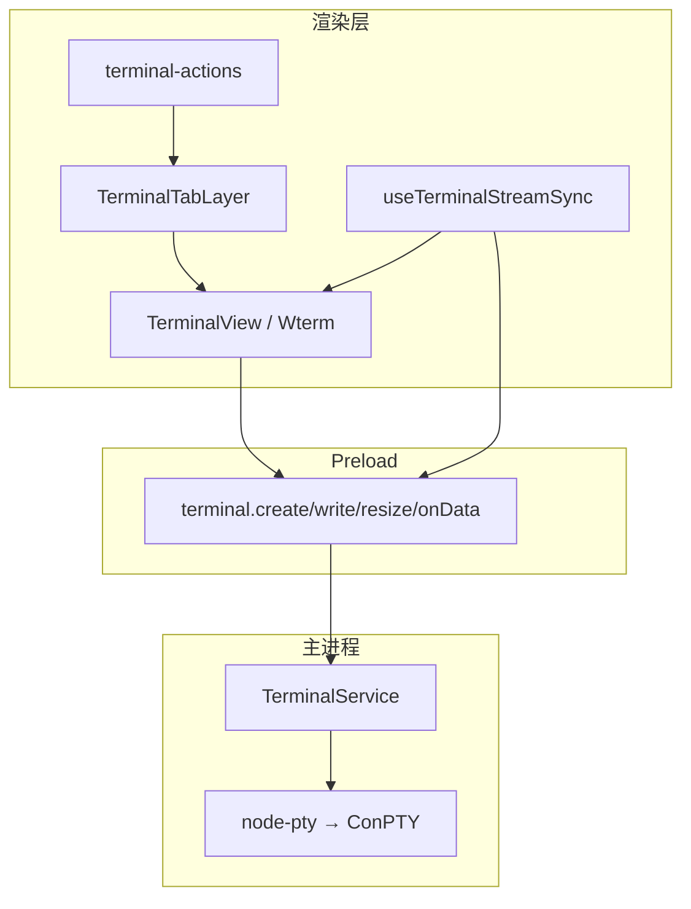
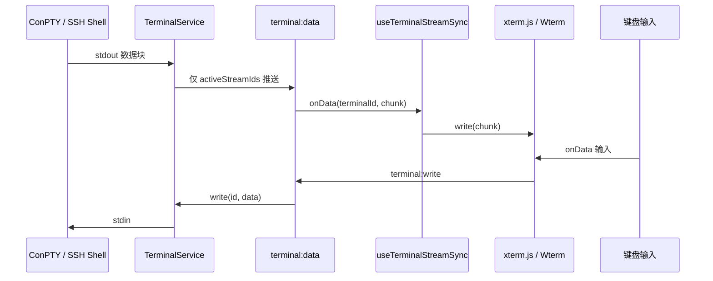
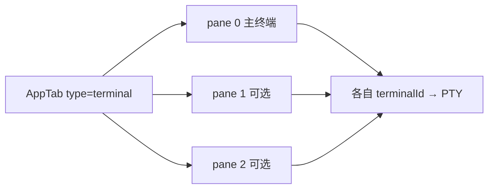
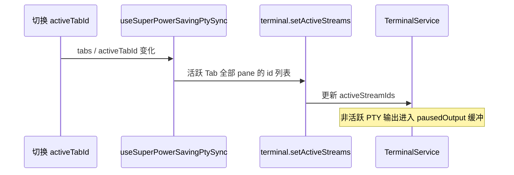

# 功能：终端与会话

多 Tab 本地/远程终端、分屏、双渲染引擎、PTY 生命周期与 Shell 集成。

## 功能列表

- 新建本地终端（PowerShell / CMD / pwsh / 自定义命令）
- 以管理员身份启动本地 PTY
- SSH 会话（见 [功能SSH连接.md](./功能SSH连接.md)）
- Tab 内横向拆分，最多 3 个 pane
- 终端输出流：仅活跃 Tab（及拆分 pane）接收 `terminal:data`
- 工作目录同步（OSC 序列 → 状态栏 CWD）
- 双引擎：xterm.js 6（DOM / WebGL，默认 WebGL）；实验性 Wterm（WASM，仅 DOM）
- **同步渲染（DEC 2026）**：`terminal.synchronizedOutputEnabled`（默认开启，仅 xterm）
- **回滚行数**：`terminal.scrollback`（0–100000，默认 1000），创建与运行时均写入 xterm `scrollback`
- 实验性 Attach-PTY：单 xterm 实例切换绑定 PTY
- 超级省电：非活跃 Tab 暂停推流（性能设置）；分屏多 pane 时非聚焦 pane 使用 DOM 以节省 WebGL 上下文
- 终端自定义背景图（可与 WebGL 同时使用；单元格半透明底色避免壁纸穿透）
- 内置 Nerd Font Mono（可覆盖系统字体）：0xProto / Comic Shanns / Departure / Ubuntu Mono
- 右键「在此处打开 NioZy」→ 指定目录开终端（主进程 Shell 集成）
- **重启恢复终端会话**（设置 · SHELL 开关，见 [SHELL.md](./SHELL.md)）

## 进程归属

| 层级 | 职责 |
|------|------|
| **主进程** | `node-pty` 创建 ConPTY、`TerminalService` 读写/resize/kill |
| **渲染层** | xterm/Wterm 渲染、Tab UI、输入转发 |
| **Preload** | `terminal:*` IPC |

## 架构与数据流

### 模块架构



### 终端输出/输入数据流



### Tab 拆分结构



### 活跃流控制（超级省电）



## 实验特性

| 开关 | 配置路径 | 说明 |
|------|----------|------|
| Wterm 模拟器 | `experimental.terminalEmulator: 'wterm'` | 仅 DOM 渲染 |
| Ghostty Core | `experimental.ghosttyCoreEnabled` | Wterm 下 WASM VT |
| Attach-PTY | `experimental.attachPtyRenderMode` | 仅 xterm |

详见 [功能实验特性.md](./功能实验特性.md)。

## xterm 渲染与选项

### 渲染模式

| 模式 | 说明 |
|------|------|
| `webgl` | 默认推荐；`@xterm/addon-webgl`，同时最多 6 个 WebGL 上下文（LRU 驱逐） |
| `dom` | 稳定兜底；超级省电、分屏非聚焦 pane 会自动降级 |

旧配置中的 `canvas` / `webgpu` 会在加载时迁移为 `webgl`（xterm 6 已移除 Canvas 渲染器）。

调试当前 Tab 实际渲染器：在 DevTools 选中 `.niozy-terminal-host`，查看 `data-niozy-renderer`（`dom` / `webgl` / `webgl-loading`）与 `data-niozy-renderer-fallback`（降级原因，若有）。

### 同步输出（DEC mode 2026）

- 开启：PTY 输出原样写入 xterm 6，由内核处理 `CSI ? 2026 h/l` 原子刷新
- 关闭：剥离同步输出序列，回退为即时渲染
- 实现：`src/lib/terminal-sync-output.ts`

### 回滚（scrollback）

- 设置 → 终端 → **回滚**：映射为 xterm `ITerminalOptions.scrollback`
- 新建终端：`buildTerminalOptions()` 传入初始值
- 修改设置：`applyTerminalRuntimeOptions()` 热更新，无需重开 Tab
- Wterm 使用独立项 `experimental.ghosttyScrollbackLimit`（见 [功能实验特性.md](./功能实验特性.md)）

### WebGL 图集刷新

挂载 WebGL 前等待字体就绪并 fit，resize / 字体变更时 `clearTextureAtlas()` 重建，避免 Braille 等密集字符错位。见 `src/lib/terminal-webgl-refresh.ts`。

## 配置文件片段

`settings.json`：

```json
{
  "defaultTerminal": "powershell",
  "builtinConnections": { "powershell": true, "cmd": true, "pwsh": true },
  "terminal": {
    "colorScheme": "atom",
    "fontFamily": "Consolas",
    "useBuiltinFont": false,
    "builtinFont": "0xProtoNerd",
    "fontSize": 13,
    "renderer": "webgl",
    "cursorStyle": "block",
    "cursorBlink": true,
    "scrollback": 1000,
    "synchronizedOutputEnabled": true,
    "drawBoldTextInBrightColors": true,
    "rightClickCopyPaste": true,
    "backgroundOpacity": 100,
    "backgroundImageExt": "jpg"
  },
  "experimental": {
    "terminalEmulator": "xterm",
    "attachPtyRenderMode": false,
    "attachPtyTabSwitchDwellMs": 300
  }
}
```

## 数据存储

| 路径 | 内容 |
|------|------|
| `settings.json` | `terminal.*`、`defaultTerminal`、`builtinConnections` |
| `%USERPROFILE%\.config\NioZy\background\` | 终端背景图（扩展名由 `backgroundImageExt` 决定） |
| `resume-term.json` | 终端会话恢复快照（见 [SHELL.md](./SHELL.md)） |
| 安装包内 `src/fonts/` | 内置 Nerd Font Mono 字体文件（经 `@font-face` 注册） |

背景目录：`35:38:electron/config-paths.ts`（`getTerminalBackgroundDir`）。

## 核心代码

### 主进程 TerminalService

```64:192:electron/terminal-service.ts
  create(options: TerminalCreateOptions): { id, name, shell, cwd }
  // node-pty.spawn，ConPTY，elevated 分支，shell 集成参数
```

```195:200:electron/terminal-service.ts
  async createSsh2(options: Ssh2TerminalCreateOptions): Promise<{ id, name, shell, cwd }>
```

```337:365:electron/terminal-service.ts
  write(id: string, data: string): void
  resize(id: string, cols: number, rows: number): void
  kill(id: string): void
```

### 渲染层：创建 Tab

```33:55:src/lib/terminal-actions.ts
async function openTerminalTab(options) {
  const result = await getElectronAPI().terminal.create(createPayload)
  addTerminalTab({ id: `tab-${result.id}`, type: 'terminal', terminalId: result.id, /* ... */ })
}
```

```57:65:src/lib/terminal-actions.ts
export async function createTerminal(shell?: BuiltinShellType): Promise<void>
```

### 终端视图

- xterm：`src/components/terminal/TerminalView.tsx`
- Wterm：`src/components/terminal/WterminalView.tsx`
- Tab 层调度：`src/components/terminal/TerminalTabLayer.tsx`
- Attach 模式：`src/components/terminal/AttachPtyTerminalHost.tsx`、`src/lib/attach-pty-render.ts`

### 输出流同步

`src/hooks/useTerminalStreamSync.ts` — 订阅 `terminal:onData`，写入对应 xterm/Wterm。

### 拆分

`splitPanes` / `activeSplitIndex` 定义于 `src/lib/terminal-tab-utils.ts`；侧栏与标题栏拆分操作见 `src/lib/tab-actions.ts`。

### 设置 UI

`src/components/settings/TerminalSettings.tsx` — 配色、字体、渲染器（DOM/WebGL）、同步渲染、光标、回滚、背景图。

### 内置 Nerd 字体

设置页「终端字体」旁提供**内置字体选择器**与**使用内置字体**开关。开启后 `builtinFont` 覆盖 `fontFamily`，xterm / Wterm 均通过 `resolveTerminalFontFamily()` 解析最终族名。

| `builtinFont` | 显示名 | 字体文件 |
|---------------|--------|----------|
| `0xProtoNerd` | 0xProto Nerd | `0xProtoNerdFontMono-Italic.ttf` |
| `comicShannsNerd` | Comic Shanns Mono Nerd | `ComicShannsMonoNerdFontMono-Regular.otf` |
| `departureNerd` | Departure Mono Nerd | `DepartureMonoNerdFontMono-Regular.otf` |
| `ubuntuMonoNerd` | Ubuntu Mono Nerd | `UbuntuMonoNerdFontMono-Regular.ttf` |

- 定义与解析：`electron/shared/terminal-builtin-fonts.ts`（`TERMINAL_BUILTIN_FONTS`、`resolveTerminalFontFamilyCSSValue`）
- `@font-face` 注册：`src/index.css`（族名无空格，如 `NioZy0xProtoNerdMono`）
- 设置 UI：`src/components/settings/BuiltinTerminalFontPicker.tsx`
- xterm 选项：`src/lib/terminal-xterm-options.ts`（含 `scrollback`、`customGlyphs`）；运行时更新：`TerminalView.tsx`
- 同步输出过滤：`src/lib/terminal-sync-output.ts`
- WebGL 图集刷新：`src/lib/terminal-webgl-refresh.ts`
- 渲染器规范化：`electron/shared/terminal-renderer.ts`
- Wterm 变量：`src/lib/wterm-theme.ts` → `--term-font-family`

### Shell 集成（主进程）

`electron/shell-integration.ts` — PS 脚本注入工作目录 OSC；`electron/windows-shell-context-menu.ts` — 资源管理器右键注册。

**Oh My Posh**：`omp-bootstrap.ps1` 在 `shell-integration.ps1` 之前 dot-source，详见 [功能增强SHELL.md](./功能增强SHELL.md)。
