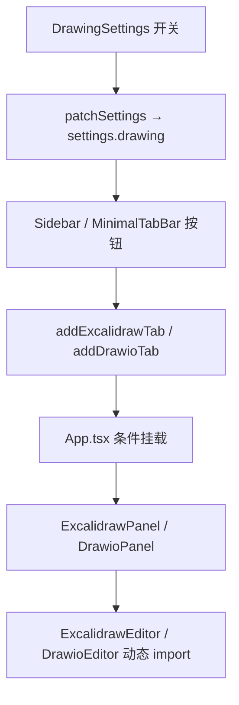
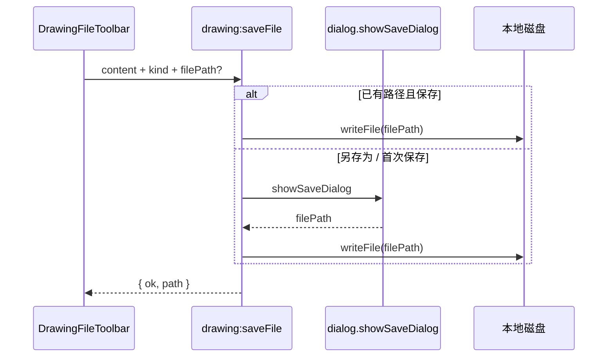

# 功能：绘图（Excalidraw / Draw.io）

在应用内集成白板绘图与流程图编辑，通过设置开关按需启用，懒加载重型依赖，支持本地文件保存与打开。

## 功能列表

| 子功能 | 说明 |
|--------|------|
| Excalidraw | 手绘风格白板，`.excalidraw` / `.json` 文件 |
| Draw.io | 离线流程图编辑器（打包 `public/drawio`），`.drawio` / `.xml` 文件 |
| 设置开关 | 设置 · **绘图功能**，两个开关可独立启用 |
| 侧栏入口 | 开启后在侧栏 / 极简顶栏显示对应按钮 |
| 单例 Tab | `excalidraw`、`drawio` 各最多一个 Tab |
| 文件工具栏 | 新建、打开、保存、另存为 |
| 未保存提示 | 关闭 Tab 时若有未保存修改，弹出确认 |
| 懒加载 | 未打开 Tab 时不加载 `@excalidraw/excalidraw` / `react-drawio` chunk |
| 卸载 | 关闭开关或 Tab 后卸载编辑器实例（Draw.io iframe 随 unmount 释放） |

## 进程归属

| 层级 | 文件 |
|------|------|
| **主进程** | `electron/main/index.ts`（`drawing:openFile` / `drawing:saveFile`） |
| **Preload** | `electron/preload/index.ts` → `api.drawing.*` |
| **渲染层** | `src/components/drawing/*`、`src/stores/drawing-session-store.ts` |
| **静态资源** | `public/excalidraw-fonts/`、`public/drawio/`（构建前由 vendor 脚本生成） |

## 架构与数据流

### 开关 → 侧栏 → 面板



### 本地文件保存



## 实验特性

否。默认两个开关均为 **关闭**，需在 **设置 → 绘图功能** 中手动开启。

## 配置文件片段

`settings.json` → `drawing`：

```json
{
  "drawing": {
    "excalidrawEnabled": false,
    "drawioEnabled": false
  }
}
```

类型：`electron/shared/drawing-settings.ts`。

## 数据存储

- 绘图内容保存在用户自行选择的本地文件路径，**不写入** `settings.json`。
- 关闭 Tab 后内存中的编辑状态丢弃（未保存则丢失）。

## 静态资源与构建

| 脚本 | 作用 |
|------|------|
| `scripts/vendor-excalidraw-fonts.mjs` | 复制 Excalidraw 字体到 `public/excalidraw-fonts/` |
| `scripts/vendor-drawio.mjs` | 从 jgraph/drawio Release 解压 webapp 到 `public/drawio/` |

`prestart` / `prebuild` 会自动执行 `npm run vendor:drawing`。

`index.html` 中设置 `window.EXCALIDRAW_ASSET_PATH = './excalidraw-fonts/'` 以离线加载字体。

Draw.io iframe 的 `baseUrl` 必须指向 **`drawio/index.html`**（见 `src/lib/drawio-base-url.ts`），否则 Vite 开发模式下访问 `/drawio` 会 SPA 回退到主应用页面。

## npm 依赖

| 包 | 用途 |
|----|------|
| `@excalidraw/excalidraw` | Excalidraw React 组件 |
| `react-drawio` | Draw.io embed iframe 封装 |

Vite `manualChunks` 独立拆分：`excalidraw`、`drawio`。

## 核心代码

### 设置 UI

`src/components/settings/DrawingSettings.tsx` — 两个 Switch；关闭时调用 `closeExcalidrawTabIfPresent` / `closeDrawioTabIfPresent`。

### Tab 与侧栏

- `useAppStore.addExcalidrawTab` / `addDrawioTab` — `src/stores/app-store.ts`
- `src/components/layout/ExcalidrawTabItem.tsx`、`DrawioTabItem.tsx`
- `src/hooks/useDrawingTabClose.ts` — 未保存关闭确认

### 面板与编辑器

```
ExcalidrawPanel.tsx  → lazy → ExcalidrawEditor.tsx  → @excalidraw/excalidraw
DrawioPanel.tsx      → lazy → DrawioEditor.tsx      → react-drawio
```

共用工具栏：`src/components/drawing/DrawingFileToolbar.tsx`。

### 主进程 IPC

```typescript
// electron/main/index.ts
ipcMain.handle('drawing:openFile', ...)
ipcMain.handle('drawing:saveFile', ...)
```

类型：`electron/shared/drawing-file-types.ts`。

### App 集成

```typescript
// src/App.tsx — 仅当 Tab 存在且对应开关开启时挂载
{hasExcalidrawTab && excalidrawEnabled && (
  <Suspense fallback={<DrawingPanelFallback />}>
    <ExcalidrawPanel />
  </Suspense>
)}
```

## 相关文档

- [common公共功能.md](./common公共功能.md) — Tab 路由、懒加载、`React.lazy` 模式
- [功能文件系统.md](./功能文件系统.md) — 同类「设置开关 + 侧栏单例 Tab」参考实现
