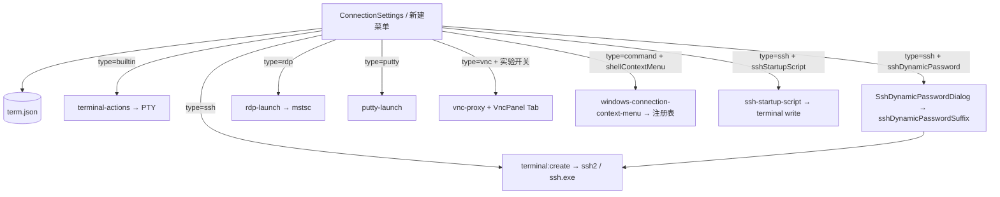
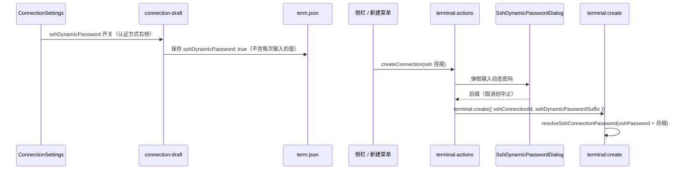
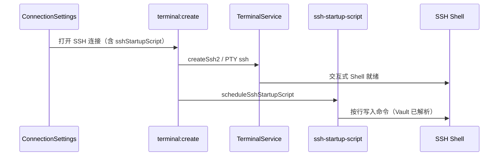
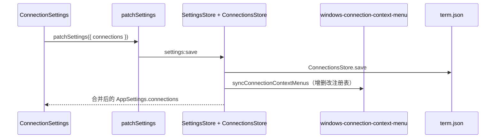
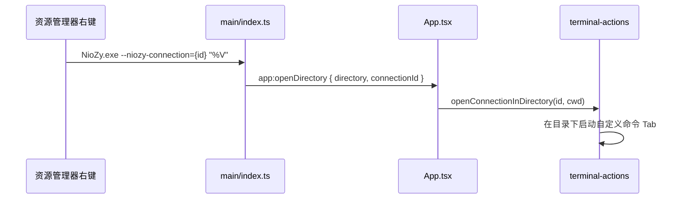

# 功能：连接管理

自定义连接（本地命令、SSH、RDP、PuTTY、VNC 等）的 CRUD 与一键连接。

## 功能列表

- 自定义连接列表增删改查、排序
- 内置 Shell 开关（PowerShell / CMD / pwsh）
- 默认启动 Shell 类型
- 从侧栏/菜单新建：终端、SSH、RDP、PuTTY、VNC（实验）
- RDP：调用 `mstsc`
- PuTTY：调用 `putty.exe`
- VNC Web Viewer Tab（实验，见 [功能实验特性.md](./功能实验特性.md)）
- 连接草稿与 Vault 变量引用 `${KEY}`
- **SSH 动态密码**：创建/编辑 SSH 连接时，在「认证方式」右侧可开启「动态密码」（仅密码认证有效）；连接前弹框输入服务器当前随机密码，实际登录密码为配置密码与其拼接（见 [功能SSH连接.md](./功能SSH连接.md)）
- **SSH 连接后脚本**：创建/编辑 SSH 连接时可配置多行 bash 命令，连接成功后按行依次执行（内置 ssh2 与系统 `ssh.exe` 均支持；断线重连后也会执行）
- **自定义命令右键打开**（仅 Windows）：在创建/编辑自定义命令时，名称行可开启「右键打开」，向资源管理器注册「通过 NioZy 打开 {名称}」，在该目录下启动对应自定义命令

## 进程归属

| 连接类型 | 主进程 | 渲染层 |
|----------|--------|--------|
| 本地/SSH 终端 | `terminal-service` | `terminal-actions` |
| RDP | `electron/rdp-launch.ts` | `ConnectionSettings` |
| PuTTY | `electron/putty-launch.ts` | 同上 |
| VNC | `electron/vnc-proxy.ts` | `src/components/vnc/VncPanel.tsx` |
| 自定义命令右键菜单 | `electron/windows-connection-context-menu.ts` | `ConnectionSettings` |

## 架构与数据流

### 连接类型路由



### SSH 动态密码



- 配置字段：`CustomConnection.sshDynamicPassword`（布尔，持久化于 `term.json`）
- UI：`ConnectionSettings.tsx` 中 SSH 表单的「认证方式」Select 右侧 Switch；切换为公钥认证时自动关闭
- 临时传参：`TerminalCreateOptions.sshDynamicPasswordSuffix`（IPC 一次性传入，不写入 Tab `terminalSpawn`）
- 草稿映射：`src/lib/connection-draft.ts` — `connectionToDraft` / `draftToConnection`

### SSH 连接后脚本



- 配置字段：`CustomConnection.sshStartupScript`（多行文本，每行一条 bash 命令）
- 空白行忽略；支持 `${vaultKey}` 引用
- 执行时机：Shell 就绪后延迟约 600ms，行间间隔约 120ms
- 多行块结构（如 `if … fi`）需写成单行或使用 `bash -c '…'`

### 保存连接配置



### 自定义命令右键打开



- 注册表路径（每连接独立键名 `NioZy.Conn.{id}`）：
  - `HKCU\Software\Classes\Directory\shell\NioZy.Conn.{id}`
  - `HKCU\Software\Classes\Directory\Background\shell\NioZy.Conn.{id}`
- 菜单显示文案：`通过 NioZy 打开 {连接名称}`
- 关闭「右键打开」或删除连接时，主进程从注册表移除对应项
- 同名重复：若已有其他自定义命令（同名且已开启右键打开）存在，保存时提示用户，不写入注册表

## 实验特性

- **VNC Web Viewer**：`experimental.vncWebEnabled` 及相关 `vnc*` 选项

## 配置文件片段

`term.json`：

```json
{
  "connections": [
    {
      "id": "uuid",
      "name": "My Server",
      "type": "ssh",
      "command": "192.168.1.1",
      "args": [],
      "env": {},
      "sshHost": "192.168.1.1",
      "sshPort": 22,
      "sshUser": "root",
      "sshAuth": "password",
      "sshPassword": "fixed-prefix",
      "sshDynamicPassword": true,
      "sshStartupScript": "cd /var/log\nls -la"
    },
    {
      "id": "cmd-uuid",
      "name": "Dev Shell",
      "type": "command",
      "command": "pwsh.exe",
      "args": ["-NoLogo"],
      "env": {},
      "shellContextMenu": true
    }
  ]
}
```

`settings.json`：

```json
{
  "defaultTerminal": "powershell",
  "builtinConnections": { "powershell": true, "cmd": true, "pwsh": true }
}
```

## 数据存储

| 路径 | 内容 |
|------|------|
| `%USERPROFILE%\.config\NioZy\term.json` | 全部 `CustomConnection[]` |

存储类：`electron/connections-store.ts`（`9:38:electron/connections-store.ts`）。

## 核心代码

### ConnectionsStore

```13:37:electron/connections-store.ts
  load(): CustomConnection[]
  save(connections: CustomConnection[]): CustomConnection[]
```

### 设置 UI

`src/components/settings/ConnectionSettings.tsx` — 连接表格与编辑表单（约 85 行起 `export function ConnectionSettings`）。SSH 类型在「认证方式」行提供「动态密码」开关，并提供「连接后脚本」多行输入；自定义命令类型在名称行提供「右键打开」开关（与名称同一行）。

### SSH 动态密码

`src/lib/connection-draft.ts` — 草稿字段 `sshDynamicPassword`；保存为 `CustomConnection.sshDynamicPassword`。

`src/lib/terminal-actions.ts` — `applySshDynamicPasswordToCreateOptions`；`src/components/ssh/SshDynamicPasswordDialog.tsx` — 连接前输入弹框。

`electron/ssh-auth.ts` — `resolveSshConnectionPassword`；`electron/main/index.ts` — `terminal:create` 传入 `sshDynamicPasswordSuffix` 后解析 profile / spawn 环境。

### SSH 连接后脚本

`electron/ssh-startup-script.ts` — `parseSshStartupScriptLines` / `scheduleSshStartupScript`。

`electron/main/index.ts` — `runSshConnectionStartupScript`，在 `terminal:create` 成功创建 SSH 会话后调用。

### 新建连接菜单

`src/components/layout/NewConnectionMenuContent.tsx`

### VNC Tab

`useAppStore.addVncTab`：`src/stores/app-store.ts`；面板 `src/components/vnc/VncPanel.tsx`。

### 自定义命令右键注册表

`electron/windows-connection-context-menu.ts` — `registerConnectionContextMenu` / `unregisterConnectionContextMenu` / `syncConnectionContextMenus`。

### 主进程 IPC

```1032:1076:electron/main/index.ts
ipcMain.handle('rdp:connect', async (_, connectionId: string) => { /* ... */ })
ipcMain.handle('putty:connect', async (_, connectionId: string) => { /* ... */ })
ipcMain.handle('vnc:startProxy', /* ... */)
ipcMain.handle('vnc:stopProxy', /* ... */)
```

保存连接时 `settings:save` 在 `partial.connections` 变更后调用 `syncConnectionContextMenus`；应用启动时调用 `syncAllConnectionContextMenus` 恢复注册表。
