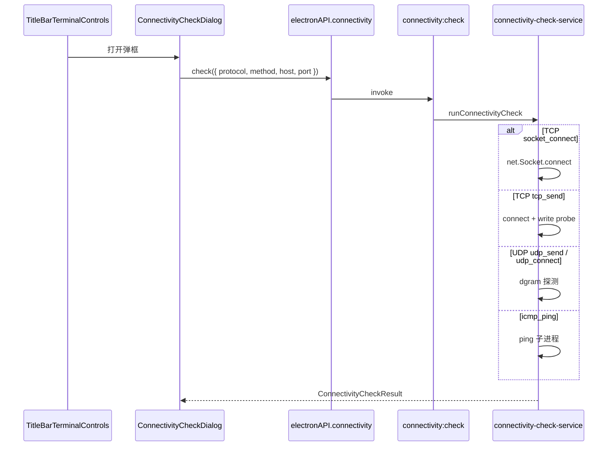

# 功能：连通检测

从标题栏快速检测目标 IP / 主机与端口的网络连通性，支持 TCP、UDP 多种探测方式。

## 功能列表

- 标题栏 **Cable** 图标按钮打开检测弹框
- 协议下拉：**TCP** / **UDP**
- 检测方式下拉（随协议切换）：
  - **TCP**：TCP 连接尝试（socket）、ICMP Echo（ping）、TCP 发送探测报文
  - **UDP**：UDP 发送探测报文、ICMP Echo（ping）、UDP 连接式探测
- 同一行配置 **IP / 主机** 与 **端口**（ICMP 模式下端口禁用并提示忽略）
- 点击「开始检测」显示连通状态、延迟（ms）与详细输出
- 国际化：`titleBar.connectivityCheck*`（`zh` / `en` / `ja`）

## 进程归属

| 层级 | 文件 |
|------|------|
| **主进程** | `electron/connectivity-check-service.ts` |
| **共享类型** | `electron/shared/connectivity-check-types.ts` |
| **渲染层** | `src/components/layout/ConnectivityCheckDialog.tsx` |
| **标题栏入口** | `src/components/layout/TitleBarTerminalControls.tsx` |
| **Preload** | `electron/preload/index.ts` → `connectivity.check` |
| **浏览器预览 Mock** | `src/lib/electron-browser-mock.ts` |

## 架构与数据流



## 检测方式说明

| 协议 | 方法 ID | 实现要点 |
|------|---------|----------|
| TCP | `socket_connect` | `net.Socket` 尝试 TCP 三次握手 |
| TCP | `tcp_send` | 建立连接后发送 `NIOZY_PROBE` 报文 |
| TCP / UDP | `icmp_ping` | 调用系统 `ping`（Windows `-n 1 -w`；Unix `-c 1`），不依赖端口 |
| UDP | `udp_send` | `dgram` 发送 UDP 探测包，超时内无 ICMP 不可达则视为已发送 |
| UDP | `udp_connect` | `dgram.connect` 后写入探测包，通过 ICMP 不可达判断端点 |

默认超时 **5000 ms**（`connectivity-check-service.ts` 内 `DEFAULT_TIMEOUT_MS`）。

## 实验特性

否；无设置项开关，标题栏始终可见。

## 配置文件片段

无持久化配置；每次检测参数仅在弹框会话内填写。

## 数据存储

无磁盘存储；检测结果仅显示在弹框内。

## 核心代码

### 共享类型

```1:33:electron/shared/connectivity-check-types.ts
export type ConnectivityProtocol = 'tcp' | 'udp'
export type TcpCheckMethod = 'socket_connect' | 'icmp_ping' | 'tcp_send'
export type UdpCheckMethod = 'udp_send' | 'icmp_ping' | 'udp_connect'
// ConnectivityCheckRequest · ConnectivityCheckResult
```

### 主进程 IPC

```1011:1011:electron/main/index.ts
ipcMain.handle('connectivity:check', (_, input) => runConnectivityCheck(input))
```

### Preload

```229:231:electron/preload/index.ts
  connectivity: {
    check: (input) => ipcRenderer.invoke('connectivity:check', input),
  },
```

### 标题栏入口

`TitleBarTerminalControls` — `Cable` 图标按钮，`connectivityOpen` 控制 `ConnectivityCheckDialog`（约 `189:193`、`361:361:src/components/layout/TitleBarTerminalControls.tsx`）。

### 弹框 UI

`src/components/layout/ConnectivityCheckDialog.tsx` — 协议与检测方式同一行，IP 与端口同一行；结果区与按钮区使用 `mt-4` 与上方表单项间隔。

### 探测实现

`electron/connectivity-check-service.ts` — `runConnectivityCheck()` 按协议与方法分发至 `tcpSocketConnect`、`tcpSendProbe`、`udpSendProbe`、`udpConnectProbe`、`icmpPing`。
