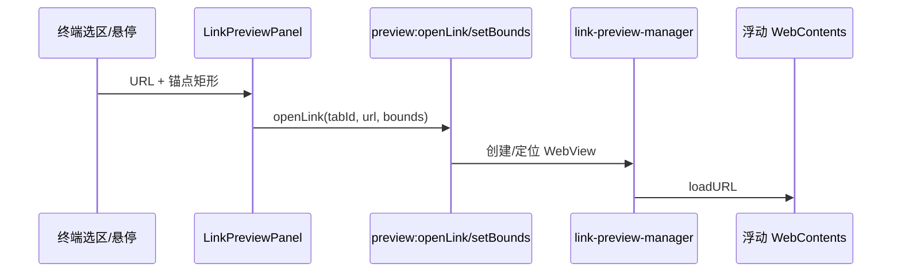
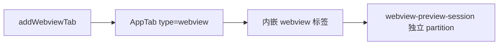

# 功能：预览与 WebView

终端内链接悬浮预览、文档预览、独立 WebView Tab。

## 功能列表

- **链接预览**：终端选区/悬停 URL → 浮动 WebView 预览（`LinkPreviewPanel`）
- **文件预览**：Office / PDF / 图片等（js-preview，`FilePreviewDialog`）
- **WebView Tab**：在应用内打开网页 Tab（`type: 'webview'`）
- 清除 WebView 浏览数据
- 预览设置：链接行为、文档预览选项

## 进程归属

| 功能 | 主进程 | 渲染层 |
|------|--------|--------|
| 链接浮动预览 | `electron/link-preview-manager.ts` | `src/components/preview/LinkPreviewPanel.tsx` |
| WebView 会话 | `electron/webview-preview-session.ts` | Tab 内嵌 webview |
| 本地文件协议 | `electron/local-file-protocol.ts` | — |
| 文档预览 | — | `src/components/preview/FilePreviewDialog.tsx`、`JsPreviewDocumentView.tsx` |

## 架构与数据流

### 链接悬浮预览



### WebView Tab



## 实验特性

否（稳定）；部分预览格式依赖可选资源。

## 配置文件片段

`settings.json` → `preview`：

```json
{
  "preview": {
    "linkPreviewEnabled": true,
    "linkPreviewDelayMs": 400,
    "documentPreviewEnabled": true
  }
}
```

详见 `electron/shared/preview-settings.ts`、`src/components/settings/PreviewSettings.tsx`。

## 数据存储

- WebView 缓存：Chromium 分区数据（可通过 `preview:clearWebviewBrowsingData` 清除）
- 无独立 JSON 持久化

## 核心代码

### 链接预览 IPC

`electron/preload/index.ts` — `preview.openLink`、`setBounds`、`setVisible`、`close`（约 134–145 行）。

```1105:1112:electron/main/index.ts
ipcMain.on('preview:setVisible', (_, tabId, visible) => { /* ... */ })
ipcMain.on('preview:close', (_, tabId) => { /* ... */ })
ipcMain.handle('preview:clearWebviewBrowsingData', () => clearWebviewPreviewBrowsingData())
```

### 渲染层打开预览

`src/lib/terminal-preview-open.ts`、`src/lib/terminal-preview-mouse.ts`

`src/stores/terminal-preview-store.ts`

### App 挂载

```16:17:src/App.tsx
import { FilePreviewDialog } from '@/components/preview/FilePreviewDialog'
import { LinkPreviewPanel } from '@/components/preview/LinkPreviewPanel'
```

`addWebviewTab` — `src/stores/app-store.ts`。
