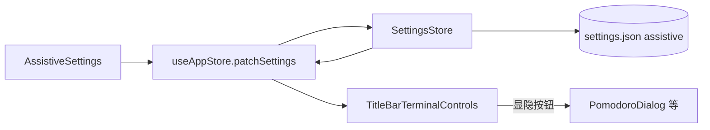
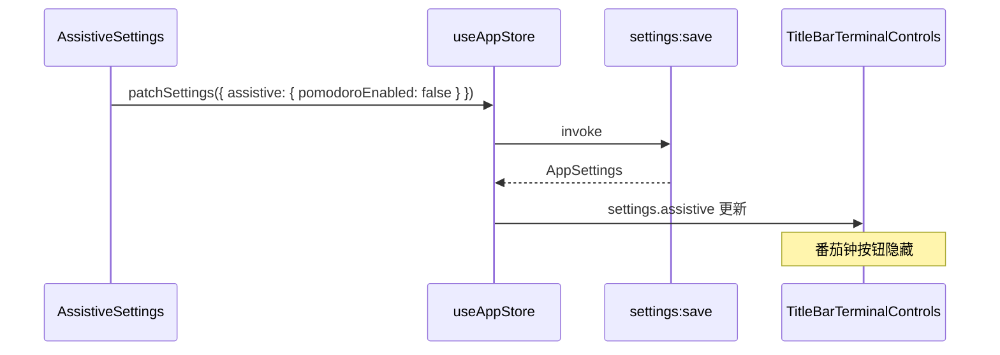
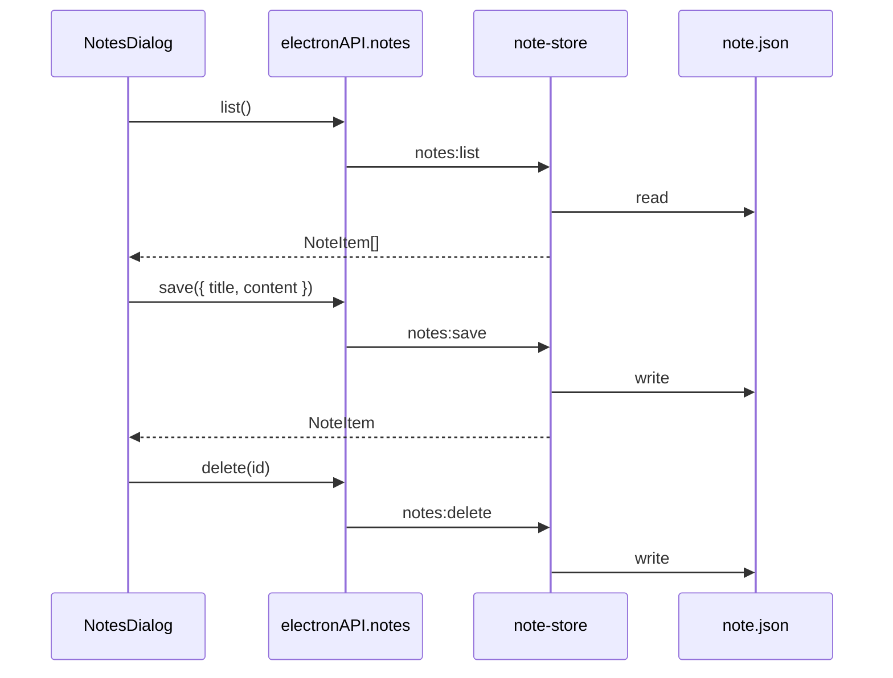

# 功能：辅助功能

设置中心 **辅助功能** 分区（位于「提醒设置」下方），统一控制标题栏辅助工具入口的显隐。六项开关默认均为 **开启**；关闭后对应按钮从标题栏隐藏，相关弹框也不会打开。

## 功能列表

| 开关 | 设置键 | 标题栏入口 | 说明 |
|------|--------|------------|------|
| 开启番茄钟 | `pomodoroEnabled` | Timer 图标 | 见 [功能番茄钟.md](./功能番茄钟.md) |
| 开启命令重放 | `commandReplayEnabled` | Command 图标 | 见 [功能增强SHELL.md](./功能增强SHELL.md) § 命令回放 |
| 开启终端搜索 | `terminalSearchEnabled` | Search 图标 | 搜索当前终端 scrollback |
| 开启连通性检查 | `connectivityCheckEnabled` | Cable 图标 | 见 [功能连通检测.md](./功能连通检测.md) |
| 开启屏幕截图 | `screenshotEnabled` | Crop 图标 | 见 [功能截图.md](./功能截图.md) |
| 开启备忘录 | `notesEnabled` | NotebookPen 图标 | 列表 CRUD + 一键复制正文 |

### 备忘录

- 标题栏按钮打开备忘录列表弹框
- 支持 **新增 / 编辑 / 删除**
- 列表项左侧点击进入编辑；右侧 **复制**（仅正文 `content`）、**删除**
- 数据持久化于配置目录 `note.json`（与 `settings.json` 同级，非 settings 内嵌字段）

## 进程归属

| 层级 | 文件 |
|------|------|
| **共享类型** | `electron/shared/assistive-settings.ts`、`electron/shared/note-types.ts` |
| **设置持久化** | `electron/settings-store.ts` → `settings.json` 内 `assistive` 字段 |
| **设置 UI** | `src/components/settings/AssistiveSettings.tsx`、`SettingsPanel.tsx`（section `assistive`） |
| **标题栏** | `src/components/layout/TitleBarTerminalControls.tsx` |
| **备忘录主进程** | `electron/note-store.ts`、`electron/config-paths.ts`（`getNoteFilePath`） |
| **备忘录渲染层** | `src/components/notes/NotesDialog.tsx` |
| **Preload** | `electron/preload/index.ts` → `notes.list` / `notes.save` / `notes.delete` |
| **主进程 IPC** | `electron/main/index.ts` → `notes:*` |

## 架构与数据流

### 辅助开关





### 备忘录 CRUD



## 实验特性

否。

## 配置文件片段

`settings.json` 内 `assistive` 字段（节选）：

```json
{
  "assistive": {
    "pomodoroEnabled": true,
    "commandReplayEnabled": true,
    "terminalSearchEnabled": true,
    "connectivityCheckEnabled": true,
    "screenshotEnabled": true,
    "notesEnabled": true
  }
}
```

默认值定义见 `electron/shared/assistive-settings.ts` 中 `DEFAULT_ASSISTIVE_SETTINGS`。

## 数据存储

| 路径 | 内容 |
|------|------|
| `%USERPROFILE%\.config\NioZy\settings.json` | `assistive` 开关（随 `AppSettings` 持久化） |
| `%USERPROFILE%\.config\NioZy\note.json` | 备忘录数组 `NoteItem[]` |

`NoteItem` 结构：

```typescript
interface NoteItem {
  id: string
  title: string
  content: string
  createdAt: string   // ISO 8601
  updatedAt: string   // ISO 8601
}
```

## 核心代码

### 设置分区顺序

`assistive` 位于 `reminder` 与 `system` 之间：

```43:58:src/components/settings/SettingsPanel.tsx
const SECTION_DEFS = [
  // ...
  { id: 'reminder', icon: Bell },
  { id: 'assistive', icon: Accessibility },
  { id: 'system', icon: Settings2 },
  // ...
]
```

### 标题栏显隐

```typescript
const assistive = settings.assistive
const showPomodoro = assistive.pomodoroEnabled !== false
const showCommandReplay = assistive.commandReplayEnabled !== false
const showTerminalSearch = assistive.terminalSearchEnabled !== false
const showConnectivityCheck = assistive.connectivityCheckEnabled !== false
const showScreenshot = assistive.screenshotEnabled !== false
const showNotes = assistive.notesEnabled !== false
```

见 `src/components/layout/TitleBarTerminalControls.tsx`。

### 备忘录 IPC

```typescript
notes: {
  list: () => ipcRenderer.invoke('notes:list'),
  save: (input) => ipcRenderer.invoke('notes:save', input),
  delete: (id) => ipcRenderer.invoke('notes:delete', id),
}
```

见 `electron/preload/index.ts`。

## 相关文档

- [功能番茄钟.md](./功能番茄钟.md)
- [功能增强SHELL.md](./功能增强SHELL.md)
- [功能连通检测.md](./功能连通检测.md)
- [功能截图.md](./功能截图.md)
- [common公共功能.md](./common公共功能.md)
